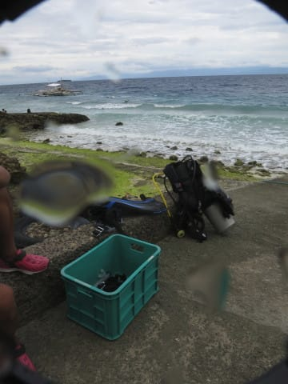

# 2019年8月，4度目のモアルボアル・小6の娘Cカード取得1周年！その26…いつもの旅程より1日長い，ダイビング4日目スタート！

📅 投稿日時: 2020-09-09 02:25:33

なんだか，

昨日の超マニアックスキー場ネタの記事．

「こんなもん，マニアックすぎる…」

と思っていたところ．

思った以上に刺さった人がいらっしゃった

ようですね…

うーむ．

時々，古い写真をひっくり返して記事にしても

面白いかも…

と，思いつつも．

私がデジカメをゲレンデにもっていくように

なったのが2005年ごろなので．

それ以前の写真が無いんですけどね…

ってなことで．

昨日はスキーネタでしたが．

本日はまた，ダイビング日記です．

では，どうぞ～！

ーーー

ということで．

旅行5日目の朝．

いつもなら4泊5日なので，

この日は帰る日なのですが．

今回の旅程は一日伸ばした5泊6日．

なので，まだ1日潜れますが…

今日がダイビングラストデーです．

…あぁ…

楽しい時が過ぎるのは早いもの…

…で．

ダイビング最終日となる今日．

いつも通り，朝7時のレストランオープン

に合わせて，ホテルのレストランへ

宿泊とセットの朝食を食べに行くわけ

ですが…

なんだか，今日は日が射してはいるものの…

朝ごはんを食べながら眺める海に，

白波が立って，かなり荒れ気味に

見えるのは気のせいかな…？？

うーむ．

風もちょっとあるし．

今日はぺスカドール島へ遠征には行けず．

潜れるポイントは限られるかも…？？

と，心配しながら．

朝食後の朝8時頃にホテルを出て．

ダイビングショップへ向かいますが…

ダイビングショップへ到着後．

ショップのガイドのアイさんから

言われた一言は，当初予想を上回る，

ショッキングな事実でした…！

アイさん「今日，波が高くてボートが出せ

　ません！」

私「…

　　…

　　…

　　え！！？」

アイさん「ボートの出航が禁止になってます…」

…どうやら，モアルボアルのダイビングショップ

全体で，ボート出航が止められている

状況らしく．

せめて近場には行けるのかな？

と思っていたのよりも，

ずっと悪い状況じゃないですか…（涙）

私「…それって，今日は潜れないってことですか！？？」

アイさん「…いえ．車でちょっと離れたビーチまで

　移動して，そこでビーチから潜ろうかと

　思っているのですが…どうしますか？」

…良かった…っ！！！

今日はもう潜れないのかと思った！！

ボートが出せなくても，ビーチエントリーで

潜れるのか…

なら，せっかく一日旅程を伸ばしたのに，

潜れずにぶらぶらしてるのももったいないので，

ビーチエントリーでも潜れるなら

潜りに行きましょう！

アイさん「ただ，車がやってくるのに

　1時間くらいかかりそうなので，

　それまで1本ハウスリーフで潜る

　こともできますけど…」

え？

なら，ハウスリーフでイワシ見に行きたい！

アイさん「ただ，このハウスリーフは風が直接

　当たっていて，波が高くてエントリーは

　ちょっと大変ですけど…波にもまれると

　思います．」

ふむ．

…これは，娘と妻は行かない方がいいかな…

特に，娘はまだビーチエントリーをやったことが無く

（なんて贅沢なダイバーだ…）

小学生が重いタンクと器材一式を

身に着けて，波にもまれながら

フィンを履く，ってのは無謀ですね…

私「…妻と娘には波が高いビーチエントリーは

　危ないので，私一人だけ潜りに行っても

　いいですか？」

　

アイさん「OKです！」

ということで．

ガイドのアイさんと私のマンツーマンで

ハウスリーフを攻めに行くことに決定！

車で移動して潜る2本目のポイントは風下らしく，

エントリーはそれほど厳しくないようなので．

娘は2本目以降潜りに行くことにして．

1本目の間は，ショップのワンちゃんと

遊んですごすことに…

ってなことで．

アイさんと二人，ショップ前の

ハウスリーフへ！

うーむ．

モアルボアルは4回目になり，何度も

潜ったハウスリーフですが．

ビーチエントリーは初めてですね…

スタッフが，いつも船に乗る桟橋まで

器材を運んでくれているので．

器材を身に着けて，

いざ，ハウスリーフへ！

写真だとそれほどに見えないけど．

波に揺さぶられながら海に進んで行き，

ある程度の深さのところでフィンを

履いたら…

いざ，潜行！

…普段，ボートを繋いでいるロープの下に，

ツバメウオの若魚がいました…

そして，浅瀬を抜けて，

ドロップオフまで出ると…

波の高い本日も．

いつも通りのイワシの群れの

お出迎え！

てなことで．

本日のイワシ攻略，スタートです！
