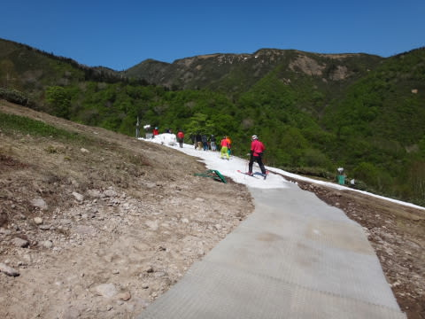

# 5月22日，2016シーズンかぐらスキー場ファイナル，詳細レポート！…晴天ガラガラ，予想より良かったよ！

📅 投稿日時: 2016-05-24 03:09:13

🏷️ カテゴリ: [2016スキー滑走日記](c70c67ed5248e9432b899dcd5747048bb.md)

あぁ…終わってしまった…．

そう．

かぐらもついに終わってしまいました…．

で．

2016シーズンも，ついに終盤戦に

突入しましたね～っ！←いや，普通の人はもうシーズン終わってるから

ということで．

この日曜，ファイナルかぐらの詳細レポートをば…

えー．

まず．

朝イチのかぐらの駐車場は，こんなにガラガラ！

…さすがに，ペアリフトのみの営業ということで，

人が少ないのか…

んで．

ロープウェーに乗って，ピスラボを滑って

みつまたのリフトに乗りに行くところで…

あれ？？

ピスラボを一部はがして，下に砂利を敷く

工事をしてますね～．

さすがにこんな泥だらけの茶色いピスラボでは，

夏営業は苦しいと思ったのか…

泥が浮かないよう，水はけ改良工事をやっている

ようですね～

…そして，みつまたリフトを降りて，

ゴンドラへ向かう方のピスラボゲレンデにも，

改良が…っ！

…これは，スプリンクラー？？

どうやら，人力水撒きの限界を感じたのか，

ついにこちらのゲレンデも，機械力で

水撒きができるようにしたみたいです…

誰もが，そうするべきだと思ったはず…

＃このスプリンクラー，盛大にスキーヤーを濡らす

＃性能を誇ってます（涙）

で．

ゴンドラに乗って，やってきましたかぐらゲレンデっ！！

ふむ…

コース幅は狭いけど．

雪の厚みは十分ありそうに見えますね…

で．

パークは，キッカーが無くなり，ジブアイテムのみに

なっちゃってます…

キッカーの雪は，ゲレンデに供給されちゃったのね…

しかし．

そのおかげか，

ペアリフト乗り場までの雪は十分な厚み！

そして，リフトに乗ると…

…

…とても，スキーをしに来た景色ではありませんね（笑）

んで．

ペアリフトの乗り場は雪があったのに．

降り場はピスラボになってます…

こんなピスラボを滑ってゲレンデに出ると…

ふむ．見事な廊下ですな．

でも，しっかり雪寄せされて．

雪の厚さも十分！

朝イチは，雪が茶色くなったり，

融けかけてたりする部分は無く．

コース幅は狭いけど，

意外といいコンディションでは？？

一番最後，パークに向かっての落ち込み

部分は，そこそこの幅があり．

まーまー楽しめます．

まさか．この雪不足の年．

5月3週目まで，こんなに滑れると

思わなかったよ！

あー．

この最後の落ち込み部分．

左端にコブラインが作られましたが…

ただ，さすがにこのコブライン，

すぐに底が抜けちゃってました…

んで．

リフト待ちはピークでも搬器数台待つかどうか…

という程度で．

コースも人が少なく，好きなだけ滑り放題っ！！

しかし．人が少ないとはいえ，

コース幅が狭いところを人が集中して滑るので．

さすがに，11時ごろになると…

ちょっと，コースが荒れ始めてきましたよ…

そして，すくすくと凸凹は成長し．

午後1時ごろには…

あぁ…

ところどころ土が顔を出すところも…

でも．

まぁ，この時期としては，

コースが「どこを通ればいいの？」というほどに

幅いっぱいに渡って雪が薄くなったりすることなく．

まぁ，ファイナルデーまでよくこのコンディションを

維持したものだ！

さすが，かぐらスキー場…！

ってことで．

予想よりは楽しめたかぐらでしたが．

これにて，かぐらも営業終了．

次からは…月山ですね…

6月になったら月山へ行きますので，よろしく～！

＃月山へ行った方，情報お願いします…

## 💬 コメント一覧

### 💬 コメント by (Tomoko.Y)
**タイトル**: 14、15の月山は
**投稿日**: 2016-05-24 09:04:38

例年5月末～6月初めに行くのですが、今シーズンの小雪で不安になり早めに行ってきました。

だからといって積雪量がいつもより多い印象はなかったので、月山も例年よりは少な目かも知れません。

とは言え、スキーキャリーは健在、リフト乗り場、リフト降り場、牛首、コブの大斜面は雪はたっぷりです。

リフト降り場から大斜面、コブ斜面下からリフト乗り場まで、雪上移動できました。

リフトの混み具合は、日曜の昼過ぎまではリフトに並ぶ人の列がコブ斜面から見える、と言うとわかりやすいでしょうか。

14日は月山リゾートイン（スキーキャリー発着地点）まで宿の送迎で、15日は姥沢駐車場に停めました。

8時20分に駐車場から200メートルくらいの距離で駐車渋滞にはまりましたが、何とか駐車場に入れました。

ギリギリセーフでした。

小雪シーズンで、皆さんの月山への出足が早かったように思います。

Sさまが行かれる時まで雪がたくさん残っているといいですね。

お気をつけて行ってきてくださいませ～♪

### 💬 コメント by (Skier_S)
**タイトル**: Tomoko.Yさま
**投稿日**: 2016-05-25 02:42:36

情報ありがとうございました～！

かぐらはガラガラでしたが，それだけぶん

月山が混んでたんですね…

まだ，板を履いて乗り降りできるんですね．

私は2週間ほど休憩期間を置いて，

禁断症状に苦しみ始めたころに，

月山に行ってみようと思います

### 💬 コメント by (オヤジスキーヤー)
**タイトル**: 5月29日今日の月山
**投稿日**: 2016-05-29 19:48:40

いつも楽しく拝見させて頂いてます！

今年は月山も雪溶けが早く、スキーを脱いでの乗車になってますよ！大斜面も薮が増殖中です！例年より2～3週間は早い様な…来週にはリフトの架け替えが始まります。是非早目にお出かけになった方が良さそうですよ！

### 💬 コメント by (Skier_S)
**タイトル**: オヤジスキーヤーさま
**投稿日**: 2016-05-30 02:34:19

レポートありがとうございます！

そうですか…

もう，板を脱いでのリフト乗車なんですね．

こちらもいろいろな人のブログとか見ましたけど，

もう大斜面に藪が出て，ボトルネック状態に

なっているみたいですね…（涙）．

おそらく，大斜面藪漕ぎ無しで滑れるのも，

あと2週間くらいでしょうか…

6月第2週になったらやばいかも？？

ってくらいの勢いですね．

うーむ．

早く行きたいけど，6月第1週，第2週の予定は

埋まっちゃったんですよね．

6月第3週まで，リフト滑れるかなぁ…

