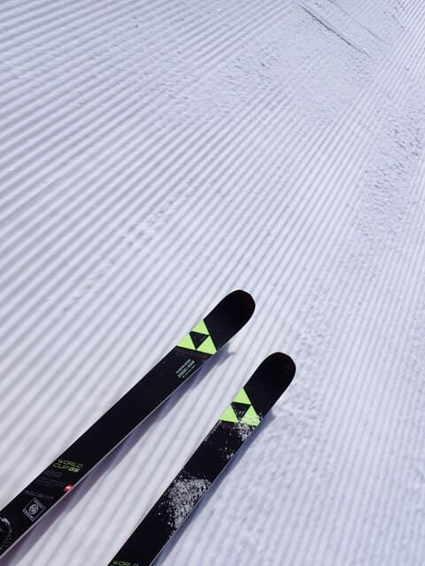

# 2025/4/5(土)の志賀高原焼額山スキー場は…朝は硬めだったけど気温も低く午前中は最高！午後は雪は緩んだものの板は走ったよ

📅 投稿日時: 2025-04-06 00:46:27

ということで．

本日は予告通り志賀高原で滑ってました～！！

…睡眠時間1時間45分で300km運転してくるのは

結構辛かったけど．

早朝営業最初には間に合わなかったものの，

午前7時には志賀高原にやってきましたよ～！！

ちなみに，志賀高原の上りの道路は積雪や

凍結は全くなく．

夏タイヤでもやってこれるレベルの路面

でしたね…

（いつ凍結するかわからないので，夏タイヤで

　来るのは全く推奨しませんけど…）

そして…

6時からの早朝営業開始に遅れること

約1時間．7時に焼額第1ゴンドラへ…！

慌ててゴンドラに飛び乗り，山頂に着くと…

気温は-6℃といい感じに冷え込んでいて…

そして見事な快晴！！！

お天気に祝福されてるよ！！

早朝7時段階でのバーン状況は…

結構硬めですね．

硬いのがダメな人や，エッジが研いでない

板だと厳しめの感じですが，

ツルツルではなくザラメの固まったざらざら

した感じのシマシマなので，エッジがかかり

ますよ…！

早朝の参加者は思ったより少なく，

ゴンドラもガラガラなので…

営業開始1時間たっても，まだ全然

シマシマが残ってます！

しっかり硬めのスピードが出るシマシマ

バーンを味わえるのだ！！

今日みたいな日が，GS板の本領発揮なのだ！！

いつもより1時間半早く，太陽がまだ低い位置に

いるこの時間．

春の日差しでも雪が緩まず．

太陽の下でしっかり締まったシマシマが

味わえるのだ…！！

とりあえず，本日は焼額のほぼすべての

コースが早朝から滑れたので…

早朝参加者も複数コースに分かれたので

コースはガラガラだし．

どこに行ってもシマシマが残っているのだ！！

白樺コースなんか，朝8時近くてもシマシマ！！

いやーー．

今日は晴れてるのに気温も低く，

前回は晴れてても春霞で北アルプスが

見えなかったのに．

今日は北アルプスがくっきり見えます…！

朝8時ごろには，表面がわずかに緩み始め，

カリカリハイスピードバーンから，

エッジががっつり効く快適バーンに

変わってきましたよ…！！

いや…

今日はホントに朝2時間滑っただけで，

志賀高原に来た価値があると思う，

天気よし，ガラガラのGoodコンディション

ですよ…っ！！！

そして．

もう4月に入って，シーズン終了した人が

多いからか．

第1ゴンドラもガラガラだし…

第2ゴンドラも終日飛び乗りに近い感じ

だったし…

第2高速も，最大でこれくらいしか並ばない

感じで．

なぜこんなにコンディションがいいのに，

これほどまでに人が少ないのだ？？？

志賀高原はまだいいコンディションだよ～！！

と，今日滑りに来なかった全員に言いたい…

午前10時ごろになると，硬かったバーンが

いい感じに緩んできて，かなり滑りやすい

バーンになり．

表面がしっとりしてきたけど板が滑って，

全然雪面が荒れてない，4月の晴れた日としては

これ以上望むべくもない好コンディションなのに．

なぜコースがこんなにガラガラなのだ…

この第2高速沿いの唐松コースなんか，

無人貸し切りバーンだよ！！！

まだまだ雪がいっぱいあるのに，ここが

明日で営業終了とは…

もったいない！！もったいなさすぎる！！

そして，今日は気温が低めで，最高気温も

ぎりぎり0℃を上回るかどうかという程度

だったので…

昼間になっても日陰は雪が硬いままで，

昼近くまでは，4月の晴れた日にしては

かなりいい雪をキープしてくれたんですが…

さすがに12時ごろには雪が結構緩み始め．

午後1時ごろには，GSコースは結構

荒れてきました…（泣）

まぁ，4月の晴天ですから．

午後1時になったら，こんな雪になるのも

仕方がない．

でも，12時過ぎまでGS板を履いてたし．

今日は思ったより長い時間，結構フラットで

滑りやすいコンディションをキープして

くれたので良かったかな！

オリンピックコースも，午後1時過ぎには

結構ボコボコになり始めてきました…

あ，今日はこの写真にあるように，

オリンピックコースの上から見て左側に

コブラインができてました～！！

ここ以外に，パノラマの壁とサウスコースにも

ラインコブありましたね…

ってな感じで…

午後2時過ぎには雪も結構緩み，

かなり全体的にバーンが荒れて

きましたが．

それでも雪はストップ雪になる気配すら

なく．板は終日いい感じですべってくれたし．

バーンも終日全く混む気配はなく，

貸し切りバーンに近い状態だったし．

春営業で営業開始が早まった分，

営業終了が15時半と1時間近く早まったので…

バーンが結構荒れてきたのは，営業終了

1時間半くらい前．

ボコボコバーンになり始めたら，

あっという間（Skier_S個人の体感時間）に営業終了タイム．

終了が早まって，いつもよりかなり日が高い

時間に営業終了となりましたが．

今日も朝7時からしっかりラストまで，

休まず滑り続けてしまったのでした…

いやーーー．

今日はラストはちょっと雪が荒れたけど．

でも，午前中はかなり天気も雪もいい感じで，

晴れた春スキーなのにしっかり締まった雪を

ほぼ貸し切りバーン状態で滑れるという

シアワセな一日だったのでした…

明日もこんな天気だったらいいんだけどな…

今，志賀高原は晴れてます．

明日，空から液体が降るとは信じられない

天気なんだけど…？？

明日，降らないでいてほしい…（祈）

私は日ごろの行いがいいから，私だけなら

明日は昼くらいまでは降らないでいてくれる

はずだけど．

もし運悪く，明日朝から雨が降ったら…

それは私以外の誰か日ごろの行いが

悪い人がいるということですので，

よろしくお願いします．←何をよろしくお願いされているんだ？？

## 💬 コメント一覧

### 💬 コメント by (hapi44)
**タイトル**: Unknown
**投稿日**: 2025-04-06 00:23:30

日帰り志賀高原…厳しいっす…

### 💬 コメント by (副院長)
**タイトル**: Unknown
**投稿日**: 2025-04-06 08:55:14

コンディションよかったのですねー。オリンピックの、ラインは大阪の、某団体の、講習の様です。デモもいるみたいです。中の人の報告です。睡眠不足、お怪我のない様に。

### 💬 コメント by (Skier_S)
**タイトル**: 今日は意外と良かったよ
**投稿日**: 2025-04-07 01:37:40

＞hapi44さま

関東からなら志賀高原日帰りは楽勝だと思っています…

K奈川県から月山も日帰りで行けますよ～！

毎年1回は日帰り月山に行っている気がする…

＞副院長さま

予想通り，結構コンディションよかったですよ～！

この週末は大阪某団体の行事もあり，赤い団体の皆様もいらっしゃいました…

### 💬 コメント by (だんご)
**タイトル**: 発見できず
**投稿日**: 2025-04-07 17:07:41

5(土)6時半過ぎから現地に居たのですが、発見する事が出来ませんでした…今度こそお声をお掛けしようと気合を入れていたのですが(笑)

良かったですよねーこの日。日ごろの行いのおかげです^_^

### 💬 コメント by (ねも)
**タイトル**: Unknown
**投稿日**: 2025-04-08 05:55:17

はい、Sさんの善行のおかげです(笑)　Sさんのシーズンはまだまだ続きますね✌️

やはり４月になってもスキー⁉️っていう思い込みが｢普通｣じゃないですか？

私は４月に滑ったことは数えるほどですが、うち２回が志賀高原でした。案外楽しかった(^^*)

で、驚きは滑っているのはほぼ上級者で、私のような下手っぴはほとんどいない(ﾟ-ﾟ)

### 💬 コメント by (Skier_S)
**タイトル**: 今週日曜の志賀は暴風雨？
**投稿日**: 2025-04-09 02:09:33

＞だんごさま

あら…焼額にいらっしゃったのですね．

私もずっと焼額にいたのに見つからなかったですか…

でも，土曜はいい一日でしたね！！

志賀のシーズンはまだ続くので，また焼額にお越しください…！

＞ねもさま

そうです．私のおかげです～！！（笑）

4月なんてまだまだスキーシーズン真っ最中！

GWを過ぎてからがシーズン終盤です！！

でも，確かにこの時期に滑ってるのはスキー中毒者ばっかりかも…

