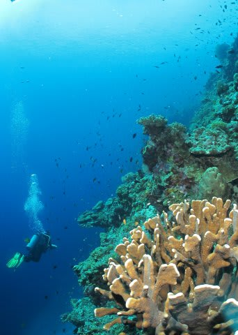

# 2013年11月　フィリピン・オスロブ　子連れでジンベエを見るぞっ！　その15

📅 投稿日時: 2014-07-25 00:33:09

🏷️ カテゴリ: [ダイビング日記](ce3a7a8d424d112fce83ee85c81a0e344.md)

あぁ…

本当なら．

休みが取れていれば．

…今頃，石垣や西表で潜っていたはずなのに…（ため息）．

それなのに．

今日も仕事．

明日も仕事．

…なんて真面目なサラリーマンなんだろう…←それが普通だから！！！

ってことで．

一昨日，予約投稿のミスで．

未完成の原稿を一瞬さらしてしまった，スミロン旅行記その15．

すでに読んじゃった人もいると思いますが…

どうぞ～！

----

午前のスミロン島でのランチの後．

オプションの午後のダイビングのため，

またまたスミロン島周辺へ舞い戻り．

…そして，私にとっての，今回の

フィリピンでの初ダイブへGo！

いやー！

結構透明度がいいねぇ．

25m以上，ヘタすると30mくらい抜けてるかも！！

そして．

サンゴも元気だし…

結構カラフルな海じゃないですかっ！

ふーーむ．

フィリピンは，アポやバリカサグに行かないと

それほどでもないだろうと思っていて…

セブ島近辺なんて，たいしたことないだろうな～…って，

思ってたけど…．

その考えは，改めないといけませんな！

サンゴとハナダイ系の乱舞もきれいだし…

結構魚影も濃いし…

…アジアンリゾートは，あんまり海にいいイメージがなくて．

ここしばらく，タヒチやらモルジブやらコモドやら，

比較的遠くにまで出かけてましたが．

すいません．

ここで宣言します．

いや，フィリピン．

いいじゃないですか！

セブ島近辺は，昔はダイナマイト漁で壊滅

していた時期もあったようですが…

こんなに透明度が良くて，魚影も濃くて，

サンゴもきれいだったとは！

うむ．

セブ島近辺も，意外と悪くない…！

と，思いつつ，

ひれを開いてくれないニチリンダテハゼやら…

クラウンアネモネフィッシュやら…

シャイでなかなか出てこないゴールドスペックジョーフィッシュなどを

眺めていると．

おおっと！

ウミガメ登場！

結構フレンドリーなタイマイさんでしたね～．

って感じで，浅瀬に上がり…

ダイブタイム50分で浮上！

…いや～．

スミロン．

意外といい海じゃないかっ！←偉そうな上から目線なんですけど
