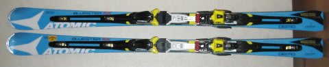
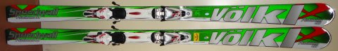

# Skier_Sはここ10年で何セット板をヘタらせたのか？ちょっと振り返ってみる…その1

📅 投稿日時: 2021-08-23 03:27:03

🏷️ カテゴリ: [スキー雑談](c1f9d2cb7478308da16419928ea3945e9.md)

えー．

このままだと，

このBlogが登山Blogになってしまう

という危機感から．

定期的にスキーネタを突っ込まなくては

ならない宿命を負う，

この徒然スキーヤー日記．←だから，例年夏はダイビング日記になってませんでしたっけ？

今日は，その義務感に従って．

スキーネタを行ってみましょう！！

…で．

皆さんご存知のように．

なぜか自分が履いた板は，

1．たまたま毎回外れ板ばかりを買ってしまっている

のか，

2．何か人知を超えた巨大なパワーが働いている

のか．あるいは，

3．私からスキー板を劣化させる謎の電磁波が放射されている

のか．

なにが理由か分かりませんが，

ものすごい勢いでスキー板が劣化していってしまう

という悲しい運命をもつわけですが．

…でも，最近は．

私が履いた板だけじゃなく．

私と一緒に滑っている皆さんのスキー板

劣化速度も加速している気がするので．

3番目の理由が一番疑わしい

と思っている今日この頃．←そんなわきゃない

…しかし．

一体何が原因でこんなにすぐ板が

ヘタるんでしょうねぇ…

とりあえず，今回は．

Skier_Sはこの10シーズンで，一体

どれだけの板をヘタらせてきたのか？

というあたりを，ちょっと振り返ってみました…

○2012シーズン

板購入：なし

…なんと．

このシーズンは板を買っていません！

そんなシーズンがあったのか…

まだ物欲に汚されていない，ピュアな

時代だったのかも．

それがのちに明らかになる，翌シーズンの

悲劇を生むとは知らずに…

死亡：1セット

○’09 Salomon DEMO X3…引退まで4シーズン

2009，2010シーズンの2シーズン，メイン

マシンとして利用してきたこの板．

2011シーズンから，すでにシーズンイン＆

春スキー用になってましたが…

シーズン終わりのかぐらで春スキー用と

して使うにも耐えられないほどヘタっている

ことに気づき死亡宣言．引退．

○2013シーズン

板購入：2セット

○Atomic Bluester Demo SX

当初購入予定が無かったところ．

後述のように，メインマシンの

Salomon 24hours LMが剝離してしまった

ため，[小回り機を買い替える予定がなかった
ところ，急遽購入することになった](e06ff03392356a872ae2cb4034a92b750.md)のですが．

まさかこのときは，これからSXを次々

買い替えて，9シーズンも履き続けるとは

思ってなかったよな…

さらにこのあとに述べる，このシーズンの

すさまじい悲劇を生む原因になるとは

全く思わず…

○Volkl Platinum CD

この板も，シーズン中に大回り用の板が

全て死亡していることが判明し，

[購入予定がなかったのに，急ぎ大回り機を
買い替えたもの](ecc72330cb8bfe2567d1b372d6b1bb067.md)でした…

死亡：4セット(涙)

○’11 Salomon 24hours LM…引退まで3シーズン

2シーズンしか使ってないのに，3シーズン目の

[シーズンインのYetiで剝離](e6302c5755708c26ad01f9cd7b82c90ae.md)．

剝離しながらもこの3シーズン目は使い切り，

翌シーズンのYetiの石ころ踏み用として

利用した後引退．

○'07 Nordica Dobermann GS Pro…引退まで7シーズン

このころは，大回り板と別に，朝イチの

焼額専用マシンとしてGS板を履いて

ましたが…

(181cmのR=21mで，今年新しく買ったFISCHERのGS Masterよりはマイルドでしたね )

そんなに履く機会は多くなかったので，

ヘタッてないと思い7シーズン

履いたんだけど．

この年に買った[ATOMICのSXと履き比べ，
どうしようもなくヘタっていたことが判明](e2417d511869d49d0e1e493c47fbd692c.md)．

その後，[蘇生作業](e0a672342792800a978ecf10526499088.md)もしてみたけど復活せず，

死亡判定．

昨シーズンは新しい板を買っておらず，

比較対象が無かったので気づかなかった

だけで．

もしかしたら，昨シーズンくらいに

ヘタっていたのかも…

○’10 Atomic D2 Demo Type-A…引退まで4シーズン

 メイン大回り機として使っていたこの板も，

[このシーズンに買ったSXと比べて，
どうしようもなくべろんべろんになっていた](e2417d511869d49d0e1e493c47fbd692c.md)

ことが判明．

この板も比較対象が無くて気づかなかった

だけで，前のシーズンからヘタっていた

可能性大．

○'09 Ogasaka KC-RV…3シーズン履いた中古をもらって，2シーズンで死亡

知り合いから「新しい板買ってもう履かないから」

という理由でタダでもらった板だけど．

私が履いて2シーズンで死亡．

そんなに履いてないんだけど…

とりあえず．

このシーズンは一気に4セットがお亡くなりに

なったわけですが．

実は昨シーズンに新しい板を買って，

その板と履き比べられていれば，

NordicaとAtomic D2は，昨シーズンに引退

してたかも…

このシーズンにAtomicのSXを買ってしまったが

ために，集中して4セットに死亡判断が

下されるという，悲劇の年でした（涙）

（続く…すでになんだか長い記事になりそうな予感）

## 💬 コメント一覧

### 💬 コメント by (大阪のK)
**タイトル**: Unknown
**投稿日**: 2021-08-24 10:37:31

確かに、焼額山の早朝メンバーは板の消耗が早い様です。

皆さんについて滑ると、30～40日位で剥離してしまいます。

最短は12日滑走で剥離しましたが(涙)

Sさんもマテリアルの入れ替えが激しくて、大変ですね😅

### 💬 コメント by (マルハバ)
**タイトル**: お～っ♪
**投稿日**: 2021-08-24 12:30:05

懐かしのSalomon DEMO X3・・

想えばこのブログとの邂逅のきっかけはこの板でした。もう10年になるんですね～

更に焼額で後ろのゴンドラに乗っていたSさん”捕獲”？の目印となったVolkl Platinum CD・・

思い出深い板です。

### 💬 コメント by (Skier_S)
**タイトル**: Skier_Sの板の歴史書です
**投稿日**: 2021-08-25 02:56:22

＞大阪のKさま

やっぱり，焼額で私と一緒に滑ると板の消耗が激しくなるようなので，

どうやら私から板を劣化させる謎の電磁波が出ているのは間違いないようです…

おそらく，12日で剝離したやつは，私からの電磁波をよっぽど強烈に浴びたのでしょう（笑）．

＞マルハバさま

私も自分で写真をひっくり返してみて，

「この板，懐かしい…」

と思いながら書いてました．

いろいろ思い出がある板が，1年1セット以上死んでいくこの悲しさ…

