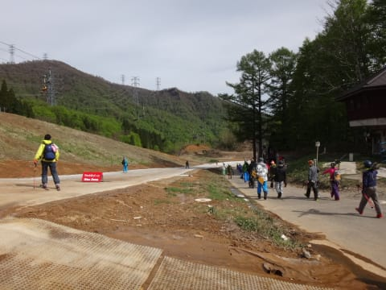
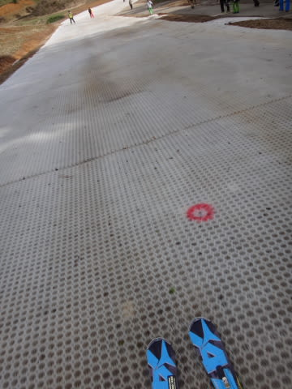

# かぐら・みつまたのピスラボ（スノーマット）ゲレンデはこんな感じ

📅 投稿日時: 2016-05-08 04:56:36

🏷️ カテゴリ: [スキー雑談](c1f9d2cb7478308da16419928ea3945e9.md)

ってことで．

昨日はかぐらのゲレンデレポートをしましたが．

本日は，かぐらゲレンデに移動するのに滑ることになる，

Pislabゲレンデの状況を，より詳細に報告してみましょうか…

まず．

みつまたロープウェーを降りてから，みつまた高速リフトまでの

約100mほどが，最初のPislabコースになるわけですが．

…ここは歩いていくこともできるので，無理やり滑る必要は

無いかと思いますけど．

まぁ，ここの部分のPislabマットは結構きれいです．

ところどころ，ワックスゾーンがあって，

ワックスをしみこませた布（？）が貼ってあります．

赤丸の部分にスプリンクラーがあって，

びしょ濡れになりますが…

で．

その次．

みつまた高速リフトを降りてから，ゴンドラまで．

ここは，長くて急で，結構怖いです…

Pislabって，雪面ほどエッジでブレーキが掛けられないので，

結構スピードが出てしまいます…

ここは，ウインターシーズンの移動専用で，

サマーゲレンデとしては使わないからか，

スプリンクラーが無くて，おじさんが水を

撒いてます…

ゲレンデに行くまでのPislabエリアはこんなもんですか．

あとは，帰りですが…

下りゴンドラを降りてから．

みつまた第2ロマンスリフト乗り場まで歩いていき…

降り場，乗り場にはPislabが貼ってあるので，

板を履いて乗っても，手でもって乗ってもいいみたいです．

で，降り場で降りたら…

そのままPislabを滑ってロープウェー乗り場まで

行けます．

…歩いて下りリフトに乗っていけば，Pislab滑らずに

ゴンドラ乗り場に行けますよ～．

で．

この，帰りのみつまたのPislabは，サマーゲレンデとして

使うので，かなり幅が広いですね～！

スプリンクラーも景気よく水を撒いていて，

結構濡れますので，ご注意っ！

…でも．

ちょっと残念なのは…

うむ．

下の泥が浮いてきて…

あまりきれいじゃないです…（涙）．

当然，砂混じりの泥をエッジで踏むと，

エッジが砂で削れて行きます…

ウェアが泥だらけになるようなことはなかったですが…

いい板では滑りたくない感じですね～，やっぱり…

で．

ゴンドラ乗り場まで下りてくると．

そこには，ちゃんと高圧洗浄機が…

うむ．気が利いてますね～．

…しかし…

Pislab滑った後の板は，こんな感じに…

うむ．

やはり．

どうなってもいいような捨て板ならまだしも，

トップシーズンで使う板では滑りたくない感じかな…
