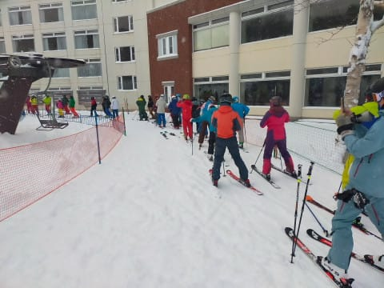
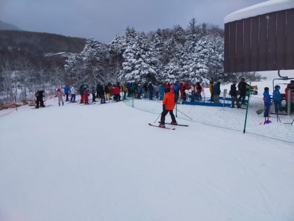
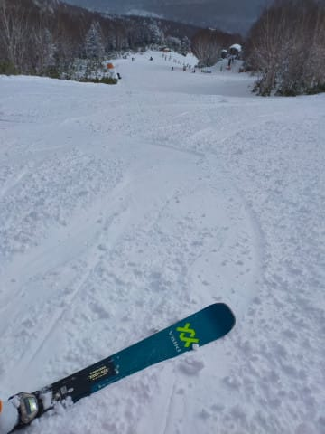
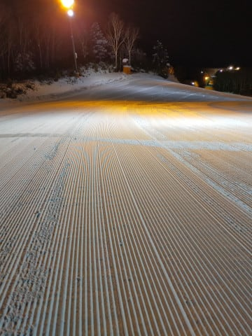

# 2024/12/23(土)の志賀高原，焼額山スキー場は…曇り，時々小雪，時々晴れ．朝までの積雪は50cmで朝はやわらかめ圧雪！午後は荒れ気味(涙)

📅 投稿日時: 2023-12-24 00:43:40

てなことで．

本日も志賀高原にやってきました～！！

予想通り昨晩からの積雪があって，

高速道路は坂城からチェーン規制が入って

いたものの…

高速道路には信州中野まで積雪はほとんどなし．

ただ，中野市街から完全に積雪路で．

志賀高原への登り坂は，トップシーズンの

雪道になってました…

やっと冬が来た感じ！！

で．

今日も8時半のリフト営業前に焼額に到着しま

したが…

残念ながら，本日もゴンドラは動かず（涙）

今日も動くのは第4ロマンスと第2高速の2本

のみで，さらに第2高速側の日帰り駐車場は

除雪が間に合っておらず，日帰り客は

第4ロマンス側からのスタートとなりました．

あさイチに第4ロマンス側に並んでいるのは

この程度で，今日はそんなに混まないかな，

と思わせる出だし

（あとでそれが勘違いだと気づかされますが…)

そして，朝イチは…

昨晩からの50～60cmの積雪があったけど，

圧雪後は雪が降らなかったようで，

バーンはやわらかい新雪がきれいに

圧雪されたシマシマ！！

あさイチは冷え冷え雪が圧雪された，

今シーズン初のトップシーズン並みの

やわらかい最高雪質っ！！！

そして，コース脇は…膝パフの新雪っ！！

…ちょいと重めでしたけど，

今シーズン初のパフパフ新雪っ！！

で，さらに日が差すというボーナスまで！！

（…とはいえ，正直に言うと晴れなくて

いいから，雪がドサドサ降ってほしいんだけど）

日が差す中，今シーズン一番の最高トップシーズン

雪質のゲレンデをかっ飛ばせるこのシアワセ…っ！

…と思ったのも束の間．

営業開始から1時間，9時半過ぎには，

修学旅行の団体さんが出てきて，

ちょっとリフトが混み始めてきたん

ですが（泣）

そして．

リフトが混み始めただけじゃなく，

ゲレンデもかなりの混雑になってきちゃい

ました（涙）

先週ほどではないにしろ，ペアリフトも

混んできたし．

奥志賀高原が開いていないので，

杉山スキースクールの団体さんも大量に

やってきて…

ゲレンデはすごいことに（涙）

ゴンドラが動かず，リフト2本に人が

集中するので…

かなり残念なことに，朝イチの気持ちよさとは

ほど遠いゲレンデの人口密度になっちゃい

ました（激涙）

ただ，団体さんは昼休みには休憩に入るので…

午前中は混んでいたけど，

昼12時前から1時過ぎまでは一気にガラガラの

快適バーンに…！！

昼休みタイムはリフトもガラガラで

いい感じだし…

お昼休みの今のうちに滑っておかねば…！！

さらに．

今日は時折雪がぱらついたり，曇ったりの

タイミングもあったものの．

今日は基本的に晴れベースの天気で…

お昼休みは気持ちいい感じ！！

…だけど．

やっぱり午後になったら…

団体さんがまた出てきて，混雑ゲレンデに

なっちゃいました（泣）

で．

さらに．

やわらかい雪が積もった本日．

午後になると，急斜面ではやわらかい雪が

荒らされて凸凹になってきて…

午後3時ごろには，第2高速がわの唐松

コースは，ところどころ吹っ飛ばされる

凸凹バーンになってきました…（泣）

とはいえ．

第4ロマンス側のサウスコースは，

コース幅が広いからか，

ペアリフトの輸送力が低くて

唐松より人が少なかったからか…

午後になってもそれほど荒れず．

さらに，午後3時を過ぎると，講習も終わり，

団体さんもいなくなって．

コースはまたガラガラコースになり．

営業終了の16時までの最後の1時間は，

それほど荒れてないサウスコース側は，

ペアリフトが遅いという点を我慢すれば，

かなり気持ちよく滑ることができたのでした…

ってなことで．

今日もいつも通り，日が暮れかける16時の

営業終了まで滑り倒したのでした…

しかし．

これで終わらない．

まだ続く．

…そうです．

焼額山スキー場，本日からナイター営業

開始です！！

本来なら，第3高速でナイター営業のはず

でしたが…

第3高速がまだオープンしていない本日．

第4ロマンスでのナイター営業となりましたが．

午後6時からの，圧雪がかけなおされた

シマシマバーンAgainのナイター，今シーズンも

スタートです！！

うほーーーー！！！

シマシマっ！

昨晩から降った冷え冷え雪のピカピカ

圧雪，朝に続いて，本日2度目！！

そして今日からナイターと知らない人が

多いのか，お客さんは10人ちょい位しか

おらず…

ほぼ貸し切りっ！！

いいんですか？？

今シーズンで最高…

というか，トップシーズンでもそうそうない，

やわらかい冷え冷え雪が圧雪された，

最高のシマシマバーン…

何本滑っても，シマシマが消えないほど

人が少ない貸し切り状態で楽しめて，

いいんですか…っ！？？

と．

某スキーショップさんが

私の物欲を刺激するために貸してくれた，

SL競技用の板を思いっきり満喫して．

傾き放題に深周りをしまくった，

超快感ナイターを楽しんできたの

でした…←某スキーショップの術中にはまってないか？？

いや．

よかった．

ナイター，すごいよかった…

でも，18時から20時までの2時間で2800円か…（ちょい涙）

ということで．

昼間の混雑と，午後の唐松コースの

混雑は残念だったけど．

雪質は良く，天気も晴れベースで快適で．

サウスコースは終日いいバーンコンディション

だったし．

ナイターは最高だったし．

結構楽しめた本日だったのでした…

でも．

ゴンドラが動いてほしい．

どうやら本日積もった雪は軽すぎて，

60cm積もったけど，圧雪すると

ほとんど厚みがないペタンコになっちゃった

みたいで…

ゴンドラが動くには，もうひと降り必要らしく．よ

残念ながら，明日の日曜もゴンドラが動かない

ようです（泣）

…果たして，ゴンドラが動くのはいつの日に

なることやら…（涙）

ちなみに，奥志賀は明日から第2高速ペアの

エキスパート，第3高速ペア，第4ペアが

滑れるようになるようです…

とりあえず私は，明日も2高と4ロマのみの

焼額を滑っている予定です…

## 💬 コメント一覧

### 💬 コメント by (アリス)
**タイトル**: Unknown
**投稿日**: 2023-12-24 07:24:47

S様

ナイターはストレスなしで最高ですね☺

しかも貸し切り同然。

私は今回失敗ばかり

①ホテル敷地駐車場満車でパノラマ（朝一動けない）　

②ワックスはガリウムピンク

反省です。

Sさんの車ですが、3◯◯◯3のレボーグですか?

昨日私の車の隣りにありましたので。

今日は、ファミリークワッドとダイヤクワッドが動くらしいので午後からヤケビに行ってみます。

### 💬 コメント by (愛読者)
**タイトル**: Unknown
**投稿日**: 2023-12-24 12:43:38

いきなりSL板ですか、、、となるとブーツは、くたびれた方でなくおニューのフォーミングしたほうですね。。板ももしかして来シーズン仕様のものですか?両方の感想をさわりだけも教えてください。こちらは、ただの風邪で初滑りにいけず、指をくわえてＳさんのblogを見ています。

### 💬 コメント by (人混みに怯える田舎のネズミ)
**タイトル**: Unknown
**投稿日**: 2023-12-24 15:23:22

「お客様の中に西館山を滑った勇者な特派員はいらっしゃいませんか？」

西館山下部のライブカメラは空いていた。

### 💬 コメント by (レインボー76)
**タイトル**: Unknown
**投稿日**: 2023-12-24 15:51:44

日曜日の志賀高原情報

朝の上林-6℃、蓮池-8℃。晴れて爽やかな日。

奥志賀ゴンドラに初乗車。やっぱり速い、快適。三高の雪が極上過ぎて、新雪非圧雪のエキスパートは回避。エキスパ回しの師匠らは初パウダーの快感に夢中で、足がヘロヘロになって早あがり。

三高回しのレインボー隊は、あまりの快感にエキスパへ行けない。極楽ってこういう所なのかなあ？

流石の流石の天然雪100%。年間100日は滑る私にとってもベストの環境。

10時を過ぎると混んできたので、ためらわずに終了。ダウンヒルが開かないので、ゴンドラで下山。

ヤケビも一ノ瀬も混んでたので、今日は奥志賀に軍配！

### 💬 コメント by (レインボー76)
**タイトル**: Unknown
**投稿日**: 2023-12-24 22:32:43

田舎のネズミさん

帰り(昼前)に見た感じでは、

西舘の第一だけ動いていて、メインは圧雪されて、非圧雪はロープくぐりのあとがいくつもありましたよ。

### 💬 コメント by (Skier_S)
**タイトル**: 一体いつ雪が降るのか…
**投稿日**: 2023-12-25 01:54:50

＞アリスさま

あら．そうです．私の車の横に止めてらしたんですね…！

午後は焼額滑ってらっしゃいましたでしょうか？

タイミングが合わなかったのか，発見できませんでした…

ワックスはこの時期，雪温低めをおススメします！

＞愛読者さま

正解です．ブーツはフレックス150のフォーミングした方です…！

板は今シーズンモデルです．さすがにまだ来シーズンモデルは試乗板が出てませんので…

HEADフォーミングはいいですよ～！全人類買うべきだと思いました．

SL板は…雪が柔らかすぎて本領を発揮できない感じでしたが，かなりエグい深回りが

できる板でした．

＞人混みに怯える田舎のネズミさま

残念ながら，私は西舘を滑ってませんが…

もし滑っていた人がいれば，コメントを！

＞レインボー76さま

今日もお世話になりました～！！

奥志賀よかったみたいですね…

エキスパートの新雪そこまでよかったとは．行けばよかった…

