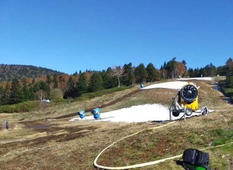
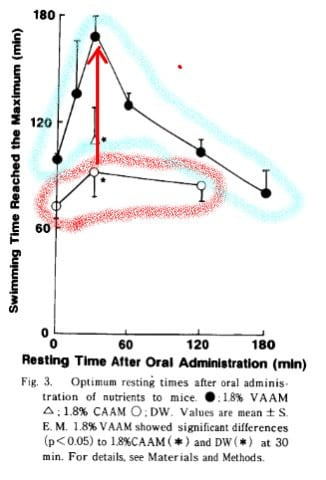
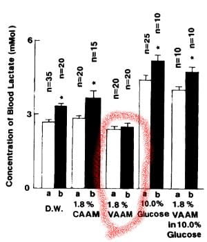
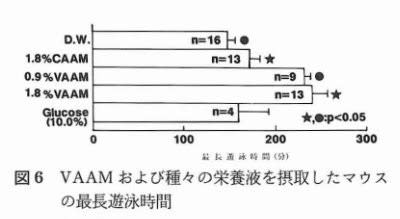
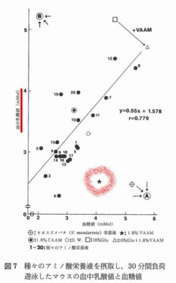
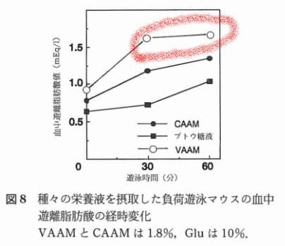
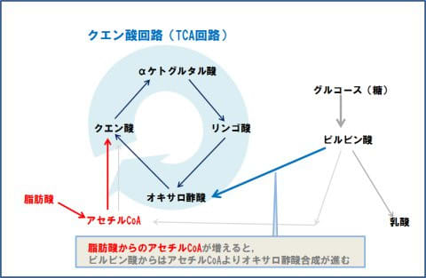

# なぜ登山でVAAMを試してみようと思ったのか？その6…え？VAAMって，スズメバチに効くから人体にも効いてるわけじゃない？？

📅 投稿日時: 2022-10-21 04:53:55

えー．

本日．

というか，日付が変わっているので，

もう昨日ですね…

なんだか，一部の志賀高原特派員．

志賀高原に対する忠誠心と，報告せねば

という義務感があまりにも高すぎたのか…

人工降雪機が動いたという横手山を

見に行ったようです…！！

いや．

昼間になっても雪が消えずに残ってますね…

間違いなく，アイスクラッシュではない

人工降雪では，今シーズン日本一早くに

積もった雪です！！！

ってなことで．

横手も人工雪が積もり始めましたし．

イエティもついにオープン日になったし．

スキーシーズンが始まりますよ～！！！

という前フリのあとは，今日のメイン

テーマへ…←いつも言ってるけど，スキーネタのここまでが本題で，むしろこのあとがおまけなのでは…？

さぁ．

読者を振り落とすことで有名な（？）

VAAMの解析ネタです～！！

とりあえず，「なぜ？」と思ったら

口コミやまとめサイト等の根拠のない

情報は信頼できず．

原典を当たらないと気が済まない

という，めんどくさい性格の私．

この記事を書くために，全く専門外の論文やら

何やらを読み漁ってたわけですが…

今回は確実に読者を振り切っていきます．

…なんとか分かりやすくまとめるよう

努力したのですが…

はい．

今回は，読みたい人だけ読んでください！（開き直り）

ってなことで．

[前回，人体の場合のクエン酸回路周りの
図を書いてみて](e52cdbd4e344d2974e9515bf33dfb5ac1.md)．

VAAMの元となった，スズメバチの

17種類のアミノ酸ミックスって，

人体に必要なアミノ酸と違うのでは…？

ということに気づいたわけですが．

とりあえず，VAAMの17種類のアミノ酸

ミックスが効くという論文を探してみると…

まず見つかったのがこいつ．

…これが，[以前の記事](e57f7e152440954d9758a907381a39e42.md)で紹介した，理研の

阿部先生が筆頭著者となっている原著ですね．

[Abe T. et al., "Effects of Vespa Amino Acid Mixture (VAAM)Isolated from Hornet Larval Saliva
and Modified VAAM Nutrients on Endurance Exercise in Swimming Mice
- Improvement in Performance and Changes of Blood Lactat."
Jpn. J. Phys. Fitness Sports Med. 1995, 44:225-238](https://www.jstage.jst.go.jp/article/jspfsm1949/44/2/44_2_225/_pdf/-char/ja)

（https://www.jstage.jst.go.jp/article/jspfsm1949/44/2/44_2_225/_pdf/-char/ja）

人間ではなく，マウスにVAAMを与えたら

効き目があったよ！って論文ですが．

とりあえず，ざっと見てみると…

VAAMを飲ませた30分後に泳がせると，

蒸留水だけを飲ませた場合のに比べて

倍近い時間泳げたよ～！！

（上記論文より引用，一部加筆）

ってなことですが．

上の図の水色のVAAMを与えた場合と，

赤色の蒸留水を与えた場合

を比べると．

赤矢印の部分，与えて30分後のところ，

泳げた時間が確かに一気に伸びて

ます…！！

そしてさらに．

泳いだ後の血中乳酸値はVAAMを与えた

場合が明らかに低くなったよ！

ってことですが…

（上記論文より引用，一部加筆）

上の図中で，赤く囲ったVAAMを与えた

場合の血中乳酸値を見ると．

運動前の白棒，運動後の黒棒ともに

他より低くなっており．

また，運動前後での変化も小さく

なってます…

で．最後の考察を読んでみると．

　これは，運動で急激に減少するアミノ酸をVAAMが

　補填してくれるからでは？

みたいな論調になってます…

ふむ．

以前紹介した[アミノ酸エンジン仮説](e57f7e152440954d9758a907381a39e42.md)が

正しいとすると．

運動で分解されちゃう，クエン酸回路を

上手く動かすのに必要なアミノ酸が

VAAMによって補給されるんだな…？

と思いながら読んだわけですが．

まぁ，人体じゃなく，マウスで実験した

結果とはいえ，マウスも哺乳類で，

昆虫と違ってほぼ人体と同じ代謝機構なので．

これなら，人体でも同じ効果があると

言えるってことなのかな…？？？

と思いつつ，さらに論文を探すと．

上の論文にいくつかの情報を

付け加えた，解説記事っぽい感じのが

「ミツバチ科学」って雑誌に載ってますね…．

[阿部　岳
スズメバチ栄養液 の運動への作用
ミツバチ科学16(1):p.1-8 (1995)](https://www.google.com/url?sa=t&rct=j&q=&esrc=s&source=web&cd=&cad=rja&uact=8&ved=2ahUKEwjIoZzi07X6AhUQ62EKHTahCAsQFnoECA0QAQ&url=https%3A%2F%2Ftamagawa.repo.nii.ac.jp%2F%3Faction%3Drepository_action_common_download%26item_id%3D944%26item_no%3D1%26attribute_id%3D8%26file_no%3D1&usg=AOvVaw3fd1LNbnxNBApAOX-EkMPb)

これを読むと．

VAAMを飲ませると，泳ぐ時間が伸びたよ～

（上記論文より引用）

VAAMを飲ませた方が乳酸値も低かったよ～！

（上記論文より引用，一部加筆）

って書かれていて．

ここまではだいたい前の論文と同じ

内容ですね…

さらにちょっと長いけど，引用すると．

ヒトでも激しい，あるいは長時間の運動の

あとは分枝アミノ酸やセリン, スレオニン,

 グリシン, アラニン, チロシンなどが著しく

減少するが…（略）…

運動ストレスに伴う血液中のアミノ酸,

特に筋肉で特異的にエネルギー源として用いら

れる分枝アミノ酸を中心に多くのアミノ酸の

減少をVAAMは抑制する

と書かれていて…これはすなわち．

運動で分解されちゃう，クエン酸回路を

上手く動かすのに必要なアミノ酸が

VAAMによって補給される

のではなく．

血中アミノ酸の運動に伴うインバランスを

補正する作用は，運動によって起こる筋細胞

の破壊防止を示唆している．

ってことが書かれてます…

なに？？

VAAMのアミノ酸バランス補正は，筋破壊を

防ぐ効果であり，クエン酸回路をサポート

するわけではないということか？？？

まぁ，筋破壊を防ぐだけでも十分な

効果はあるわけですが…

だとすると，VAAMはクエン酸回路を

活性化させる効果は無いということに

なるんだけど…？？

と思いながらさらに読み進めると…

この論文では，他に

VAAMを飲むと，遊離脂肪酸が増えるよ

ってのが新たに追加されてます…

（上記論文より引用，一部加筆）

赤く囲ったVAAMを投与した場合では，

VAAMを投与しなかった場合と比べ

明らかに血中遊離脂肪酸が多く．

脂肪が分解されてエネルギー源になって

いることが分かります！

さらに読み進めていくと…

このような脂肪の分解促進は

ノルアドレナリンやアドレナリンなどの

ホルモンの増加がもたらしていたことが

同様の遊泳実験で明らかになった

って書かれていて…

ふむ？ホルモン？

もう少し読んでいくと…

VAAMは吸収される腸,あるいは代謝される

肝臓や脳でその組成にもとずいたアミノ酸の

種頬と量のパターンが認識され, このような

シグナリングをもとにした高次ホルモンの

合成と分泌の促進を促すと推定した

…（途中略）…

その結果, カテコールアミンなどの低次の

ホルモンを誘導し, さらにホルモン感受性

リパーゼを活性化する．

活性化した酵素は脂肪の分解を促進し,

 グリセロールと脂肪酸を増加する．

ってことですが．

長かったので，これを簡単に書くと．

アミノ酸そのものが体中に行き渡って

脂肪分解を促すんじゃなくて．

アミノ酸がホルモン分泌を促して，

そのホルモンが脂肪の分解を

促進する

ってことのようです…

そして，

ホルモンの影響で脂肪酸が増え，

アセチルCoAが増えると．

下の図にあるように…

ピルビン酸⇒アセチルCoAの変化より

ピルビン酸⇒オキサロ酢酸への

変化の方が促進されて，クエン酸回路が

ガンガン回るよ…！

ってことらしく．

つまり．

アミノ酸がホルモン分泌促進

⇒ホルモンが脂肪分解促進

⇒脂肪分解によってアセチルCoA増加

⇒アセチルCoAが増加したので，

　糖を分解して作られたピルビン酸から

　アセチルCoAへの合成が抑えられる

⇒ピルビン酸からはアセチルCoAの代わりに

　クエン酸回路に必要なオキサロ酢酸に

　変化するようになり，クエン酸

　回路が元気に回り始める

という，風が吹けば桶屋が儲かる的な

仕掛けみたいです…

…これ．

無脊椎動物のスズメバチでは，

哺乳類の肝臓や脳が作用するホルモン分泌の

仕掛けは無いから…

もしかしたら．

VAAMの元となった，スズメバチの

17種類のアミノ酸ミックスって，

人体に必要なアミノ酸と違う…

ってだけではなく．

そもそもスズメバチと人体では，全く違う理由で

たまたま同じアミノ酸ミックスが効いていた

ってことなんじゃない…？？

ということに．

この分野に全く素人ながら，

いろいろ論文やらを読んで気づき始めて

きた，Skier_Sなのだった…

（続く．まだ続く．読む人はもういないだろうけど[続く](ee65fe930d3c233bbbac696553903c397.md)）

…ここまで読んだ人はいないってほうに100カノッサ

## 💬 コメント一覧

### 💬 コメント by (副院長)
**タイトル**: Unknown
**投稿日**: 2022-10-21 08:44:01

読みます。VAAMも、お天気解説も　元データを見ながら、読みます。こんなにあっちこっちのページ見ながら、読み進むブログあまりないです。楽しみにしています。

### 💬 コメント by (Skier_S)
**タイトル**: ＞副院長さま
**投稿日**: 2022-10-22 01:20:59

え？お天気解説まで元データを見ながら読んでらっしゃるんですね…（感動）

今回は私の専門分野じゃない記事を書いているので，なかなか手ごわかったです．

解説記事としてこれだけの記事を仕事で書いたら原稿料もらえるレベルだと思ってます（笑）

### 💬 コメント by (一昨年から読んでいる者です)
**タイトル**: Unknown
**投稿日**: 2022-10-23 10:27:15

まとめて6シリーズ読みました。続きとヒトでのデータが気になり探しそうです

### 💬 コメント by (Skier_S)
**タイトル**: ＞一昨年から読んでいる者さま
**投稿日**: 2022-10-24 03:16:57

読んでいただいてありがとうございます～！！

このシリーズ，あと2回続く予定ですが…

次回は人体での論文ですよ～！！

