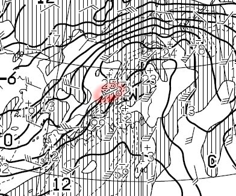

# 12月23日からの3連休までに，高温で雪が解けるのか…？？スキー場は壊滅するのか？？天気図を読み解いてみた

📅 投稿日時: 2016-12-20 01:38:13

🏷️ カテゴリ: [スキー天気予想](c6554f5c3c106093b511a8daae23757e8.md)

ということで．

今週は，かねてから予告したように．

スキー場にとって壊滅的な気温＆雨に

なりそうな天気図だったのですが．

…22日までの詳細天気図が出たので．

果たして，3連休まで雪がもつのか？？

一体どの程度の雨が降りそうなのか？？

といったあたりを．

天気図から読み解いてみましょうか…

＃今日この記事を書くため，

＃昨日は必死に速報版じゃないレポートを書いたという…

＃えらい！自分！←自分で誉めてどうする

えー．

まず．20日の火曜，朝9時の850hpa図ですが．

あーー．

ダメだ（涙）．

0℃線は，信州より北に上がってますね…

でも，[先日の予想段階](e239f4764f56d43406c70bc5fe31fb9fe.md)での天気図だと，

20日に北海道まで0℃線が上がりそうだったのに比べれば．

まだマシか…

20日の地上天気図はこんな感じなので．

うーーーん．

ギリギリ20日は，雨に祟られずには済みそう…

そして，21日の水曜，朝9時の850hpa図ですが…

あう．赤くマークした0℃線，北海道付近まで北上してます（涙）．

これは，[先日の予想段階](e239f4764f56d43406c70bc5fe31fb9fe.md)とほぼ同じ

レベルですね…

これは，スキー場でも降れば確実に雨の気温ですが．

地上天気図を見ると…

こんな感じなので．

うーん．

なんとか．

何とか21日も，雨にならずに済みそう…

そして．

3連休の前日，22日木曜朝9時の850hpa気温図は…

だめだ～！

やはり，0℃線は津軽海峡付近…

で．

地上天気図は…

はうぁ（屍）．

ダメだ…

ダメだよ，これは．

22日の朝から．

スキー場は高温の雨に襲われそうですね…

この日，木曜の夜9時の850hpa気温図を見ると．

あぁ…0℃線は相変わらず北海道近辺．

志賀高原には，+9℃線が近づきつつあるレベルで．

この日は，標高2000mクラスでも気温は

+5度を超えそう（涙）．

そして．

なんだか，低気圧がすごく発達してるのですが…

いやーーダメだ（涙）．

これは…

22日は終日，高温の雨っぽい…

それどころか．

この図を拡大すると．

すごい強烈な南風で．

特に赤くマークしたところ，風速50ノット！！（涙）

風速25mを超えてます…台風並みの南風です（泣）．

ダメです．

22日．夜明け前から夜遅くまで．台風並みの高温南風＆雨です…（死）

どうしたこった…

ただし．

志賀高原は．

「強い南風だと雨が降りにくい」

というパターンがあるので．

強風・高温になるかもしれないけど．

志賀高原ではそれほどひどい雨にならずに済むかも？？

で．

3連休の天気を見てみると．

3連休初日，23日の夜9時の850hpa予想図は…

をを！

0℃線が本州の南側にまで下がるよ！！

地上天気図を見ると．

すさまじい冬型…

これは，荒れそうです…

3連休初日．

朝から雨が雪に変わり．

すごい吹雪の荒れ荒れ天気になりそう…

雪が解けた後に冷えるので，コースはアイスバーンか？？

そのあと，24，25日は．

まぁ，そこそこ冷えて．

24日は小雪，25日は晴れかな…

ということで．

3連休までの天気をまとめると

20日（火）：気温はちょっと上がるけど，雨にならない．

　雪は何とかもつか．

21日（水）：気温はそこそこ上がる．昼間，志賀高原で+5度程度か？

　雲が多いので，日差しで雪が解けないのが救いか…

22日（木）：未明から雨．終日雨．2000mクラスでも+5度以上，

　標高の低いスキー場は+10℃近くの高温の強風が

　吹き荒れ，ゴンドラ＆リフトは運転見合わせ続出．

　夜中になっても雨は降り続け，雪はかなりダメージを

　受ける．

　ただ，真南の風なので，志賀高原はすごいザーザーぶり

　にならず，ポツポツ程度の降り．時折強く降るタイミングも．

って感じです．

今のところ，23，24日は雪になり，少しは回復しそうですが．

23日の何時ごろに雨が雪に変わるか，まだ現段階では

読めないところ．

＃でも，23日は激荒れの天気なのは間違いなさそう

ということで．

この，22日．

この22日さえ乗り切れば，何とかなりそうな感じなのですが…

22日，激烈なザーザー降りで，スキー場は壊滅するのか…？？

それとも，南風＆高温にはなるけど，ポツポツ程度の降りで

ゲレンデは壊滅せずに済むのか…？？

それは，これからの．

スキーヤーの皆さんの熱い思いを結集した，

「雨よ降るな降るな踊り」

の出来に掛かっているのだ…っ！！！！！←なんだか，踊りが変わってないか？

## 💬 コメント一覧

### 💬 コメント by (たにむらこうせつ)
**タイトル**: こんにちは
**投稿日**: 2016-12-20 13:04:55

天気図で天気予想出来るんですか･･･凄いですね！

天気予報士になれますね。

尊敬です(^-^)

みんなのブログからきました。

詩を書いています。

### 💬 コメント by (かず)
**タイトル**: 日曜ありがとうございました
**投稿日**: 2016-12-20 13:18:52

3連休は避けます　年末年始毎日志賀なので　またよろしくお願いします　腰パウ期待してますがどうでしょう…

### 💬 コメント by (名無し)
**タイトル**: Unknown
**投稿日**: 2016-12-20 15:53:24

ブログ拝見してます。

年末、志賀高原へ行くので参考にさせて頂いております。

### 💬 コメント by (Skier_S)
**タイトル**: コメント返事遅くなりました…すみません(;_;)
**投稿日**: 2016-12-21 15:49:01

>たにむらこうせつさま

あら。詩をお書きになるのですね…(^^)

私はこのblogを見ておわかりのように、

究極の理系人間で文学からは程遠い人間なので…

天気図を読むくらいしか芸がないです(笑)

>かずさま

日曜は子連れだったので、ゆっくりお相手できずすみませんでした…

また年末年始によろしくお願いします！

>名無しさま

年末志賀ですか！

それまでには、全面オープンのグッドコンディションになると強く信じているのですが…

明日の雨がひどくならないことを祈るばかりです。

