# 2024/12/15(日)の志賀高原焼額山スキー場の詳細レポート！…天気いい冷え冷えのグッドコンディション！ゴンドラもそれほど混まず，いい一日！

📅 投稿日時: 2024-12-18 01:55:25

えー．

我がホームゲレンデの焼額山．

19日の木曜から第2高速が動き，

唐松コースが滑れるようです！！

…そして，21日の土曜からは一ノ瀬

山の神も動いて，焼額と一ノ瀬が

繋がるようですね…！！！

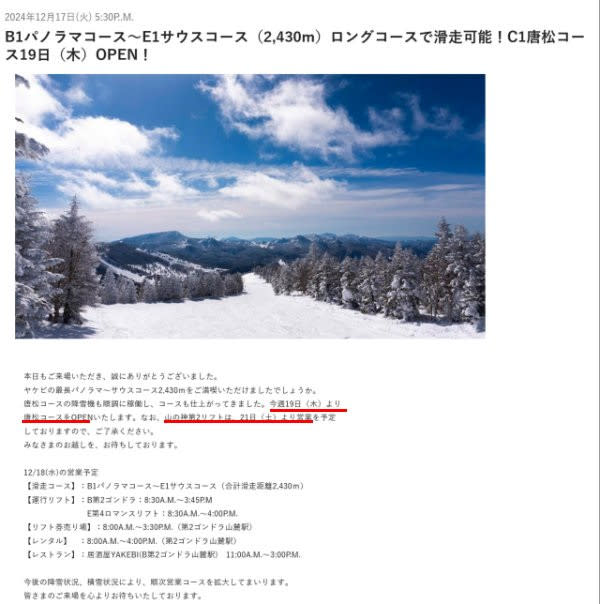

（[焼額山スキー場ホームページ](https://www.princehotels.co.jp/ski/shiga/winter/)より）

おそらく21日には，焼額は第1ゴンドラも

動き出すと思いますし．

奥志賀ゴンドラも動くはずだし，

山の神が動くということはダイヤも動く

だろうから…

今週末は，焼額は第1・第2ゴンドラと

第2高速が動きかなり広い範囲が滑れる

ようになるうえに，奥志賀とも

一ノ瀬ともつながります！！

今週末からは，ほぼトップシーズン並みの

エリアが滑れそうですね…！！

ってなことで．

昨日は，志賀高原レポートを途中まで

書きかけたところで気を失ってしまい，

気づいたら朝というすごい悲しい状況

だったので，日曜のレポートが投稿

できませんでしたが…

いまさら感もありますが，今日は日曜

深夜に速報レポートした日曜の焼額山の

詳細レポートです！！

まず…

日曜の朝は，一晩の積雪が1-2cmくらいしか

なかったのですが…

でも，昨日までの雪で，道は本格的雪道

なので，ご注意を！！

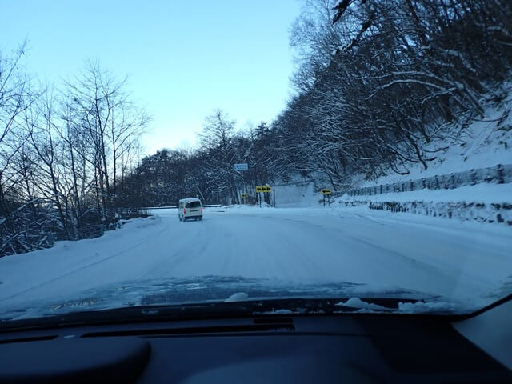

そして，焼額に到着すると…

空は雲一つない晴天！！

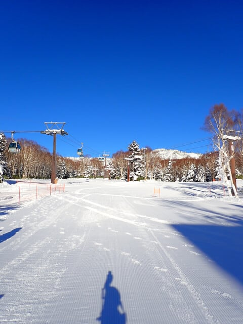

いつも通り，8:30のゴンドラ営業開始

に間に合うようにゴンドラの列につきますが…

今日もそこそこ人がいますね…

まぁ，でもゴンドラにここまで並ぶのは朝イチだけ．

午前中は最大でもゲートをちょっと超えるくらい，

午後はほぼ飛び乗りというガラガラな

日曜日でした…

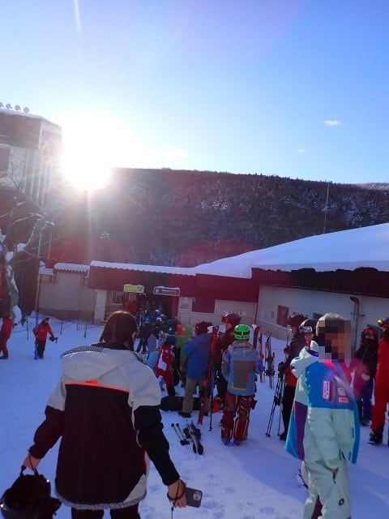

ゴンドラに乗って山頂に着くと…

気温は-9℃．

水曜の予想の-8℃とほぼ一致！

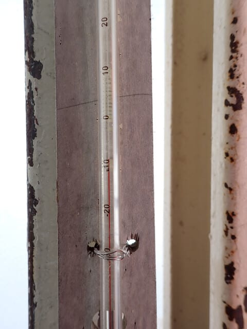

そして…

朝イチの晴天ゲレンデへ飛び込みます！！

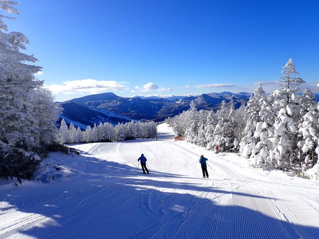

うほーーーー！！

シマシマッ！！

シマシマだ！

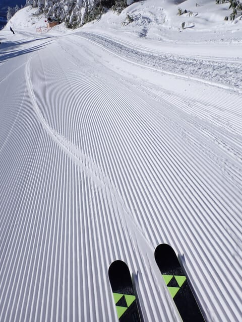

もう，今シーズンではまだ経験していない，

晴天シマシマに，大興奮…！！

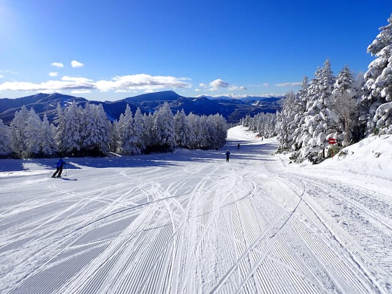

朝イチは人も少なく，ゲレンデも締まり気味で．

うおおおーーー

この朝イチ1本だけでも，来る価値があった

よ…！←かといって，この1本で帰れと言われたら暴れるでしょ

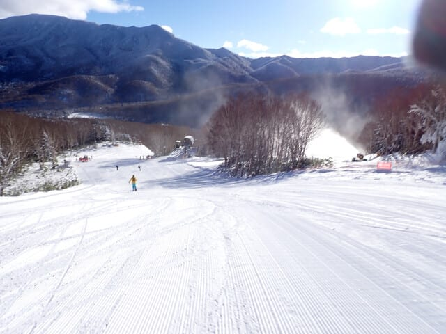

ってな感じで．朝イチは最高でしたが…

気温は結構冷えているものの土曜と違って

新たな積雪がほとんどなかった日曜は，

雪が締まり気味だたこともあり，

土曜のようにすぐ荒れてくることはなく．

昼になってもいい感じの締まり気味

の圧雪が滑れます…！！

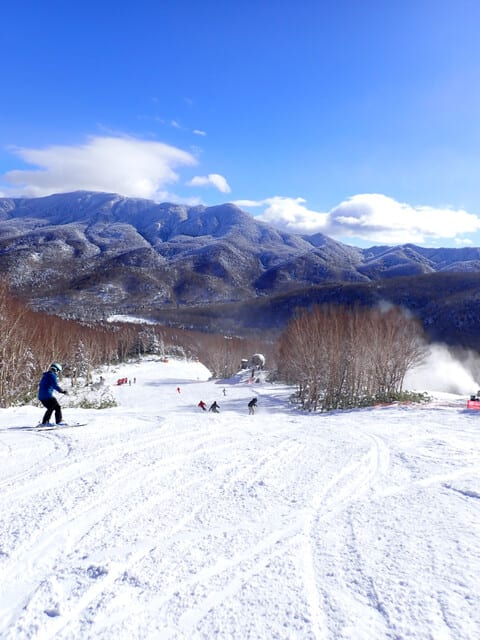

午前中は晴れていたものの，大阪府の指導員

研修会でゲレンデが混み気味で，ちょっと

惜しい感じもあったけど．

昼頃になると，研修会も終わり，人が減って

滑りやすくなりました…！

…でも．昼頃になると，ちょっと雪雲が

飛ぶタイミングもあり，昼過ぎまでは

短時間の間に降ったりやんだりを繰り返し

ていました…

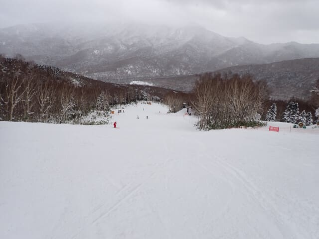

とはいえ．

一旦降り始めた雪は，意外と短時間で

止んで．

また空が明るくなってきたと思ったら…

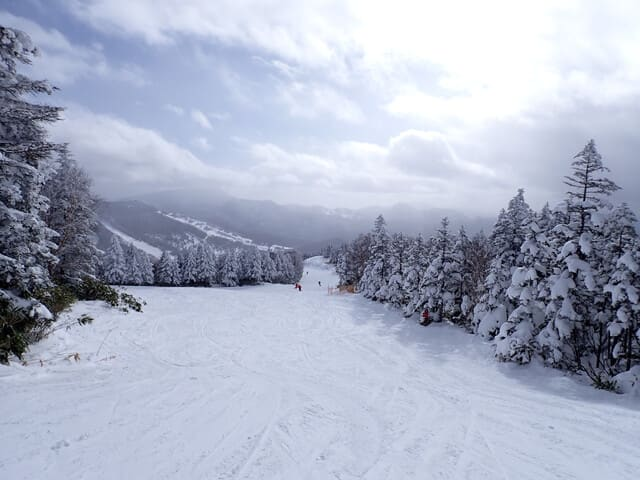

そのあとは，また青空が戻ってきました！

そして，午後はバーンもガラガラ！！

ゴンドラ待ちも午後はほぼなくなりました！

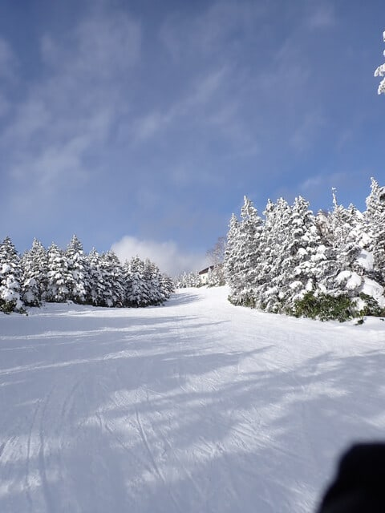

いやー．

天気は復活しても，午後になっても冷え冷えで

最高気温は-4℃程度までしか上がらず．

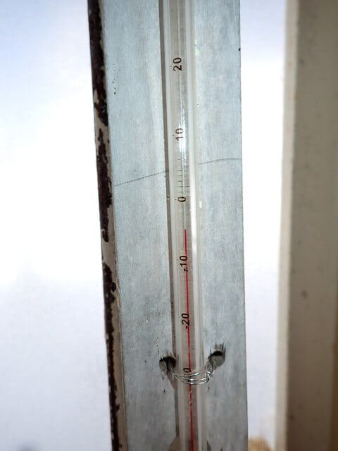

そのおかげで，午後になっても雪質は

良いままで．

いい感じのガラガラフラットバーンが

滑れます！

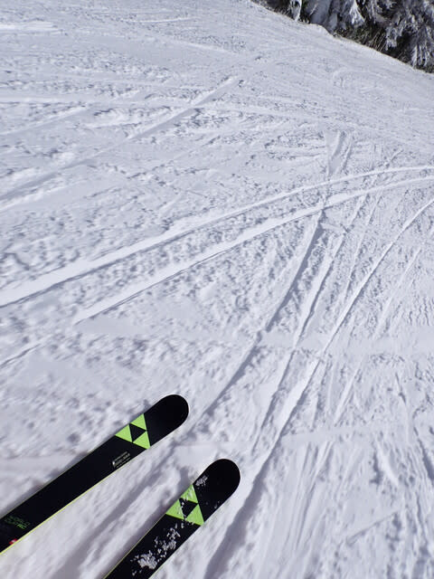

さすがに急斜面は，午後はちょっと荒れて

きて凸凹になり，バーンの硬めの下地がでて

きたところもあったけど…

荒れていたのは急斜面だけ．

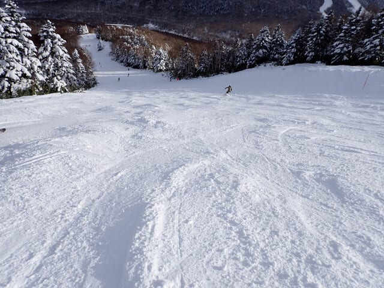

見ての通り，急斜面じゃないバーンは

全くバーンが荒れてないフラットだし．

天気は晴れて，景色がいい冷え冷え雪が

滑れて…

滑れるコースが少ない以外は，もうほぼ

トップシーズン並みですね！

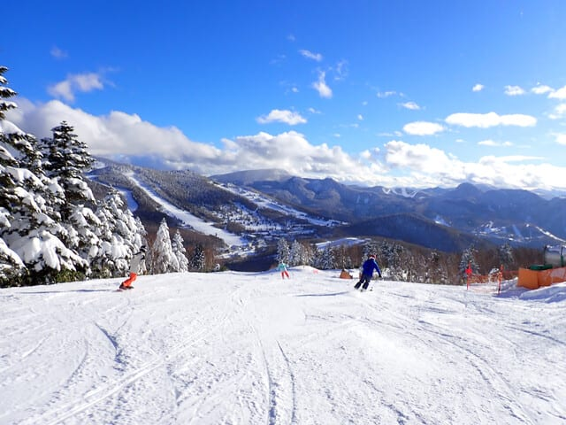

ってなことで．

日が暮れ始め，ほぼ人がいなくなった

バーンを好き放題大回りしまくって…

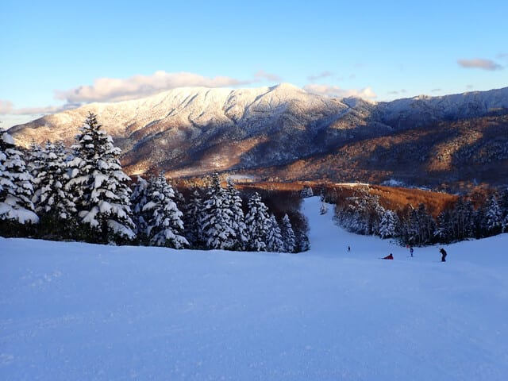

15:45のラストゴンドラに乗り，その後

16時の第4ロマンスの最後に飛び乗って．

日が暮れ始めるまで滑り続け．

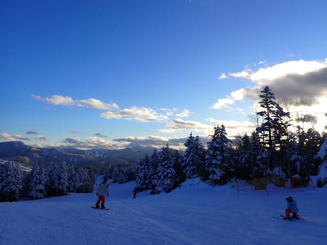

今日もしっかり営業終了まで，

また昼休みも取る時間も惜しいいい

コンディションだったので，いつも通り

昼休みも取らずに，ひたすら大回り板で

一日滑り倒したのでした…

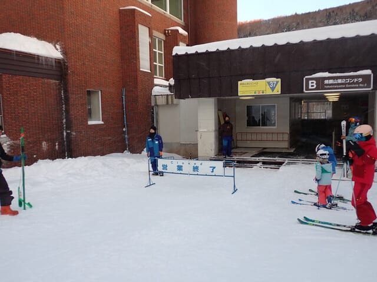

いやーー．

この12月は冷え続けていい感じ…

この先も冷え続けるようだし．

明日水曜にちょっと降ったら，

志賀高原は木・金と雪は積もらなさそう

だけど．

また21，22日の土日はそこそこ降りそう

なので．

この週末もいい感じの冷え冷え週末に

なりそうですよ～！！

## 💬 コメント一覧

### 💬 コメント by (レインボー77)
**タイトル**: Unknown
**投稿日**: 2024-12-18 07:20:43

火曜日の志賀高原情報

朝の蓮池-5℃。今日も絶好調。パノラマの壁も状態が上向き、曇天で好条件維持。昼まで休まず14本、だんだんレインボーまで滑る体力ができてきています。

### 💬 コメント by (レインボー77)
**タイトル**: Unknown
**投稿日**: 2024-12-18 12:19:31

水曜日の志賀高原情報

硬いまっ平らなバーンにさらさらパウダー5センチ。夢のような極楽バーンです。

しかしこんな幸せにはいつか終わりが訪れるのが世の常。10時頃から人が増えてバーンも荒れはじめたので、11時終了。

明日は第二高速を動かしてくれるらしいので、混雑も緩和されて、またまたエス様の健康に害を及ぼしそうな一日となりそうです。

### 💬 コメント by (アリス)
**タイトル**: Unknown
**投稿日**: 2024-12-18 16:15:16

skier_s様

お世話になっております。

本日から7ケ月ぶりの志賀高原に参戦しました。

朝一出遅れましたが、二ゴン駐車場で目の前に鮎号発見😀

レインボーさんとは入れ違いかな？

ゴンドラ改札、出口、滑り出し誰も居ません。

初滑りで、パウダー、貸し切り同然で15時30分まで2ゴンぐるぐるしてました。

これってシアワセ一杯ですね。

明日は二高と唐松ですね😀

やはり二ゴン朝一でシマシマのパノラマ〜サウス狙いで行きます。

### 💬 コメント by (Skier_S)
**タイトル**: 明日から第2高速運転！
**投稿日**: 2024-12-19 00:27:11

＞レインボー77さま

今日は5cmしか積もらなかったですか…もう少し積もってほしいところ…

でも，明日から第2高速運転ですね．唐松コースどんなだったかまた教えてください！

＞アリスさま

志賀高原へお帰りなさい！

ひたすら2ゴングルグルですか．コンディションよかったみたいですね…うらやましい…

明日からは第2高速も楽しんできてください！

