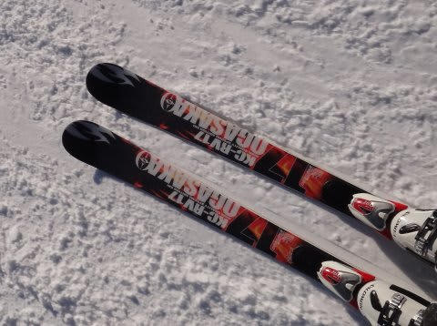

# 新しい仲間が増えたよ…’09 Ogasaka KC-RV17

📅 投稿日時: 2012-01-12 02:16:51

えーっと．

私の今シーズンの相棒は，基本的に昨シーズンと変わらず，

シーズンイン・春スキーなど雪の悪いとき用：'09 SALOMON DEMO X3

朝イチ焼額大回り用：'07 NORDICA Dobermann GS pro

大回り系：'10 ATOMIC D2 DEMO TypeA

小回り系：'11 SALOMON 24hours LM

という4セット体制だったのですが…

なぜか．今シーズンに入って．

「この板使わないからあげる」

ということで．

とある方から，中古の'09 OGASAKA KC-RV17をもらってしまいました…

昨シーズンまで3シーズン使っていたとはいえ，せいぜい使ったのは

トータル30～40日程度らしく．

それも，一日の滑走量は私の半分程度でしょうから，私が15～20日程度

使ったくらいの感じですかね～．

はっきり言って，板の張りや返りはほとんど新品．

…こ，こんなにいい板もらっていいんですか？？

と思いつつ，ありがたくいただいたわけですが…

さて．

この板の基本スペックは．

R17の大回りベースオールラウンド．

長さは170cm．

FM600プレートがついてます．

実際滑ってみると…

うむ．

面白い．

はっきり言って，「カービング」的な，サイドカーブに乗っただけの

滑り方じゃこの板の面白みは分からない．

ずらして積極的に迎え角を作ってやると，

すごいよく回ります．

なんというか，迎え角を作ったときの旋回力の出方が絶妙．

トップからテールまでのしっかりとしたグリップ感があるのに，

きれいなドリフトアングルで板のRよりずっと小さく回り込めます．

上体のひねりを使ってこの回旋を上手く開放して，

次の谷回りにつなげれば，大回りベースの板と思えないほど

気持ちよく小回りができます．

よく回る．ホントに大回りベースか？？

R=12のSALOMONのLMより，小回りやりやすいんじゃないか？？

＃この板の間違った使い方かも…

板のフレックス自体は，比較的しっかりめだけど，

FM600プレートのおかげか，「しっとり」した感じの足応え．

スピードを出すと比較的たわむので，トップスピードだと

ミドルターンになっちゃいますね…

ということで，大回りベースっていってますが，私にとっては

ミドル～ショートの板に感じます．

ズラシのコントロールが快適なので，不整地や荒れた斜面もOK.

この板，おそらくエッジはルーズ目に仕上げて，あえてグリップを

求めない方がいい気がします．

なんにしろ，ハイスピードでも，カービングで滑るよりも

ずらしで迎え角を作って操作していく「マニュアル操作」的な動きが面白い．

ホントに良く回る．

回ってきた板が体の下を通り過ぎていき，谷回りで板が体から

遠く離れていき，それがまた体の下に戻ってくる…という，

快楽のミドルターンができます．

うーーん．この板．ホントに大回り用なんだろうか？？

軽快さでもLMより軽いし…

とりあえず，私の板のラインナップに，

大回り用

小回り用

に加え，

中回り用

が追加されたのでした…

＃スキー場に何セット板をもっていくつもりだ？
