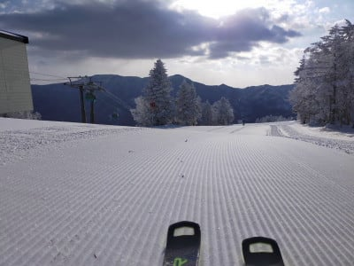

# 2月4日の志賀高原スキー場は晴れのち吹雪！そして2022シーズンのロシニョール板の写真＆情報

📅 投稿日時: 2021-02-05 03:24:02

🏷️ カテゴリ: [日記](cc4b5682fb7b8b144980957a978653fb0.md)

えー．

本日も志賀高原特派員情報が送られてきた

わけですが．

…本日，朝から曇りで，時折風＆雪…

と予想したところ．

なんと．朝はちょっと雲があったものの，晴れ！

そして，昨日からの積雪は全く無く，

あさイチのバーンはシマシマ！！

(積雪が無かった今日は，シマシマバーンの上におこみん人形が…）

なんだか，最近はこのおこみん人形を見ないと

落ち着かない感じになってきましたね(笑)．

あさイチの気温は-12℃と予想より冷えていて．

そして…

これ，最高のシマシマバーンじゃないですか！

かなり冷えて締まり気味の最高に美味な

シマシマバーンだったようです！

うがーーー！

晴れた日のこんな無人シマシマバーン，滑りたい…！

そして，朝9時ごろには雲一つない，

すっきり超晴天になり…

「終日曇り，時折雪がぱらつく．」

という予想，見事外したかな…？

と思いましたが…

ぐおおおおお！

こんな晴天のシマシマバーンを見たら，

今すぐにでも飛んでいきたい！！

…しかし．

10時前には雲が広がり始め…

10時過ぎから一気に雲が広がり，

雪がぱらつきだしたようです…

そして．

なんと，11時には朝のピカピカ青空から

一転，一気に風が強まり，吹雪っぽい

感じに…！！

　終日曇り，時折雪がぱらつく．

　風が時折強まり，ゴンドラが減速運転

　したりするかも…

という予想，まぁ外れでは無かったようです…！←自己正当化

昼間の気温も-10℃と結構寒いうえに，

風が強くて，かなり寒かったようで…

でも，冷え冷え雪が降り積もり，

寒さに耐えられる，

根性の無いスキーヤーふるい落とし機能

に打ち勝った人には，冷え冷えサラサラの

トップシーズン雪を楽しめたようです…！

で．

7日の日曜の予想．

昨日の記事では，

もしかしたら晴れ間も…

と予想しましたが．

今日の最新の天気図を見ると，

どうやらこの日は一日雪降りになりそうです．

それも，夜中にはそれほど積もらないのに．

朝から本格的に降り始め，昼間の間ずっと

降り続ける

という，あさイチパウダーが楽しめなさそうなのに，

昼魔は冷え冷えひたすら雪降りという嫌がらせ

パターンになりそう…

ってなことで．7日の日曜日も，

根性の無いスキーヤーふるい落とし機能

が働きそうな予想です…

でも，冷え冷えのいい雪で滑れるので，

ふるい落とし機能を乗り越えて生き残る人

には，最高トップシーズン雪が楽しめる

一日になると思います！

…だけど．

なんだか，来週13，14日の週末は…

えええ？？

平年比+4℃くらいの高温になりそう…！！（涙）

来週末は飛び石4連休なのに，

土日，ちょっとヤバいかも！？？

ってな予想をしたところで．

本題へ．（長い前フリだったな…）

早くも2月に突入し，2022シーズンの

マテリアルの話題が出てくる時期になったわけですが．

昨日公開OKになったらしい，2022シーズンの

ロシニョールの板の写真がGetできたので，ちょっと

解析してみましょうか…

赤い競技用モデル，HERO Athlete SLは，

2021年モデルと全く変わってませんね…

見た目では，今シーズンモデルとの違いが

全く分かりません．

そして，デモモデルも，トップモデルは

今シーズンもVIRAGEシリーズを名乗ってますが．

2021年のVIRAGE Vから

VIRAGE VIと，数字がひとつ進化したみたいです．

VIRAGEのトップモデル，VIRAGE VIシリーズ．

最上位のR22プレート付きがVIRAGE VI LIMITED，

R22より優し目のKONECTプレート付きがVIRAGE VI TECH，

センター幅広めののKONECTプレート付きがVIRAGE VI VERSATILE…

という3モデル構成なのは，2021シーズンと

変わらないようです．

…そして，構造も，2021シーズンと同じ

LINE CONTROL TECHNOLOGYがついていて…

そして，数字が読み取りにくいけど．

TECHとLIMITEDはサイドカーブが122・68・104で，

長さが161cmと166cmってのも

2021シーズンモデルと同じですね…

履いた感じも2021シーズンモデルとほぼ

同じだったということですので．

2022シーズンモデルは，去年モデルの

継続で，コスメのみ変更のようです．

やはり，昨シーズンはコロナでヨーロッパや

日本など，数多くのスキー場がクローズに

なった影響で，開発が進まなかったのかな…

…このほかのメーカーも，昨シーズンの継続

モデルとなるところが結構あるようなので．

うーん．道具マニアにとっては，ちょっと寂しい

感じの2022シーズンになるのかも…

## 💬 コメント一覧

### 💬 コメント by (Northfox)
**タイトル**: Unknown
**投稿日**: 2021-02-05 12:48:30

ロシニョールの2022モデル、自分の2019モデルから基本仕様は変わらない継続モデルのようで一安心です！フルモデルチェンジされて旧式になってしまうと寂しいですからね。

そしてこの2022モデルのカラーは自分的には好みですね！！

これなら万が一というかもし三郎君として迎え入れるとしても大いにアリですね！

あくまでも可能性、仮定の話ですが、自分の物欲が心配です。気に入ったモノは予備の予備が欲しくなるタチなので (><;

### 💬 コメント by (レインボー73)
**タイトル**: Unknown
**投稿日**: 2021-02-05 13:28:42

金曜日の志賀高原情報

朝の蓮池ー９℃。冷え込んだけど、風がない快晴で、全く寒くない快適な一日でした。今日はフィッシャーＲＣ４ＲＣ 180cm Ｒ19 ニューモデル。

パノラマ、カラマツはファースト。圧雪の上に新雪数センチと極楽バーン。私なんぞはどうせ極楽浄土なんてできないだろうから、ここで極楽を堪能しなくては!　

カラマツでは雪面にダイヤが散りばめられたサンピラー？とかいう現象が。極楽極楽！

オリンピックもＧＳも、私でもしっかり食い込むウハウハバーン。極め付きは奥志賀エキスパート。ここて学んだのは、今の平日なら下が無人になってからスタートすべしということ。危険が少ないし極楽度が違います。なんという贅沢さ！

滑っていての快感度では、やっぱりこの板。楽だし安定してる、妻に内緒で買ってよかった。

延々エキスパートを回して、あまりの環境の良さに後ろ指さされながら、本日の業務終了となりました。

また冷凍庫の中を空けるという業務が。仕方ない！

### 💬 コメント by (レインボー73)
**タイトル**: Unknown
**投稿日**: 2021-02-06 13:30:03

土曜日の志賀高原情報

朝の上林０℃、蓮池ー４℃。すっきり晴れわたり、まさに春の陽光うららかな日。雪は昨日より硬めだけど、誰もが気持ち良く滑れる好条件。

今日はフィッシャー Pro MT86Ti 175cm Ｒ16.5 を借りました。オールマイティの乗りやすい板です。柔らかめで取り回しが全く楽、小回りも快適。でも、大回りは踏み続けないと跳ね返ってきてしまうので疲れる感じ。まあ何もわかってない素人の感想なんで、お許しを。

この日は年長組の女の子と二人なので、横滑りが上手になりました。３歳の女の子は４日目なのに平気でスイスイ。恐ろしいほどの怖いもの知らず。転んでもへいっちゃら。すぐ起きてまたスイスイ。尊敬しちゃいます。

11時過ぎにニゴン居酒屋着。だけど、３歳組が来ない、それぞれの子供の気分次第でお互いが動いているので、なかなか会えない。結局、居酒屋前の椅子で待つこと80分。寒くなって先に蕎麦を。

子供が一緒の時には、他人と約束はしてはいけないと、つくづく思いました。お約束を違えてしまったN様、ごめんなさい。

今日は居酒屋も盛況、１ゴンも30分待ちがあったとか。

10時の放送『１ゴンは15分待ちです。ニゴンかリフトへどうぞ』

そんなわけで、ゲレンデ詳細はわかりません。ごめんなさい。ただ昼には軽くボコボコっぽく荒れてきたようです。

### 💬 コメント by (レインボー73)
**タイトル**: Unknown
**投稿日**: 2021-02-06 16:31:41

土曜日の志賀高原情報2

Ｒ27のＧＳ板使用の、仲間の国体選手が、午後のパーフェクタが圧巻だったとか。『あんなに飛ばせたことはない。硬からず柔らかからずカミカミで、あの急斜面を３ターン』。それほど良かったらしい。

１時前の西館がまた良かったとか。崩れた正面バーンの上を横切るコースはがら空きで、まだシマシマが残っていたらしい。明日は狙い目かも。

１時過ぎの寺子屋も、やや柔らかめながらも、やっぱり雪質最高。こんな寺子屋を、平日組は滑れない。まあ、十二分に元を取りすぎてるので、文句は何もないです。

でも、こんないい日に、私はあんまり滑ってません。でも、子供の成長はすごすぎる。

そうそう、以前スキーラインで48回りして２位に入った、現在75歳の友人が、今日、全ての搬器に乗ることを試したけど、バスの時刻が合わずに、熊横抜きの33本にのったとか。いろいろな楽しみ方があるもんですね。

### 💬 コメント by (Skier_S)
**タイトル**: ストレス解消ができない…
**投稿日**: 2021-02-07 04:57:54

＞Northfoxさま

ロシの板，これで4年目の継続になりそうですね…

三郎君，いいんじゃないですか？（笑）

＞レインボーさま

引き続きレポートありがとうございます～！

皆さんコメントを楽しみにしているようですので，引き続きお願いします！

しかし，土曜は良かったみたいですね…！

ヤケビのゴンドラは混んだようですが，雪がそんなに良かったとは…！

