# 3連休中日，1月12日の志賀高原は…超晴天っ！！最高っ！

📅 投稿日時: 2014-01-12 23:29:45

えー．

本日の志賀高原は．

金曜の予想で，

朝の積雪はほぼ0．

おそらく，晴れそう．

と書いたとおり．

朝からすっきり晴れましたっ！！

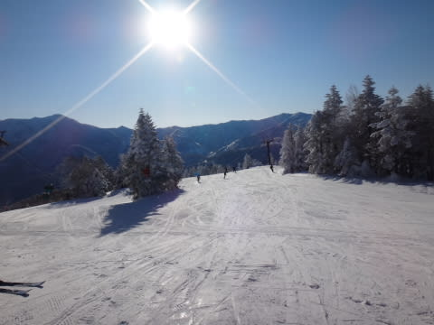

とはいえ，気温は低く．

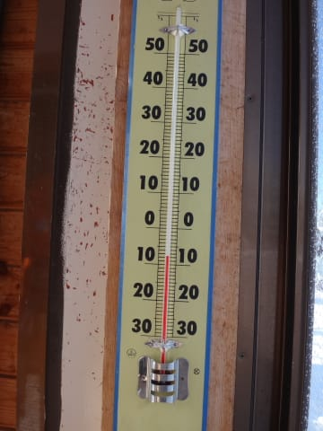

雪質が良いまま，スカッと晴れる最高のコンディションっ！

待ってたよ，こういう日を！

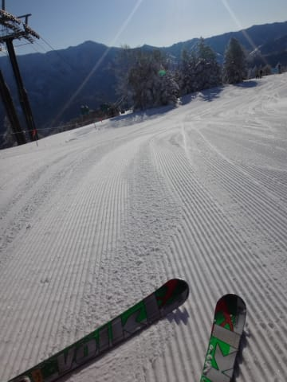

ってことで，朝のうちはチョー気持ちいい

うひょひょひょ大回りバーン！

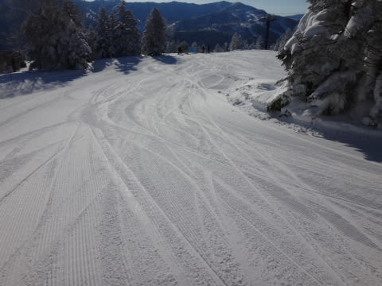

人も少なく，もう，何も考えられないウハウハバーン！

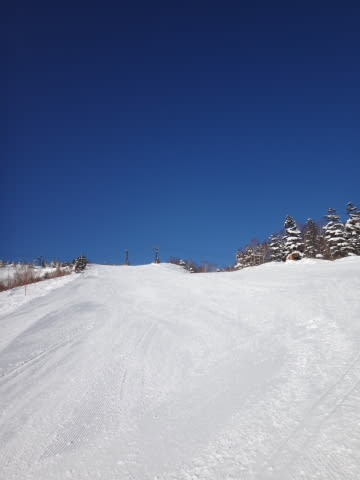

ああ．シアワセ…

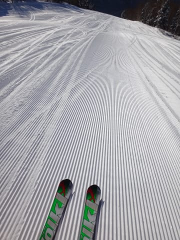

ちょっと残念ながら，午前10時ごろから，ゴンドラ待ちが伸びたけど…

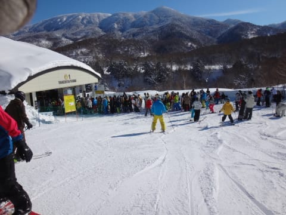

(ピークでこのくらい）

でも．ゴンドラ2本乗ったら，このくらいに待ちが短く

なって…

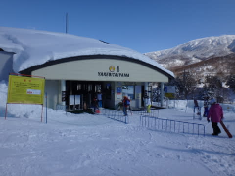

3連休中日の午前11時で，こんな待ち時間がなくていいのか…

ただ，やっぱり午後にはゲレンデの人も多く．

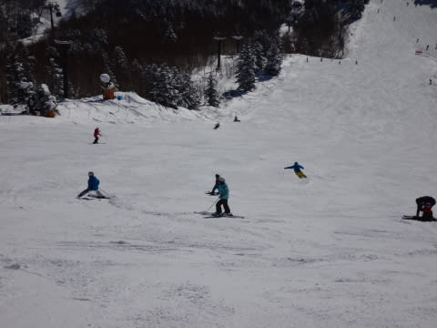

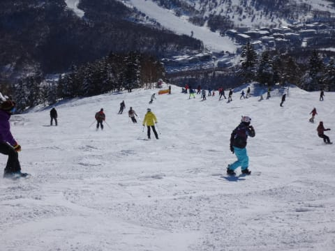

ぼこぼこになってきて．

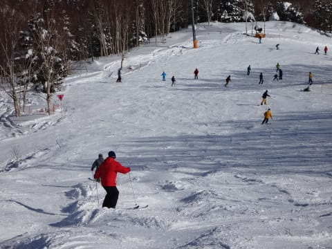

オリンピックコースとかは，硬い下地が出てきて

滑りにくくなったけど…

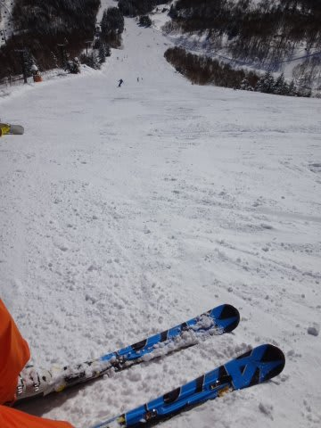

でも，晴天の下．

気持ちよく滑れた，絶好のスキー日よりでしたよっ！

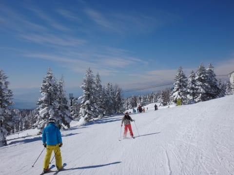

で．

天気予想に

夕方～夜ぐらいから雪が降り始める．

って書いたとおり．

今，雪がちらついてます…

あんまり激しく積もるほどではないので，今のところ2-3cmって

積雪ですが．

うーん．明日までにはそんなに積もらないかな．
