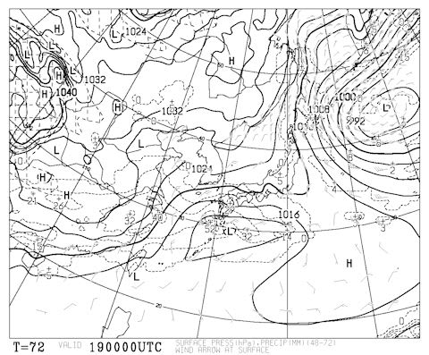
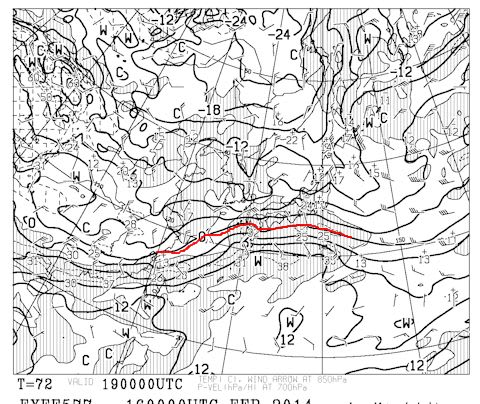

# あきらめの境地…人生，こんな週末があったろうか…

📅 投稿日時: 2014-02-17 00:19:36

🏷️ カテゴリ: [日記](cc4b5682fb7b8b144980957a978653fb0.md)

幸せは…遠くにありて思ふもの．

そして悲しくうたふもの…

…

…

…

そうです．

その通りです．

今日もスキーへ行けませんでした．

えー．

昨日に引き続いて．

今日も

行けませんでした．

土日とも，行けませんでした．

えぇ，行けませんでしたとも．

行けませんでしたよ．

…まさか．

わが人生．

まさか．

まさか，こんなことがあろうとは…（遠くを見る目）

たとえ，どれだけ深夜勤務が続こうと．

現地滞在1日の海外出張から帰ってきたその日であろうとも．

手を骨折，手術して．退院した翌週でも．

「無謀だろう～！」という，あらゆる突っ込みを受けつつも，

スキー場に立っていた私が．

…大雪でスキーに行けなかったなんて…

いや，あらゆる困難を乗り越えていけば．

スキー場にたどり着いたかもしれないんですけどね．

…その場合は．

帰ってこれませんね．

月曜の仕事までに…

…

…

まー．

せめてもの救いは．

土曜日は志賀高原に登る道が雪崩で通行止め．

日曜朝7時から開通したものの．

荒天で日曜はほとんどのリフトが動かず．

動いたリフトも，午後2時過ぎにはだいたい止まっちゃったらしい…

ってところで．

志賀高原に行っていても，ほとんど滑れなかったはず…

…

そう．

無理をして志賀高原までたどり着いても．

滑れなかったに違いないっ！（自分に無理やりそう信じさせる）

そう．

だから．

くやしくなんか，ないもんっ！！←かなり無理がある

…しかし．

しかし．

うむ？？

うむむむむむっ！！！？？？

…19日の水曜日．

また，南岸低気圧なんですが．

それも，先週・今週と全く同じく．

前面の高気圧から寒気が吹き込み，関東ではマイナス3度線がかかる

天気図パターン…

…もうイヤ（涙）

## 💬 コメント一覧

### 💬 コメント by (れお)
**タイトル**: 土曜日滑れましたが...
**投稿日**: 2014-02-17 10:21:21

おはようございます。れおです。

スキーのできない週末って、本当辛いですよね...。

私も先週、雪で行けず、ストレスが溜まってたので、今週は絶対行く！と決め、金曜日の午後から半休取って、新幹線＆レンタカーで、志賀行ってきました。金曜夜に長野市内に前泊で、土曜日に新幹線で帰る予定でした。

でも、土曜日には帰れず、結局もう一泊して、日曜日の午前中に帰ってきました...。

私は、土曜日に熊の湯で滑ったのですが、国道から熊の湯ホテルに降りる道が凄かったです。除雪が間に合っていないようで、新雪が20cm程積もったゲレンデのようで、車で滑り降りながら(?)、熊の湯ホテル前の駐車場にとめました。これは除雪完了するまで登れないな～と思い、ずっと熊の湯で滑ってました。

上林から上は、往復とも雪崩やら倒木やらで大変でした。往路は、上林から熊の湯まで1時間半ぐらい、帰りは、蓮池から長野市内まで、高速も使えないので、２時間半ぐらいかかりました。

まあ、それでもスキーできたので、良い方なんですかね...。熊の湯は、修学旅行生100人くらいの他は、全部で20人もいなかったような...。雪もちょっと重めでした。

今週末は、もっとアクセス気楽に、スキー楽しみたいです～。

### 💬 コメント by (ひろりん)
**タイトル**: Unknown
**投稿日**: 2014-02-17 17:26:26

今週末もヤバそうですね。

山梨県が復活してくれないと愛知県経由の大回りをしなくちゃいけません。。。

先週も酷い目（3.5Hが11Hかかった）んですが今回のはそれ以上ですし、19日の低気圧も置き土産を沢山残しそうで。。。

### 💬 コメント by (Goku)
**タイトル**: Unknown
**投稿日**: 2014-02-17 20:00:55

もう、雪は勘弁してください(T_T)

正直、長野市民はスキーどころではありませんでした。

土日共会社に行って雪掻き、帰って自宅の雪かき。

もううんざりです。

### 💬 コメント by (Skier_S)
**タイトル**: 月曜日に仕事をする気力が…
**投稿日**: 2014-02-18 02:19:23

＞れおさま

えええっ！！

今週，志賀に行ってたんですね！

滑れたんですね！

それは，すごい…

土曜，上林から上に上がれたんですね…

通行止めと聞いていたんですが．

しかし，もう少し気軽にスキーに行きたいですね（笑）．

＞ひろりんさま

うーむ．

なんとかこの19，20日の積雪は逃れられそうです．

この週末，冷えたいい天気になる可能性も…

山梨県，長野県が早々に復活してくれることを

大期待！

＞Gokuさま

…長野市民として，大変だったかと…

雪は山にだけ降ってほしいものですね（；_；）．

こちらは土日の雪かきはさすがになかったですが，

本日は雪の影響で朝の通勤時間の道路が大渋滞で，

ひどい目にあいました．

首都圏の交通は軟弱すぎです（涙）

