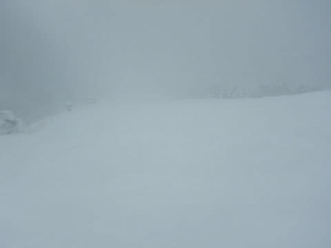

# 2021/12/31，大晦日の志賀高原焼額山スキー場は…終日パウダーデー！というより吹雪で凍死しそうな一日

📅 投稿日時: 2022-01-01 00:07:39

ということで．

今日も志賀高原を滑ってましたが…

年末飲みで遅くなってしまったので，

今日は短めのレポート！←それでも十分長いって

今日も朝8:30の焼額第1ゴンドラの

営業開始前に並びますが．

朝からかなりの雪降りで天気が悪いからか，

並んでる人が少ないですね…

で，山頂の気温は-14℃と，今日も

激冷え！

そして，かなりの雪降りなので…

圧雪コースも10～20㎝の新雪が乗ってます！

圧雪コースもブーツパフ！！

こういう日は当然，パウダーをいただきに

オリンピックコースへ向かいますが…

オリンピックコースは太ももパフ！！！

気温は低いのに，残念ながらちょい重めの雪で，

太板を履いてないと緩斜面でゴキブリ

ホイホイ状態になる雪でしたが…

でも，今日も太ももパフ！！

顔まで雪が舞い上がる，シアワセパウダー

バーンだぁ！！

そして今日は，上信越道の長野以北の

通行止めや悪天候の影響か，いつもなら

混雑する大晦日にもかかわらず，

ゴンドラはゲート外まで並ぶことのない

終日ガラガラ状態！

だもんで…

滑る人が少ないバーンは，

昼になってもパウダーだし…

昼間もひたすら視界が悪くなるほどに

雪が降り続けて．

圧雪コースも，いつまでたってもコース上に

新雪が降り積もる，エンドレスパウダー状態！！

だもんで，オリンピックコースは午後に

なっても，まだまだパウダー！！

コース横は，午後2時になっても

まだ太ももパウが残ってるし…

激しい雪が降り続け，踏まれたところにも

新しい雪が積もり…

オリンピックコースも，エンドレスパウダー状態！！

午後2時過ぎになっても，まだこんなに

パウダー！！

今日はひたすらパウダー！

こんなに最後まで太板大活躍の日は，

これまであったかな…？？

…ただ．

時折雪が激しく降り続け，風も強く…

根性の無いスキーヤーふるい落とし機能

フル発動…というより，

強い精神力をもったスキーヤーだけが生き残るレース

という感じの過酷な状況になっていき…

そのおかげで，午後はゴンドラに乗っている

人が誰もいなくなる…

というより，ゲレンデに生き残っている

生存者はごくわずか．

無人のゲレンデで時々人を見ると，

「生き残っている人がいたか…！！」

と思うほどの無人バーンとなっていき．

さすがの悪天候で，ゴンドラは

営業終了予定を早め，15時に終了（涙）

奥志賀も，一部リフトが営業休止になったようです．

ただ，焼額のリフトは，当初予定通り

16時まで運転してくれたのが救いか…

ってな感じの悪天候の中．

「うほほほほ！誰もいない！パウダー食い放題！！」

と．

バカな誰かさんは，今日も昼休みをとらず．

ひたすら16時のリフトストップまで

滑り続けたのでした…

で．残念ながら．

悪天候のため，本日のナイターと

明日のニューイヤーファーストトラックは

中止となっちゃいました（泣）

ってなことで．

ナイターが滑れず残念だったけど．

一日ひたすらパウダーをお代わりし続け

られたという，ここ数年間はなかった

恵まれた日だったので．

2021年も，終わりよければすべてよし．

いい一日で締めくくれたのでした…

ということで，来年もよろしくお願いします！！

PS.1月2日は朝は晴れのシマシマバーンを楽しめ

そうだけど，昼頃から雪降り，3日の朝くらいまで

降り続けるかな…

3日は朝は雪降り，20～30cmのパウダー，

午後から晴れるかも？

まだ，雪の降り始め・降り終わりの予想精度は低いです…

2日，3日のどっちがいいか微妙＞某氏へのメッセージ

## 💬 コメント一覧

### 💬 コメント by (m&t)
**タイトル**: Unknown
**投稿日**: 2022-01-01 06:07:38

あけましておめでとうございます

今年もよろしくお願いします

明日1/2参戦します！

### 💬 コメント by (大阪のK)
**タイトル**: Unknown
**投稿日**: 2022-01-01 07:02:08

2022年、明けましておめでとうございます。

今年もよろしくお願いいたします🙇

大阪からライブ映像を見て、誰も滑ってない❗と思ってたら、まさにその通りだったのですね。

超パウダー、うらやましー

### 💬 コメント by (koi)
**タイトル**: Unknown
**投稿日**: 2022-01-01 07:08:12

白馬も寒くて寒くて。年数回のレジャースキーヤーにはツライ年末でした。今年も楽しい記事、よろしくお願いします！

### 💬 コメント by (ダウンヒル)
**タイトル**: Unknown
**投稿日**: 2022-01-01 08:42:27

あけおめぇ～。ことよろぉ～。

わたくしが広く認知された冷え冷えのダジャレを載せたが故に...本当にお寒い冷え冷えの日々...

長い時間、冷え冷えが続くように、とか考えて追加すると、逆に冷えなくなるのでは...とビビっているダウンヒルです...

### 💬 コメント by (新米パパ)
**タイトル**: Unknown
**投稿日**: 2022-01-01 10:05:10

あけましたおめでとうございます。

今年もよろしくお願いします。

第3週からは毎週末、焼額山予定です。

30日はホウダイギに浮気してしまい、明日からもナスパですが、志賀高原のゴリゴリスキーオタクが集う地は、見てて楽しいですね。

道具もウェアも何もかも。しかも、他の地より皆、親切な気がします。

### 💬 コメント by (nyansy0120)
**タイトル**: Unknown
**投稿日**: 2022-01-01 11:10:13

明けましておめでとうございます。今年も面白くためになる記事を楽しみにしてます。私も昨日から一の瀬ですが､根性無いので３時に挫けました～。今日も大変ですが様子見てヤケビまで行けたらと思います。

### 💬 コメント by (アリス)
**タイトル**: Unknown
**投稿日**: 2022-01-01 16:45:59

S様

明けましておめでとうございます🎵

長野県高速隊&山之内町除雪隊の行動素晴らしい🎵

通行止めの高速道路は解除されて飛ばせるし、オリンピック道路の除雪もバッチリです🙆

予定より早めに志賀高原到着出来ました🎵

志賀高原の、自然に対する対処と行動力はさすがプリンスですね🎵

1ゴン&2高の繰り返し楽しかったです☀

索道協会の出遅れは溜め息しか出ないですね😅

### 💬 コメント by (通りすがり)
**タイトル**: Unknown
**投稿日**: 2022-01-01 22:13:48

厳しい1日でしたね。ラスト3高速は本当に数名でしたね(^-^;

### 💬 コメント by (ももも)
**タイトル**: Unknown
**投稿日**: 2022-01-01 23:12:25

今年もよろしくお願いします。

やっと麓まで来ました。思ったよりも道路には雪がなくて安心しました。

先日はレストラン情報をありがとうございました!

明日以降、お会いできるのを楽しみにしています。

また、4日以降のお天気予報も待っています。

### 💬 コメント by (Skier_S)
**タイトル**: 明日は朝はシマシマバーンかな
**投稿日**: 2022-01-02 00:15:29

＞m&tさま

明日は朝はコンディションよさそうです！

お待ちしております！

＞大阪のKさま

いやー．

すごい天気でした．生き残りは少なかったです…

今年もよろしくお願いします！

＞koiさま

白馬も寒かったですか…

でも，雪はすごいいっぱい積もりましたよね！

今年もよろしくお願いします！

＞ダウンヒルさま

あけおめです~！

やはりこれは，きっと私のギャグのおかげかと…

ちょっと効きすぎたようです

＞新米パパさま

第3週から志賀ですか！お待ちしています～！！

私も，志賀高原（というか焼額の人たち）はみんな優しいと思っています…

＞nyansy0120さま

明けましておめでとうございます！

今日は焼額に来れたのでしょうか？

来れたとしても，午後2時過ぎに一瞬ですよね…

明日以降もいますので，また焼額にお越しください！

＞アリスさま

今日は無事に焼額にいらっしゃったのですね！

でも，お会いしませんでしたね…

朝は道路がすごいことになってたようですが，無事到着できて楽しめたようで

何よりです！

＞通りすがりさま

いや…

ラスト3高，ホントに誰もおらず．

最後まで滑っている人はみんな遭難者みたいな恰好してましたね…

＞もももさま

無事ふもと到着ですか！

4日以降の天気予報は…

4日雪降り，5日晴れ，6日曇り～雪，

といった感じでしょうか…

