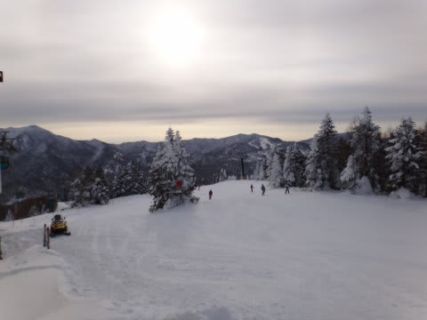
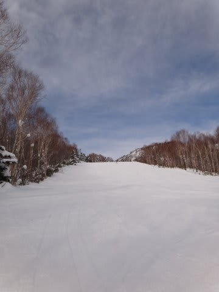
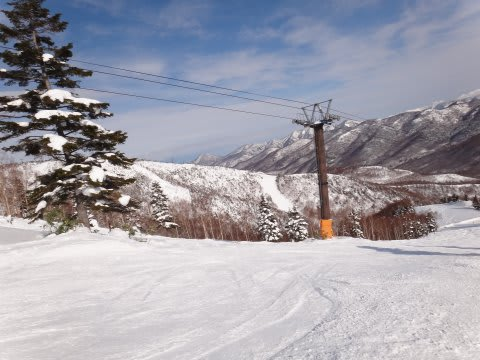
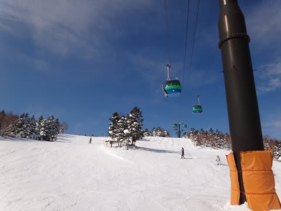
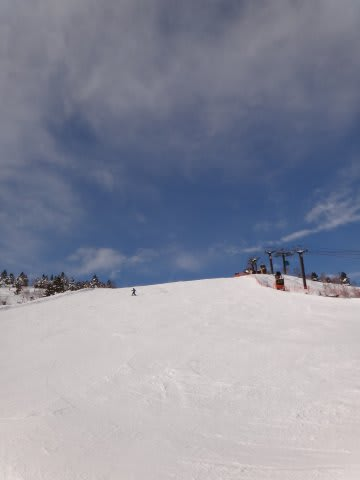
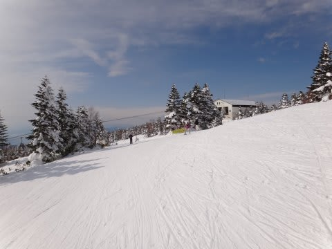
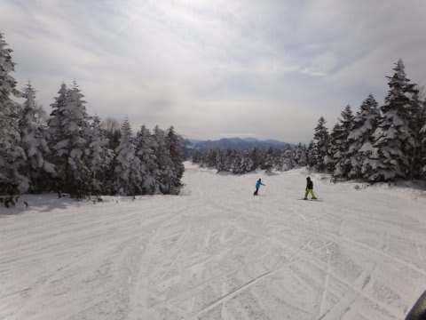
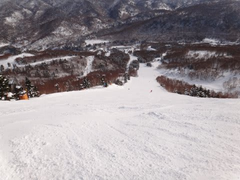

# 正月3が日も志賀高原・焼額でスキー三昧…元日の詳細レポート

📅 投稿日時: 2012-01-04 22:17:34

🏷️ カテゴリ: [2012スキー滑走日記](cca3a0e9524e0203150f790b1fc3c71ad.md)

はいはい．

お待たせしました（…待っていた人いるのか？？）

1月1日～3日の志賀高原（っつっても焼額限定）の詳細レポートです．

まずは元日から．

元日の朝は…時折うす雲がかかるものの，晴天！

31日の夜からの積雪がそれほどなかったのは残念ではあるものの．

朝イチはしっかり固めに締まった，最高ぴかぴかの圧雪っ！

キューンと締まった，固すぎず柔らかすぎずの，

むちゃくちゃ飛ばせるグッドこんでぃしょんっ！

天気もよく，元日だからか人も少なく，雪がよく…

と3拍子揃ったのは，今シーズン初か？？

タイミングによってはこんな貸切コース状態なんですけど．

コンディションはこの上ない最高なんですけど．

けど．

けど…

残念ながら．

…

…た，体調が悪い…

どーしたことだ．

元日の朝から体調不良．

深夜を回ったころから，不快感で何度も目が覚め．

朝も，頭痛と腹痛で食事を受け付けず…

だけど．

コンディションが良すぎるんだよなぁ…

ゲレンデコンディションが悪ければ部屋で寝てるのに…

3拍子揃ったゲレンデが私を呼んでいるっ！

寝てなんかいられない！

昼ごろになっても．

30，31日に比較すると高め，0度近くまで気温は上がったものの．

しまり気味の圧雪は緩むことなく．

天気は快晴で．

コブになることもなく．

人も増えることなく．

ゴンドラも最高5分以上待つことなく．

（第1ゴンドラは平均1-2分待ちかなぁ）

もう，最高（ゲレンデ状態は)

でも，最悪（体調は)

…お昼ごはんも体調不良で食べられなかったにもかかわらず．

あまりにもゲレンデコンディションが良すぎて午後2時ごろまで滑ってしまったけど．

（午後2時ごろの状況)

そのあとは体力不足で，宿の布団に倒れこんで，

夕食もとらずにバタンキュー状態でした．

ということで．

この日3食とも食べることができなかった私の体調は，

これから復活するのか？

1月3日までに滑れるのか？？

続きに乞うご期待！

（だから，だれが期待してるんだってば）
