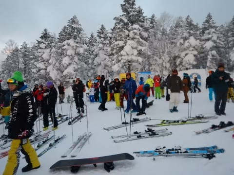
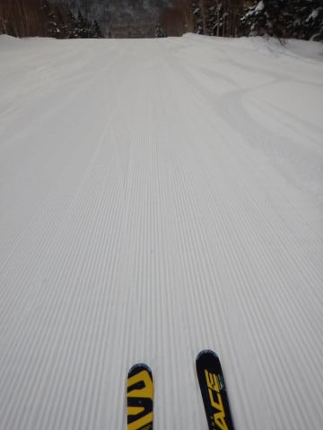
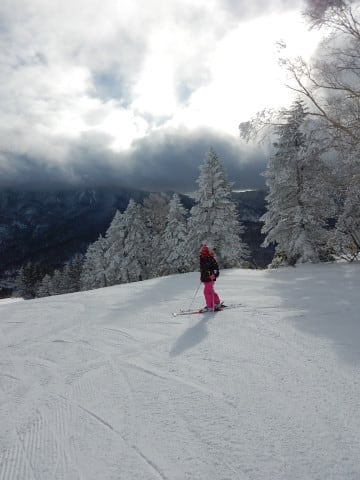

# 1月1日，2018年元日の志賀高原は…朝は一瞬晴れ，その後冷え冷え雪降り．それほど混まなかったよ！

📅 投稿日時: 2018-01-01 22:54:25

えー．

明けましておめでとうございます．

なんだか，年が変わるとおめでたいらしいので．

人並みに挨拶をしてみるSkier_Sです．

てなわけで．

新年が明けましたが．

私はまだ志賀高原にいます…

で．

新年といえば．

そうです．

焼額の名物（？），新春ファーストトラックですね．

…一種の縁起モノですから．

今年も参加してきました～！

夜も明けきらぬ6:45にゴンドラに乗り．

朝日が昇る前に，みんな山頂に集合します…

山頂に着いてすぐ．

空が茜色に染まってきて．

…をを！

そろそろ初日の出か！？？

と，大勢がその一瞬を待ちますが…

なんと．

ちょうど日の出の瞬間に，そこに

ぴったり雲が現れ，太陽を隠してしまうという

いじわる天気…！

うーむ．

日頃の行いが悪い人が，この中にいる！

間違いなく！←だからそれは自分でしょ

係員「残念ながら，雲で初日の出は

　隠れてしまいました…」

ということで．

初日の出はちょうど拝めなかったけど…

カウントダウンをして，みんな一斉に

ゴンドラ山頂をスタートっ！！

神々しい初日の出の明かりの中．

初日の出？？そんなの関係ない！

とばかりに．

いつもの常連メンバーが熾烈なトップ争いに

飛び出します！！

…そして．

私の前にいるのは，やはりこの方々か…

でも．

ほとんどの人がオリンピックコースへ

降りて行ったので…

私は2018年のGSコース，一番乗りを

いただきました～！！

新年一番のおいしいシマシマバーンをいただいて．

今年も春から縁起がいいねっ！！

そして，2本目のゴンドラ山頂では…

初日が顔をだしてくれました！！

…が．

そんな神々しい初日の出に目もくれず．

ひたすらシマシマを攻めるっ！！

攻めるのだ！

200人限定貸し切りの，人が少ないゲレンデを

ひたすら攻め続ける快感…

ニューイヤーファーストトラックは，

初日の出を見るものではなく．

貸し切りシマシマバーンをおいしく

いただくイベントですね！←認識が間違ってる

ってことで．

朝8時までの1時間，貸し切りシマシマバーンを

滑ったら…

今度は，8:30のゴンドラ通常営業オープンを

待ちますが．

元日の朝イチから，ゴンドラ前で並ぼうという

人は少ないのか…

待ってる人はすごく少ないですね…

ってことで．

通常営業朝イチゴンドラで．

ファーストトラックのスタートダッシュの

殺気立った（？）感じと異なる，

平穏な雰囲気の山頂へ出てみると…

ふむ．

気温は-9℃ですか．

そしてゲレンデは…

貸し切りっ！！

そして，青空が広がってきましたよ！

これは，最高っ！！

…と，思っていたら．

この写真の10分後には…

はえ？？

いきなり雪が…（涙）

そして，視界がちょっと悪くなってきました…（泣）

ついさっきまで晴天だったのに…

その後の天気は，曇ったり雪が降ったりを

繰り返す天気．

10:30にはゲレンデの人も増えてきたけど…

第1ゴンドラの待ちはそれほどひどくなく．

せいぜいこの程度の混雑．

やっぱり，元日から滑ろうという人は

少ないのかな？？

コースはタイミングによっては人が多いことも

あったけど．

でも．

午後になるとかなり人は減って．

なんだか，ゴンドラも飛び乗りに

なってきましたよ！

ガラガラになってきて，

良かったとはいえ…

天気は時折雪が激しく降るし．

こうなると，ゴンドラじゃないと辛い…

でも．

そのおかげで．

雪質はいいし．

人も減って，午後2時過ぎには

コース上に人がほとんどいないタイミングも…

…ってことで．

コースがガラガラで，滑りやすく．

人が少なかったので，コースも夕方まで

それほどひどく荒れず．

今日も夕方16:15の営業終了まで滑りました～！

で．

当たり前のごとく．

今日もナイターへ繰り出すわけですが…

夜になっても雪が降り続けていたため．

ナイターは，うっすら新雪状態！

軽い新雪を蹴散らすナイター！

人は少ないし，雪はいいし．

ナイター最高！！！

…と．

2018年の初日も，ナイターストップまで

楽しみつくしたのでした…

ということで．

2018年も，いつもと全くちっとも

全然変わらぬ感じで始まりましたが．

今年もよろしくお願いします～！

## 💬 コメント一覧

### 💬 コメント by (はっち)
**タイトル**: あけおめです
**投稿日**: 2018-01-01 23:57:52

新年初日からヤケビを堪能されたようですね。

今年の志賀デビューは1/3～5を予定していますので、またお会いできるのを楽しみにしています。

### 💬 コメント by (KENKEN)
**タイトル**: あけましておめでとうございます。
**投稿日**: 2018-01-02 09:47:19

今年も宜しくお願いします。

北海道は天候&雪質も良く楽しい時間を過ごして来ました。

(欲を言えばもう少しパフパフが欲しかった)

動画ありがとうございました。

年始は家族サービスに勤めます。

週末志賀高原でお会いしましょう。

### 💬 コメント by (Skier_S)
**タイトル**: 明日はパウダーだよ！！
**投稿日**: 2018-01-03 00:07:09

＞はっちさま

明日から志賀復活ですか？？

明日の朝はすごいですよ~．

たぶん．

コース全面，ぱふぱふのパウダーで

おおわれた，新雪パウダー祭りになりそう！＿

私は4日は一日抜けますが，

3，5日と滑ってます~！

＞KENKENさま

あけましておめでとうございます！

北海道も良かったのですね…

家族の皆様にもよろしくお伝えください．

では，また週末に！

