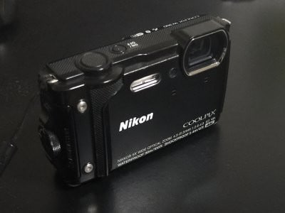
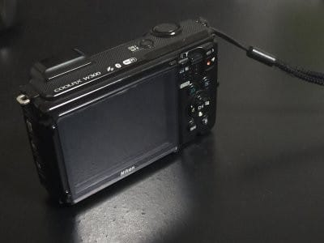
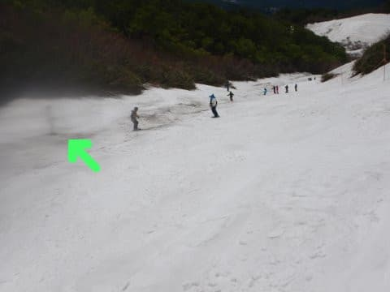
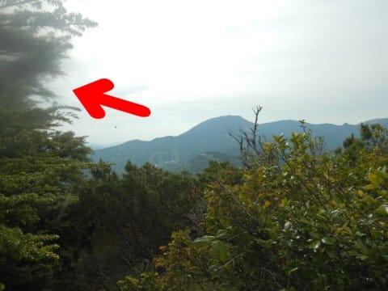

# 愛用デジカメ，Nikon COOLPIX W300の画像がダメになってきた…(泣）わずか2年9か月の寿命だったか(涙)

📅 投稿日時: 2022-07-01 02:16:09

🏷️ カテゴリ: [PC,カメラ&小物](c0d8caed13e597efe97b661a8ae56bed0.md)

えー．

私がこれまで愛用していたコンパクトデジカメ，

NikonのCOOLPIX W300．

このカメラを買って以降，

このBlogの写真の95%はこのカメラで

撮ったものなわけですが…

-15℃を下回る激冷え吹雪の志賀高原から

土砂降りの雨の中，

そして海でダイビングもする私にとって，

「耐寒・30m防水のこのカメラが最適だ！！」

…と，2019年の9月に先代のW130が

ダイビング後の浸水によりお亡くなりに

なった時に，[後継機として購入](ef23c92c7dc9ad70390490f97f70906c3.md)した，

このカメラ．

なんだか，このGWあたりから，

「画面の隅っこがボケてるな…」

と，気づき始めてきて

（この矢印の先の部分）

最初，レンズ表面が汚れてるか，

水滴でもついてるのかな…？

と思ったけど．

レンズ表面をどれだけ拭いてもボケは

解消されず．

最近6月ごろになると，症状がさらに

悪化していき．

月山で撮った写真なんかでは，すでに

矢印の先にいる人が

「何かの検閲に引っかかったんでしたっけ？」

って状態のボカシがかかった画像に

なっちゃってて…(涙)

当然，レンズ表面の汚れでは無いので，

レンズを拭いても全く改善せず…

そして．

このBlogの忠実な愛読者

なら，すでに気づいていたはず．

ここ数か月間，このBlogに載せた写真は，

ほぼ全て左端がボケた状態になっていたことが…

山で撮った写真も，もうひどいことに

なってきて．

この写真の左上を拡大すると，

もうこんな感じで．

ダメだ．さすがにこれじゃもう使い

続けられない…（激涙）

過去の写真をひっくり返してみてみると．

今年1月ごろの写真から，すでに左端が

ボケ始めてたことに気づきました…

赤く括った部分を拡大すると，最近の

写真ほどひどくはないものの，すでに

なんとなくぼやけてきてますね(泣）

うむ．

どうやら撮像センサ表面の汚れのような

気がする…

30m防水性能を確保するため，特殊ネジで

ガッチリ固定されていて，分解が

困難なこのカメラ．

[普通のデジカメみたいに，中を開けて](e876d159f92495cfcad5574c48f5e94a4.md)

撮像素子をきれいにするのは難しそう．

これは直せなさそうな予感…(涙)

うーん．

昔のSONYのTX20なら，[割と簡単に分解
出来た](ed93330f6f9f06b076e4e348661368854.md)んだけどな…

(直せない故障だったけど)

まだ買って3年経ってないし．

2019年のダイビングシーズン終了直後に

このカメラを買ったあと，

2020年，2021年とコロナのせいで

夏はダイビングに行けておらず．

せっかくの30m防水なのに，一度も海で

使ってない

というもったいない状態なのに…

これで壊れるのはちと早くないか？？

と，思っていたけど．

記録マニアのため，スキーシーズン

ひとシーズンで1万枚ほど撮影する私．

山歩き記録も含め，すでに買ってから

撮影枚数4万枚近いし．

(コンパクトデジカメの寿命は1万枚と

考えると，酷使と言える状況）

さらに．

私のこれまでのデジカメ遍歴を考えると…

SONY TX10　1年　11000枚で他人に貸した時破損(涙)

SONY TX20　1年半　25000枚で[ダイビング時水没](e9d0187dffefa89fa8f4f8a86c24c0a22.md)

SONY TX30　9か月(涙)　12000枚で[ダイビングボート上で水侵入，故障](e74a90d02680d75a3da9ee6c6ffdea8cd.md)

SONY TX30 2台目　3年半　38000枚で[紛失](e9c73c6de5ae77a84110cb54887e96426.md)(涙)

Nikon COOLPIX W130　2年3か月　40000枚で[ダイビング中水没](ef23c92c7dc9ad70390490f97f70906c3.md)

Nikon COOLPIX W300（今回)　2年9か月　38000枚で画像一部ボケ始め死亡宣言

ってな感じなので．

…冷静に振り返って見れば，

私の使ったカメラとしては，

比較的長持ちした方なのかも…

…しかし．

スキー板もそうだけど．

私が使うデジカメの寿命の短すぎ(泣）

防水カメラなのに，水没パターン多すぎ

るんですけど…

水没には懲りてるので，防水パッキン部分

とかものすごい注意して扱ってるのに…

おそらく，今回も防水パッキンのどこかから

わずかな水漏れが，撮像素子に回って

撮像素子表面が汚れてボケるように

なったんじゃないかな～…

まさかと思うけど．スキー板と同じく，

私からデジカメ(特に防水パッキン部分)を

劣化させる特殊電磁波が出てる

なんてことは無いよね…(涙)

うーむ．

どうしようかな．

写真撮影はスマホで乗り切ってもいいのかも

しれないけど．

スキーしている時に，手袋を外さずにさっと

撮影したいし．

海沿いでシュノーケリングとかでも

使えるカメラが便利だし．

やっぱりデジカメがあった方がいいなぁ…

でも．

また，私から発せられる特殊電磁波で

1-2年で劣化しちゃったらイヤだし．

デジカメとスマホの両方を持ち歩くのも

なんだし．

このまましばらく，スマホだけで乗り切って

みようかな？

## 💬 コメント一覧

### 💬 コメント by (西舘)
**タイトル**: Unknown
**投稿日**: 2022-07-05 19:14:58

今期のダイビング計画が無いのであれば

秋までスマホで乗りきるのが良いと思いますが、

いろいろなものが品薄になっていそうな

気がするので、秋まで待ったら

納品に相当な時間を要するなんて

事態も想像できるし、悩みますね…。

ブログ掲載写真を見て、目の焦点を合わせるのが

難しいお年頃になったなぁと思っていましたが、

原因は画像にも有ったのね。

### 💬 コメント by (Skier_S)
**タイトル**: ＞西舘さま
**投稿日**: 2022-07-06 03:11:13

今年は娘が受験生なので，夏のダイビング計画は無いんです…

これで3年間ダイビングしないことになっちゃいます．

潜り方忘れそう…

