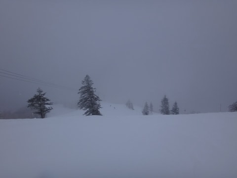
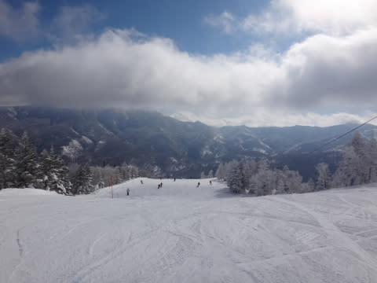
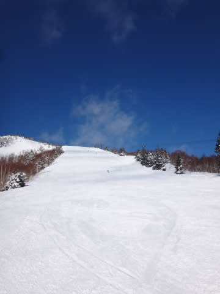
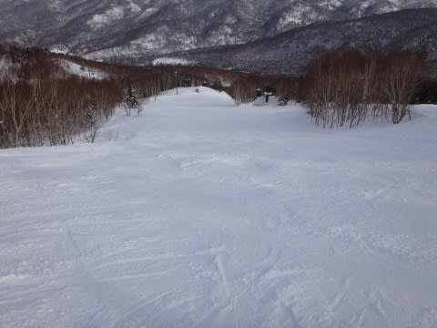
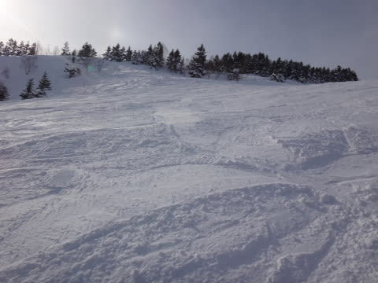
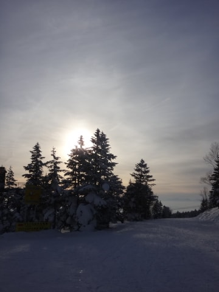

# 1月25日，日曜の志賀高原は…いやいやいや，最高のスキー日和！

📅 投稿日時: 2015-01-26 00:31:34

🏷️ カテゴリ: [2015スキー滑走日記](c09ea645cfc085f86dfcd80f49599dd89.md)

っつーわけで．

昨日はスキーに行けず．

今日，往復700kmの日帰り志賀高原を強行したわけですが．

…朝3時発だったというのに，帰宅もこんな時間で．

さらにこれから仕事をしなくてはならないので←ご無体職場…

今日は，いつもの速報バージョンで．

えー．

昨日，

「朝のうちはちょっと雲が残るかもしれないけど」

と書いた通り，朝イチの山頂は雲の中から始まった

一日でしたが…

9時半ごろには太陽が顔を出し…

10時には，予想通りすっきりくっきりはっきりしゃっきり晴れ渡り，

絶叫の絶好のスキー日和になったのでした！！

（あまりもの気持ちよさに叫びながら滑っていたSkier_Sなのだった）

なんてピカピカで気持ちよさそうなバーンでしょう！

そして．

上の写真でも人が写ってないように．

今日も午後はゲレンデから人がいなくなり…

午後までも雪質はよく，人が少ないので

ゲレンデはそれほど荒れず，かなり快適っ！！

ってことで．

朝3時発の日帰りというのに．

今日もリフトストップまで滑ってしまったのでした…

22日は雨が降って，雪質は壊滅するかと思っていたところ．

22日はプラスまで気温が上昇し，すごく湿った雪がチラチラ降ったものの．

私の祈りが通じて雨にならなかったようなので．

…

…大事なところなので，繰り返します．

私の祈りが通じて，雨にならなかったようなので．

下地はカリカリアイスバーンにならず，

雪質が良いままでいてくれたので．

いや，今日はホント，最高でしたねっ！

みなさん，私に感謝し…（ドスっ）←読者からのヒットマンに殺られた音

## 💬 コメント一覧

### 💬 コメント by (aqura)
**タイトル**: Unknown
**投稿日**: 2015-01-26 13:13:45

いゃー、ほんとに良い天気でしたねぇU+1F3B5

土日と二日間、最高U+1F603U+2934U+2934でした。

Skier_Sさんも、駐車場ポールポジションてしたねU+270C

### 💬 コメント by (はなげ親分)
**タイトル**: 感謝！
**投稿日**: 2015-01-27 01:13:38

S様のおかげで、２日間良い天気に恵まれ、年甲斐もなく勢いで昼食抜きで滑り倒しました。

そのせいか今日は眠いのと、だるさの２重苦となっております。

でも心はいまだにハイテンションです。

S様、そしてスキーの神様ありがとう！

### 💬 コメント by (Skier_S)
**タイトル**: 日帰りのしただけの甲斐はあった…
**投稿日**: 2015-01-27 01:17:15

＞aquraさま

駐車場のポールポジション，見られてる…（汗）．

もしや，滑ってるところも見られてたり！？？

でも，最高の週末でしたね～．

土曜に滑れず，日曜だけだったのが死ぬほど悔しいですが…

こういう週末が続いてくれることを期待！

＞はなげ親分さま

そうです．私のおかげで…（以下略）

でも，昼ごはん抜きですか！

かなり滑り倒したんですね～．

新しい板の調子はいかがですか？？

こちらも日帰りで活動時間23時間．

今日の仕事は眠かったです…

