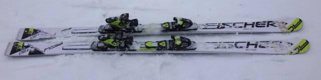
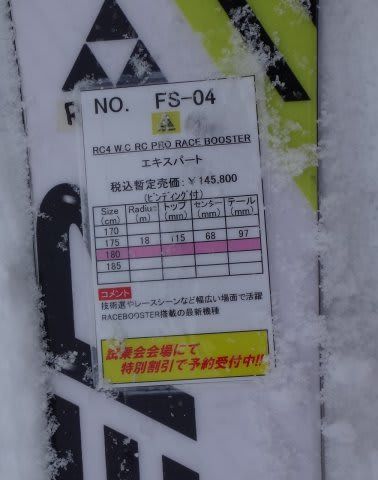
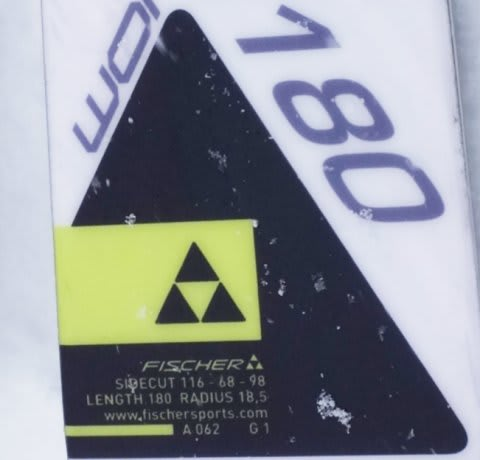
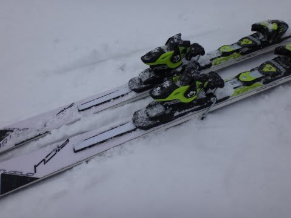
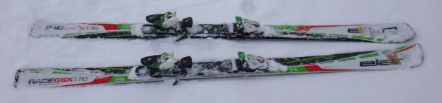
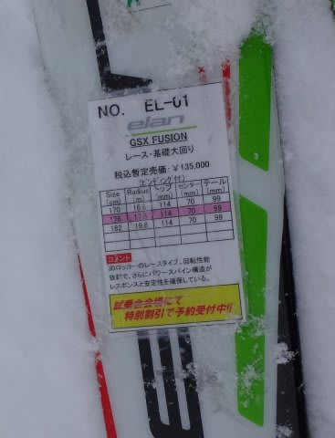

# 2015シーズンモデルのスキー試乗レポート21…FISCHER＆ELAN編

📅 投稿日時: 2014-05-23 02:41:14

🏷️ カテゴリ: [スキー板試乗](c0bd8048615710cee890e403a36cc9a2b.md)

…そろそろ，

読者の皆さんも．

飽きてきたころかと思いますが．

…まだまだ続く．

続きます．試乗レポート．

今日は，フィッシャーとエランのGS板です．

GS板と言っても，もう，FIS対応モデルは

一般人が履けるレベルを超えると思うので．

今回の2機種は，どちらもFIS非対応で．

Rは20m以下の，扱いやすいモデルに

乗ってみました．

では，どうぞ～

----

FISCHER RC4 WC RC PRO RACE BOOSTER 180cm

GS競技用．

天気が悪く，雪がもさもさになった日曜に試乗したので．

大回りの板の性能を確認できるようなコンディションではなく．

いまいちそのトップスピード耐性などはよくわから

なかったけど…

さすがGS板．

トップからテールまでグリップは比較的しっかり．

フレックスは強く，安定感も高いです．

このビンディングのプレートが，RACE BOOSTERとかいう

ものらしいんですが…

こいつのおかげなのかなんのか，たわみのエネルギーが

しっかりたまる感じ．

たわみを出して回っていき，たわみで板に溜まった

エネルギーが，メタルのばね感で気持ちよく

返ってくる感じがします．

返りはしっかりしてるけど，小回り板みたいに「ビュン！」と

返ってくるのではなく，大回り板らしく

ゆったりたっぷり帰ってきます．

安定度は高そう…

そんなに手ごわくないので，ゲレンデ大回りとしても

行けるかな．

ELAN GSX FUSION 176cm

GS競技用．

これは…SLXと似てる．

サイドカーブに乗って，クルクル回る．

176cmと，GS板にしては短いってのもある

かもしれないけど．

大回りというより，サイドカーブに乗っていくと

中回りになります．

たわませなくても，サイドカーブだけで曲がってくるくらい

旋回性は強いです．

で，たわみの解放とかもあまり感じず．

サイドカーブに乗って，板が右から左に入れ替わっていく感じ．

大回り板と思えないほど軽く感じ，動きは軽快．

アンフィビオ形状が効いているのか，プラシーボ効果か．

左右のパラレルスタンスを保ったまま，きれいに

レールターンのように両エッジに乗ったまま，

ターンができる気がします…

どうでもいいけど．

これ，絶対GS競技用板じゃない…

## 💬 コメント一覧

### 💬 コメント by (マルハバ)
**タイトル**: プラシーボ効果・・・
**投稿日**: 2014-05-23 08:46:16

こんな言葉が

まさかこんな場面で出てくるとは

思いませんでしたが・・

そう言われてみると

確かにあると思います！（笑）

### 💬 コメント by (Skier_S)
**タイトル**: マルハバさま
**投稿日**: 2014-05-24 04:16:10

いやー．

これはやっぱり，プラシーボの可能性が…．

大体，商品の売り文句の8割はこれでしょう（笑）！

