# 4月29日，GW前半最終日の志賀高原は…ガラガラで，雨も降らなかったけど…雪がイマイチ

📅 投稿日時: 2014-05-01 01:34:23

🏷️ カテゴリ: [2014スキー滑走日記](c992167609b6415052179ee69ea1ea7d8.md)

えー．

GW後半の詳細天気予想は，明日掲載予定ですが．

ざっと言って．

基本的にいい天気が続きそうですね～

…ただ．

3日目にあたる，5日．

この日だけ，ちょっと天気が悪いかも…

気温は平年よりわずかに低めで．

まー，大体，

GW前半に近い感じが続きそうかな～

天気予想の詳細は，明日に回して．

昨日速報した，GW前半最終日の志賀高原のゲレンデレポートをば…

とりあえず．

速報の通り，朝6時の早朝営業開始から滑り始めたんですが．

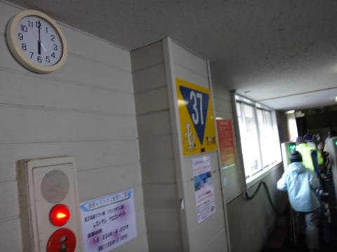

営業開始で，10人も並んでいない感じでしたね～．

…これは，今日もガラガラっぽい感じだなぁ．

で．

TVの天気予報なんかでは，雨が降るかも…と言われていたのに．

朝イチは私の日ごろの行いを祝福するかのように．

雲の隙間から薄日が差すほどの，いい感じの天気！

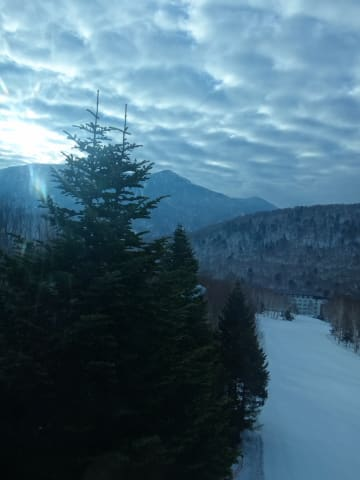

朝6時の山頂はプラス5度と，大体これまで通りかな～．

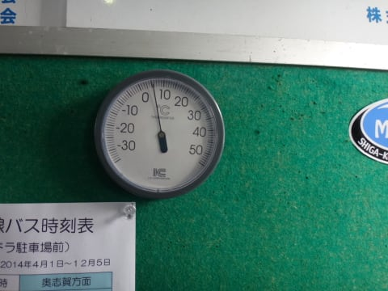

んで，早朝のゲレンデは…

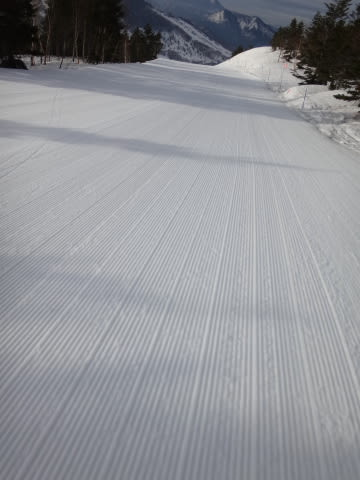

うは．

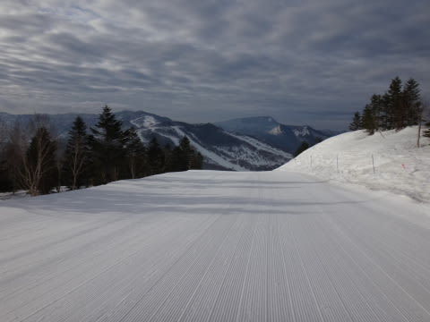

うはは．

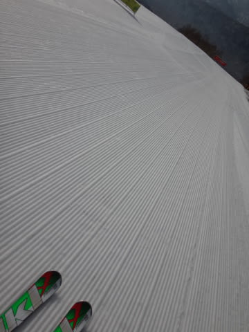

うはははは！

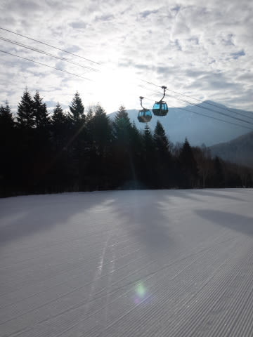

うはっははははは！

これまで同様，今日もいい感じの硬くしまった，

滑りいい超快適ハッピーラッキーシアワセ大回りバーン！

朝の2本目ほどはカリカリ音をたてる硬さだったのが．

3本目くらいからは，表面がちょっとだけ緩んだ感じで．

いやー．

トップシーズンのフカフカ雪もいいけど．

この時期の早朝のハイスピードバーンも，

これはこれでいいなぁ…

で．

通常営業開始の8時になっても．

雲が太陽を適度に隠してくれているので…

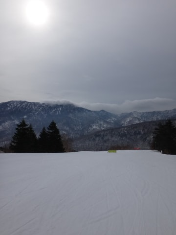

雪は一気に緩むことなく，下地の適度な硬さが

保たれたちょうどいいバーン状態が続いてくれますね～！

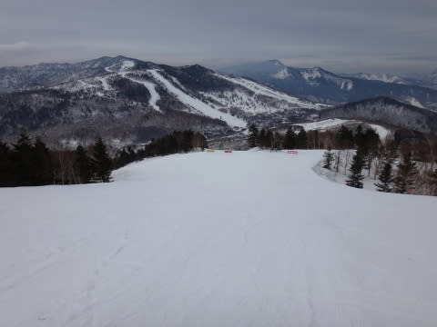

…そして．

やっぱり今日も，誰もいないんですが…

こんなゴーストタウンゲレンデなので，

午前10時を過ぎても，全然荒れてきません．

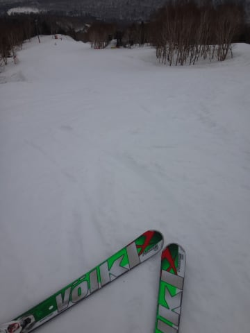

コース上の雪も，まだまだたっぷりあります．

今年は雪が多いよっ！

GW後半まで，全然余裕ですね～．

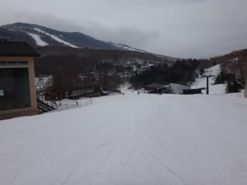

…しかし，ホントにどの写真にも人が写ってないんですが．

っつーか，人がホントにいないんですが…

これは，今日も一日，ガラガラの大回りシアワセバーンが

続くに違いない！

と，思っていたら．

南風が強く吹きつけ…

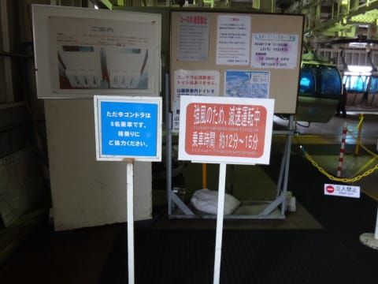

あり？

ゴンドラ減速運転？

そして，昼間でも気温はプラス6度と，朝とほとんど変わらない

気温だったというのに．

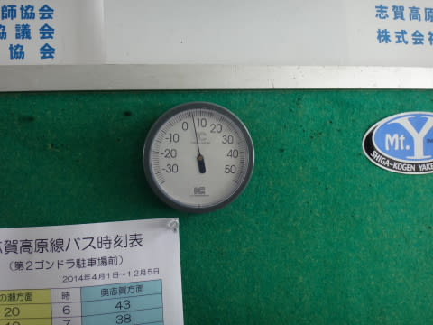

この南風のおかげで，雪が解けちゃったのか．

ちょいと部分的に，雪に汚れが浮いてきて…（泣）

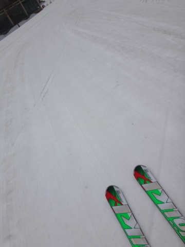

なんとなーく，人が滑ってないところは薄汚れた

感じになっちゃって…（悲）．

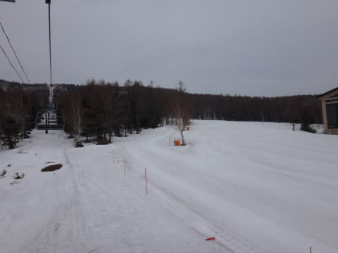

そんなに荒れてないんだけど，板が滑らない雪に

なってきちゃったよ～（涙）

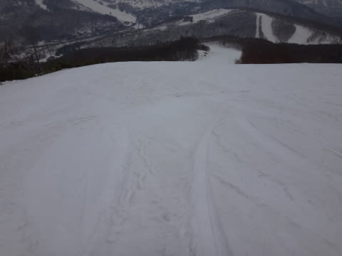

うーむ．

今日は，午前11時までの勝負だったか…

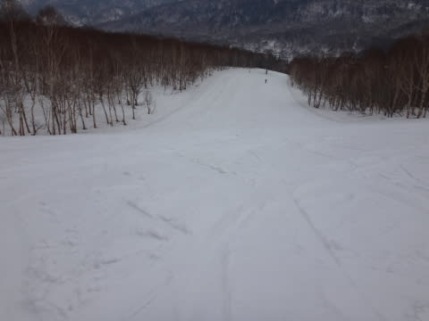

人が少なかったので，昼を過ぎても，

このすばらしいフラットさだったんだけど．

向かい風と合わせて，緩斜面では板が止まっちゃう感じ…

強烈に張り付く感じでとまではいかないのが

せめてもの救いだけど．

うーーん．

ちょっと残念っ！！

で．

朝のうち一瞬日が射したものの，

そのあと曇り空が続いていた天気は．

午後1時すぎ頃には，一の瀬山頂が雲に隠れちゃったなぁ…

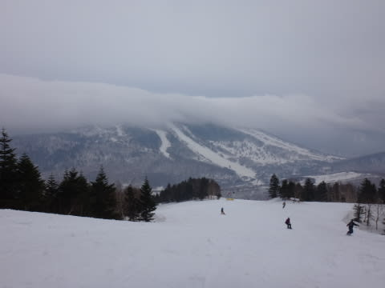

…と思ったところ．

午後3時ごろには，焼額山頂もこんな感じに…

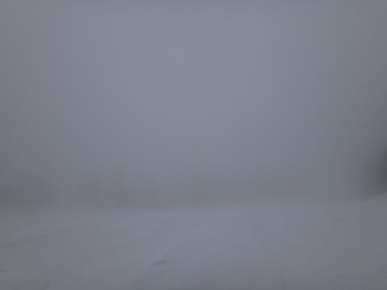

ふもとではガスはかかってないけど．

強い風のせいか，雪がちょいと汚れた，こんな感じに…

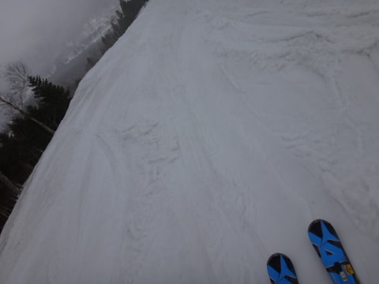

って感じで．

午前10時過ぎまではガラガラ＆快適フラット大回りバーンで．

さらに，雨の天気予報を覆し．

私の信心深さのおかげで，リフトストップまで

雨は降らずにもってくれたけど．

午後は強めの向い風＆滑りのちょっと悪い雪＆ゴンドラ減速

というトリプルパンチで，ちょっと残念な感じの

GW前半最終日だったのでした…

おそらく，この日は．

誰か私以外に，日ごろの行いが悪い人がいたに違いないです．

きっと，そうです．

そうに違いありません．←かなり無理がある

PS.　帰りの草津越えはすごい霧で…

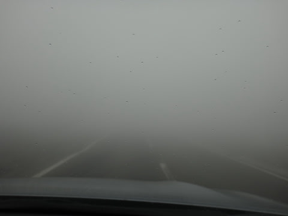

これ，目の前に車がいるんですが，

全くわからん．

前の車のブレーキランプがつくと…

こんな感じで，突然車が現れる感じ．

いやー．

なかなかスリリングだったなぁ…

## 💬 コメント一覧

### 💬 コメント by (Goku)
**タイトル**: Unknown
**投稿日**: 2014-05-01 19:53:12

＞日ごろの行いが悪い人がいたに違いないです．

俺だ・俺だ・俺だ～！

冗談はさておき、ご一緒いただきありがとうございました。

あの後１２：００ジャストで帰りました。

### 💬 コメント by (Skier_S)
**タイトル**: Gokuさま
**投稿日**: 2014-05-01 23:24:01

そうでしたか！

Gokuさんの日ごろの行いが悪かったんですねっ！

…でも．

天気と雪が悪くなったのは，Gokuさんが

帰られた後の午後だったので．

…もしかすると，私が悪いのか…？？

とりあえず．

ご一緒ありがとうございました．

またGW後半最終日お越しのようなら

お会いしましょう～！

