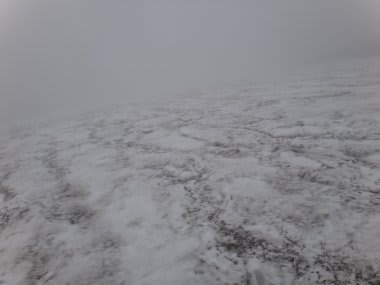

# 7月1日月山速報

📅 投稿日時: 2012-07-01 23:34:29

🏷️ カテゴリ: [2012スキー滑走日記](cca3a0e9524e0203150f790b1fc3c71ad.md)

って感じで．

行ってきましたよ．予告どおり．

月山へ．

えー．

今日，帰宅が遅かったので．

詳細は明日レポートするとしてですね．

本日，天気は曇り．

…っつーか，山頂付近はガス．

幸い，雨は降らなかったのがラッキー．

で．大斜面のピーク～リフト頂点がガスの底辺で．

そこから下に下りると視界はあるのですが．

それより上は…

ガスの中です．

うぎゃー．前がみえないよ…

で．

ゲレンデ状況は．

大斜面，一番細い部分はコブライン1本の幅でまだつながってるんですが…

大斜面が終わってリフト前．

リフトに向かって最後の落ち込み部分．

藪こぎ入ってます．

むしろ，沢コースの方がましでしたね～．

2箇所スキーを脱がなきゃならなかったけど，

藪こぎほどではなかったから…

2-3日前くらいまでは，スキーはいて滑れたんじゃないかな～．

って感じなので．

今日でリフトを滑れるのもほとんど終わりかな．

でも．まぁ．7月でリフトが滑れれば上出来ですよね…

ということで．

詳細レポートは明日のお楽しみに…

＃この時期，スキーレポートを楽しみにしている人なんていないって
