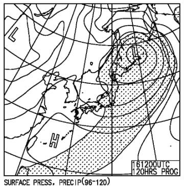

# 4月15,16日の週末の志賀高原スキー場の天気は…今の天気図だと最悪．土曜朝から日曜昼ごろまで雨が降り続けて，土曜はかなり気温が高め(泣)

📅 投稿日時: 2023-04-13 03:55:24

🏷️ カテゴリ: [スキー天気予想](c6554f5c3c106093b511a8daae23757e8.md)

えー．

おそらく，午前中にこのBlogを読む方は，

昨日[水曜の昼過ぎに記事を更新](e7d6f5c4328f6e78c6a6b46d8dc493d8c.md)しているのに

気づいてないと思いますので，

そちらの記事も見てみてください…

ってなことで．

本日は，水曜深夜ということで，

恒例の天気予想の日ですが．

その前にいつもの特派員情報を…

水曜は焼額が定休日なので，おこみん特派員は

奥志賀スタートのようですが…

うーん．

奥志賀も，リフト下の雪は消えていて…

かなり雪が減りましたね（涙）

この写真では青空も見えてますが，

天気は曇りで，朝10時ごろからぽつぽつ

雨が降ってきたようですが…

ザーザーぶりにはならなかったようです．

しかし，朝からかなり気温が高く．

あさイチですでにザブザブ雪（泣）

とはいえ…

エキスパートコースはまだ全面雪もあり，

一見大丈夫そうですね…！

ただ．

本日は奥志賀ゴンドラは故障で運休したらしい

のですが．

奥志賀ゴンドラ側のダウンヒルコースを

滑ってみると…

いわゆる2壁と言われる中間部の落ち込み．

もうかなり土が出て，コース幅は圧雪車

1台分の幅しかなかったようです…（涙）

これは，今週末でダウンヒルコースは

終わりかな…（激涙）

うーん．

そろそろ志賀高原でも，いろんなコースが

ヤバくなりつつある今日この頃．

果たして，今週末まで無事ゲレンデがもつのか？？

…いや，もってくれるはず…！！！

と，期待して天気図を見てみますが．

まずは13日の木曜の850hpa図を見ると．

うーん．

志賀高原には，ギリギリ水色の3℃線が

かかるレベル．

朝，山頂でギリギリ0℃を下回るかどうか

という感じ．

そしてこの日の地上天気図は…

高気圧に覆われるので，晴れそうな感じ！

そして，翌14日（金）の850hpa図は…

うぎゃーーー！

志賀高原にかかる水色の線は，+9℃！！？？

高い…気温が高すぎるっ！！！！

この日の地上天気図も，高気圧が本州を

だいたい覆っているので…液体が降ることは

なさそうだけど．

高温＆日差しで雪はやられるかも…（涙）

で，肝心な週末，15日の土曜の850hpa図は…

うーん．

志賀に一番近い水色の線は，+6℃線．

…これは，早朝営業からプラス気温の

ユルユル雪ですね（泣）

っていうか…

地上天気図を見ると，ものすごい降水域が

本州を覆ってるんですけど！！！

…ダメだ…

これは，朝から雨ですね（激泣）

で，16日の日曜の850hpa気温は…

おっと．この日はちょっと冷えそう．

赤い0℃線が，ギリギリ志賀にかかるかどうか．

そして，地上天気図では，網掛けの降水域が

志賀にかすかにかかっているので，

この日は朝は雨かもしれないけど…

昼ごろから雪になるかも．

…あんまり積もるほどではないけど（泣）

ってなことで．

まとめると．

13日(木)：朝から晴れ！午後は雲が増えるかも

　しれないけど，終日晴れ．

　朝はバーンは硬めだけど，すぐ緩む．

　気温は朝はマイナスだけど，昼間は+10℃

　近くまで上がってザブザブ雪になっていく

14日(金)：朝は晴れそうだけど，午後は

　曇っていくか…

　気温は朝から激高．朝で+5℃越え．

　昼間は+12，3℃まで上がるかも？？

　雪はもう典型的な春雪．

　一部雪の滑りも悪くなりそう…

15日(土)：早朝の時間は降らないでいて

　くれそうだけど…朝から雨．

　9時くらいからぽつぽつ雨かな？

　本格ザーザーぶりにはならないけど，

　昼過ぎはそこそこの雨．

　気温は朝から高く，最高気温は10℃を

　超える．

　高温の雨が夜中まで降り続け，

　雪はかなりやられそう…(泣)

16日(日)：土曜から引き続き雨が降り続ける(涙)

　早朝営業から昼前くらいまでポツポツ雨．

　昼ごろには止んでくれるか…

　朝は気温が高いけど，気温は昼に向かって

　冷えていき，昼過ぎには山頂では雪が

　ぱらつくかも．

　夕方のバーンは固まった上にうっすら雪が

　乗って，滑りにくいかも…(泣)

…ってな感じでしょうか…

いや．

しかし．

なぜ，狙ったように今週も土日に見事

低気圧がやってくるんだ！？？？（涙）

4月1・2日の週末もひどかったのに…

今の天気図のままだと，今週末もそれに

近い残念な感じが…（泣）

3月は高温でダメダメだったけど．

4月も，3回の週末のうち2回が雨が降り続ける

という，すごいダメな月になってるんですが…

ダメだ．

今シーズンは，ダメだ…

でも．

月曜は冷えて，日曜の夜から雪が降りそうなので…

月曜は意外とマシかも？？

…なぜ，週末に天気が悪くて，

週明けの滑れない日に良くなるかな～…
