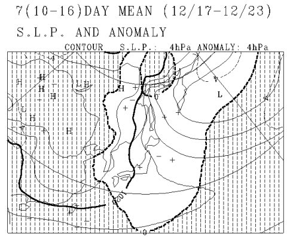
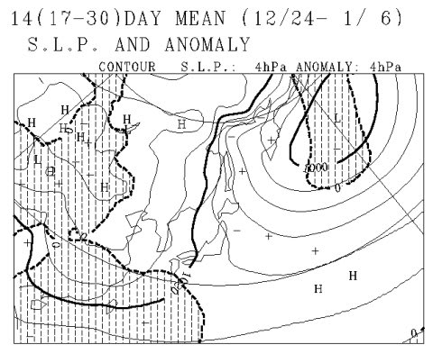

# 3日連続天気ネタ…この12月は冷えるのか？はたまた暖冬か？一か月予想図を読み解いてみた

📅 投稿日時: 2016-12-09 03:28:55

🏷️ カテゴリ: [スキー天気予想](c6554f5c3c106093b511a8daae23757e8.md)

えー．

今朝…というか．

この時間だと，もう「昨日」と言った方がいいのかな？

7日木曜の朝にかけて．

予想通り，各地のスキー場は10～20cmほどの

積雪があったようですね～．

そんなにドサドサ積もったわけでもないですけど．

この雪のおかげで，かぐらは，この週末から．

なんと全面オープンですね～！！

（[かぐらスキー場HP](http://www.princehotels.co.jp/ski/kagura/files/pdf/201601210map.pdf)より）

八方も本日ようやくオープンしたみたいですし．

焼額も，金曜から第2高速が動き始めるようです！（ぱちぱちぱち）

（[焼額山FB](https://www.facebook.com/yakebitaiyama/photos/a.133097176785637.26773.116999658395389/1159118730850138/?type=3&theater)より）

で．

金曜の日中は，志賀はそれほど

積もらなさそうだけど．

日本海側は結構降るかも…？

金曜夜から土曜朝にかけては，

前日から10cm，運が良ければ20cmの

冷え冷え積雪あり！

と予想した通り，また7日朝と

同等の積雪が期待できそうで．

土曜は，今シーズン初のフワフワやわらか天然雪で

滑れそう！！

…ってことで．

今週は，久しぶりに高温＆雨の悪夢に悩まされず

済みそうなわけですが．

はてさて．

これから先．

12月一か月間．

この冷えが続くのか？？？

ってところを．

一か月天気図から読み解いてみましょうか…

とりあえず．

いきなり結論から行ってしまいましょう．

これが，12月10日～1月4日の4週間の

平均850hpa気温予想ですが．

0℃線は日本南岸まで下がっており．

東日本は，平年比0～+1℃の範囲に入っています．

…ということで．

結論．

これから一か月間の気温は，平年並みです．

…良かった…

昨年のような異常高温じゃなかったよ…（一安心）．

…逆に言うと．

平年よりガンガン冷えるわけでもないので．

平年よりドサドサ積もる大雪になることもない，

ということですな．

もう少し詳細に見てみましょうか…

12月10日～12月16日の一週間の850hpa気温は．

うむ．

12月上旬というのに，赤く印した0℃線は

太平洋側まで下がってて，冷えそうな感じ！

平年より気温が低いことを示す網掛けが，

東日本全域を覆っており．

この一週間は，いい感じで冷えそう！！

そして．

その次の週．

12月17日～12月23日．

来週末から，天皇誕生日の3連休初日までですね．

この期間も，引き続き赤く印した0℃線は太平洋側．

信州は，-3℃線がかかっているレベルです．

いい感じで冷えます．

志賀高原は，水色でマークした平年より気温が

1℃高くなるエリアに入っちゃってますが．

まぁこの時期，平年比+1℃なら，致命的って

ほどじゃないですね．

同じ期間の平均海面気圧ですが．

こんな感じで，冬型をキープしそうなので．

ちゃんと雪が降ってくれそう…

そして．

3連休中日の12月24日から，正月明けの1月6日までの

850hpa気温平均ですが．

0℃線は，太平洋まで下がっており．

志賀高原は，-3℃線と-6℃線の間くらい．

この時期としては超冷え冷え，って

ほどではないですけど．

まぁ，異常高温に悩まされずに済むレベルですね…

水色で塗った，平年より+1℃高いエリア．

志賀高原はぎりぎりここに掛かってる感じですが．

まぁ，この時期も平年比+1℃なら，昨シーズンの

異常高温から考えれば，平和なもんです…

この時期の平均海面気圧ですが．

この期間も，おおむね冬型をキープしそう．

ドサドサ大雪になるような感じはないですけど．

そこそこの雪は降ってくれそうな天気が

続きそうですね…

という感じで．

この一か月間は．

平年並みの冷え込みになりそうです！！！

…ドサドサパウダーが毎週…

ってゼイタクは望めないまでも．

12月に何度も雨が降って雪が融けるという，

去年の恐怖を繰り返すことはなさそうです…

とりあえず．

今シーズンは，

冷え冷え踊りを踊らずに済みそう

…という事実に安心した，Skier_Sなのでした…

## 💬 コメント一覧

### 💬 コメント by (はなげ親分)
**タイトル**: 良かった～
**投稿日**: 2016-12-09 09:33:12

毎日遅く迄、お疲れ様です。

平年並みって、こんなに安心する言葉とは…！

踊りを踊らなくても良いシーズンを送りたいものですネ。

ところでハンドエス様の情報によると、今週末高天ヶ原は激混みの模様で、一の瀬&焼額山もその影響を受けそうだとのことです(泣)

### 💬 コメント by (Skier_S)
**タイトル**: はなげ親分さま
**投稿日**: 2016-12-10 00:28:36

もう，ホントに．

平年並みってだけで喜んじゃいますよね～．

去年の状況を振り返ると…

ハンドエスさんの情報，こちらも見てたのですが．

熊の湯が山頂から滑れるようになり，

横手もオープンしたし．

さらに白馬山麓も滑れるようになってきたから．

人が分散するんじゃないかな～，

って思ってます．

私は明日も，いつも通り焼額です～！

