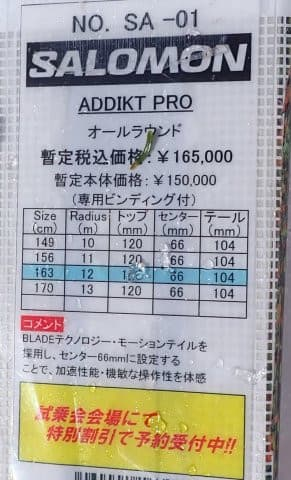

# 2025シーズンモデルのスキー板，試乗レポートその22…SALOMON ADDIKT PRO

📅 投稿日時: 2024-07-02 03:47:40

🏷️ カテゴリ: [スキー板試乗](c0bd8048615710cee890e403a36cc9a2b.md)

なんと．

2024年ももう半分が終わってしまったのか！？？？

今年ももう後半戦って…

ウソだよね．

ウソだと言って…（涙）

いつも思うけど．

1年が20か月くらい，

1日が30時間くらい欲しい…

そして．

1年の20か月のうち，19か月くらいで

雪が降ってくれるといいんだけどな…←絶対家計が破綻するし身体を壊すから

ってなことで．

もう夏もたけなわになってきたというのに，

まだまだ続くスキーネタ．

2025シーズンモデルのスキー板の

試乗レポート，本日はサロモン編です！

〇SALOMON ADDIKT PRO　163cm

オールラウンド．

今シーズンから誕生したADDIKTシリーズの

最上位モデルですね．

昨シーズンの試乗会では履いていないので，

今回が初めての試乗になりますが…

163cmは短いかと思ったけど，

しっかり走って意外と安定性もある板で，

結構面白い板でした．

この板の特徴は，ものすごい低速域

でもしっかり角付けしてきれいなカービングが

できること！！

普通なら，もう少しスピード出さないと

板がたわまないのでカービングできないよね…

という程度の，プルークからちょっとだけ

スピードを上げたくらいのかなりの低速でも，

板がたわんでカービングしていきます！

かなり低速からたわむので，スピードを

上げるとすぐ腰砕けになってしまうかと

いうと，そうではなく．

スピードを上げていっても，そのまま

カービングで楽にするすると回っていきます．

かなり楽に低速からそこそこの高速まで

カービングできる，謎のマシン．

さすがにフレックスが柔らかめなので，

スピードを出すとたわみすぎるけど…

グリップが抜け抜けになっちゃう

中級者板みたいな軟弱さはないです．

そこまで圧をかけずに，角付けを交互に

入れ替えるだけで滑っていくだけで，

気持ちいい深めのカービングのレール

ターンでゲレンデを滑り降りれる感じ．

あんまり圧をかけないで行けば，

そこそこのスピードでも中回りくらいで

降りていけます．

ただ，圧をかけると小回りになっていくし，

やっぱり硬めの斜面でスピードを出して

いくと，板がたわんでいき，かなりの

小回りになっていってしまいますが…

結構なスピードを出して弧が深くなっても，

エッジがズルズル逃げるようなことはない

です．

とはいえ，そこまでガッツリグリップを

狙っている板ではないのもあり，圧を

かけすぎるとさすがにずれ始めますが…

スピードそのものに負けてズレていって

しまう，という中級者用の板とは

違って，スピードを出していった中でも

板が負けずにグリップしてくれるけど．

かといって，エッジグリップがそこまで

強いわけではなく，

圧をかけると，容易にずらすことができる…

という感じ．

逆に言うと，キレの滑りをやっている中で，

ずらそうと思えば簡単にずらすこともでき．

ズレのコントロール性がすごくよく．

最近のSALOMONの特徴の，

ズレ・キレを自由にコントロールできる，

いい感じの板と言えます．

超低速でのプルークみたいなレベルでの

ズレから，いい感じでずれていくし．

低速でのカービングも可能なので…

スキーを指導する人にも向くんじゃ

ないかな？？

超高速でゲレンデを飛ばし続ける人には

向かないですが．

中速や低速での性能がすごく良くて，

あまりスピードを出さなくなったけど，

かなりスキーに心得がある上級者が

履くとすごくいいかも．

スキー教師にも向いてそうな板でした．
