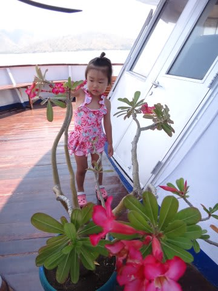
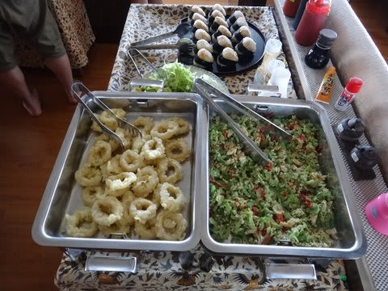
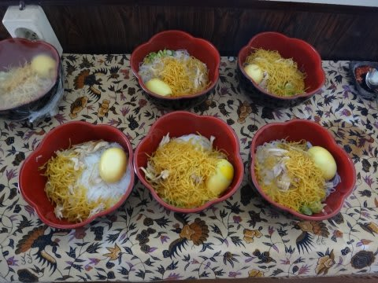
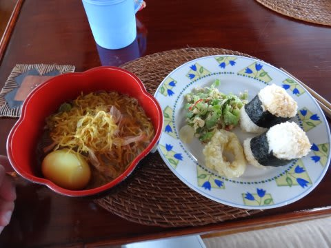
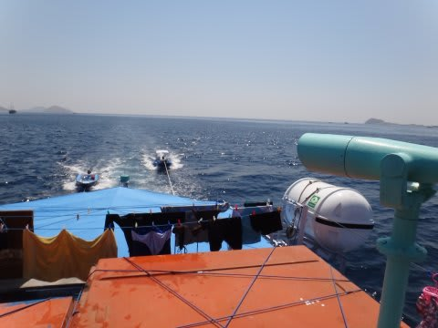
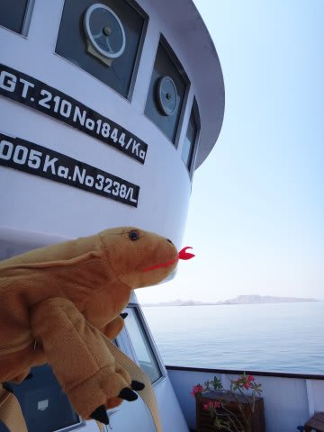
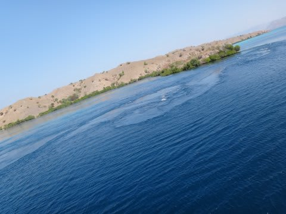
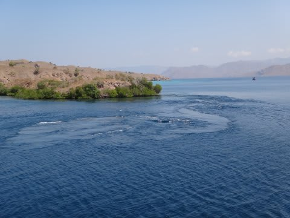
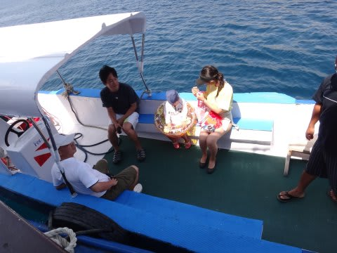
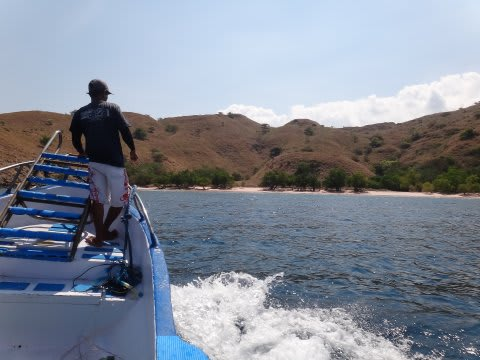

# 子連れコモドダイビングクルーズagain　その14　2日目お昼はピンクビーチ上陸

📅 投稿日時: 2011-09-12 02:48:54

超満足なマンタダイブを終えて．

船に戻ると…娘は一人で遊んで，ちゃんと留守番してました．

いやーーーー．

娘の心配をせずに，二人で潜りにいけるなんてっ！！！！

シアワセですな～！！

ダイビングが終了したら，今度はお昼ご飯タイム．

まさに食べて潜ってまた食べて状態．

お昼ごはんはおにぎりですね～．

日本食が嬉しい！

食事中，船はピンクビーチに向かって移動をはじめてます．

…移動している途中．

なんか．

これって…

ところどころ，川のように流れているところがあるんですが…

ここって…

海ですよね…

コモドの流れのすさまじさが良く分かる…

で．

今日の午後は，ピンクビーチに上陸の予定です．

例年なら，明日にあたる3日目に上陸するピンクビーチですが．

今年は新マンタポイントが組み込まれ，ルートが変わったので

2日目の今日が上陸日となります．

＃この旅行記，まだクルーズ2日目だったんだ…

午後1時過ぎに．ボートに乗ってピンクビーチへ出発！

ボートで10分ほどで…

いつものピンクビーチに到着です！
