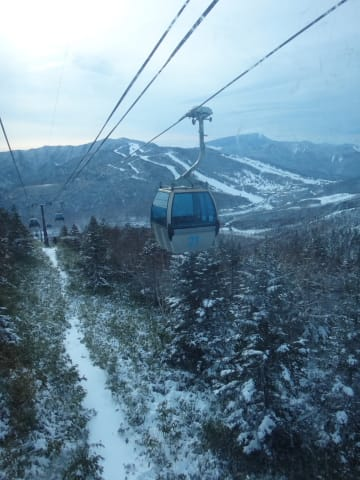
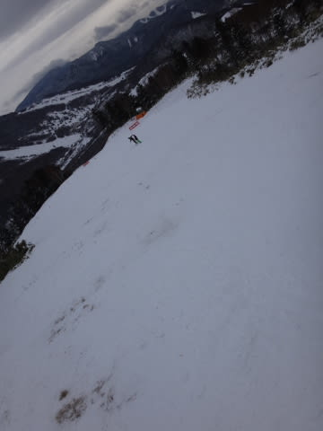

# 12月23日，祭日の志賀高原・焼額山は…ゴンドラ動いたよ！（雪少ないけど）

📅 投稿日時: 2015-12-24 00:53:08

🏷️ カテゴリ: [2016スキー滑走日記](c70c67ed5248e9432b899dcd5747048bb.md)

はい．

行ってきました．

行ってきましたよ～，

…日帰り志賀高原．

往復運転時間10時間，滑走時間7時間半と，

滑っている時間より移動時間の方が長いことに，

そこはかとない不条理を感じつつ．

…それでも，日帰りで行ってきました！

えー．

朝の志賀高原の登り坂．

しっかり積雪路面で．

今シーズン初の，坂道を登れずに難渋する車を目撃…

…みなさん，雪道対策は十分に…

で．

「今日から第2ゴンドラ運転だ～っ！！」

と，ゴンドラ営業開始8時半に，

焼額のゲレンデに到着するわけですが．

「…ゴンドラ機器不具合で，営業開始が遅れます！」

え？？

なに？

なんだって？

不具合…！？？（涙）

…ってことで．

開始前からゴンドラの列についていたのに，

仕方なく第4ロマンスで始まった本日．

ふーむ．

下地は固い人工雪だけど．

その上に先日に積もった雪が圧雪された層が乗っていて．

…朝イチは結構いけるではないかっ！

いや…これ，結構気持ちいいっ！

早くゴンドラを，ゴンドラを動かしてくれ～！！！

…と，願った，営業開始20分後．

ようやっと，ゴンドラ運転開始！

ということで．

来たよ．

来ましたよ．

待ちに待ってたゴンドラ運転っ！！

久しぶり～！第2ゴンドラッ！！！

ああ…

実に．

実に，7か月半ぶり…っ！（感動）

そして．

この温度計とも，7か月半ぶりのご対面！

ふーむ．

朝の山頂は-3℃…

ちょっと気温は高めかな．

山頂の天気はこんな感じの薄雲り．

そして，この程度の新雪が積もったようで…

一見，かなりマシそうなゲレンデ状態に見えます…

…が．

だけど．

ところどころに地雷原があるのだ…

で．

ゴンドラが営業開始したというウワサを聞きつけた人々が

集まってきたのか，朝10時ごろは，ちょいとゴンドラの

待ち時間が3分以上に伸びちゃって．

そして，コース上の人口密度も…

あれ？

ちょっと，増えてきたんですが…

でも，先週よりはずーーっとマシかな．

ちなみに，11時半ごろから，ゴンドラ待ちはほぼ0～1分待ち

程度になったので，ちょっと安心…

で．

この日の天気は，終日曇り．

時々日が射すタイミングもあって…

雪質も，思ったより良かったかな～．

…と，言うものの．

大勢の人が滑ったコース．

昼過ぎには，人工雪がついていない，コース上部の方で…

あら．

あらららら．

…ダメじゃん（涙）．

薄い…

雪が，薄いよっ！！！（残念）．

でも．

そんなコース状況を．

人力で何とかしようとする焼額のスタッフの皆さん．

＃機械力は使わないのか…？？

って感じで．

スタッフの皆さんの努力もあり．

無事，ゴンドラが動いた本日．

しっかり，営業終了まで楽しめました！

…いや．

ゲレンデ状況は，例年よりかなりひどいのだが．

[去年の同じ時期](d20141224.md)と比べると．

悲しくなってしまうほどひどいのだが．

でも．

これまで，カリカリコロコロ混雑斜面だった

第2高速をひたすらひたすら滑るしかなかった

先週末までのことを考えれば．

さらに，それからあまり雪が降っていない

天気を考えれば．

第2ゴンドラ1本とはいえ，ゴンドラが滑れるようになって．

大変幸せ

だった，今日一日だったのでした…

## 💬 コメント一覧

### 💬 コメント by (Goku)
**タイトル**: Unknown
**投稿日**: 2015-12-24 18:52:22

昨日は日帰りスキー、本当にお疲れ様でした。

やはりゴンドラの力は偉大ですね。

昨日も4ロマ＋2高だったらおそらく激混みだったかと・・・

この週末こそスペシャル冬将軍に頑張っていただきましょう！

### 💬 コメント by (Skier_S)
**タイトル**: Gokuさま
**投稿日**: 2015-12-25 00:06:10

水曜はお疲れ様でした

もう少し雪があったらうれしかったですが，

ゴンドラが動いたってだけでありがたいです．

この週末の冬将軍も…平年並みの

冷え込み程度で．

うーん．

ドサドサ積もる感じじゃないですね…

でも，大体全面可能になるくらいに積もってくれるかな？？

