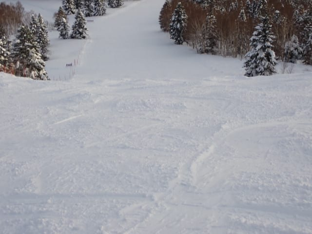

# 2025/1/1(水)元日の志賀高原焼額山スキー場は…曇り時々雪のち晴れ！午後はちょい荒れ気味だけどゴンドラはそこまで混まず

📅 投稿日時: 2025-01-01 23:05:49

どうやら，また私が許可しないうちに

世界は2025年に突入していたようで…

2024年，あと5－6か月続くんじゃ

なかったっけ？

ってな感じなのですが．

とりあえず，年が明けたようなので．

あけましておめでとうございます

ということで．

2025年初日の本日．

焼額山恒例のニューイヤーファースト

トラックに参加してきました～！！

これ，日の出前の朝6時45分から

ゴンドラ乗車開始で．

7時10分ごろの初日の出を山頂で待ち，

初日の出を拝んでから全員でスタート，

そのまま8時半まで第1ゴンドラを

滑り続けられる…

というイベントなんですが．

2000円という参加費にもかかわらず，

かなりの人が並んでますね…

朝6時45分運転開始の1ゴンに乗って

山頂に行くと…

気温は-12℃と，そこそこの冷え！

この寒い中を，日の出の時間まで

スタートラインの手前に並んで

待つわけですが…

残念ながら天気が悪かった本日．

日の出の時間になっても太陽が

顔を出す気配はなく．

初日の出は拝めず…

なので．

日の出の時間を過ぎたら，

スタートのコールで全員一斉に

スタート！

目の前にほぼ誰もいない，2025年の

初めてのバーンを，気持ちよく滑り降りる

ことができます…！！

私の前にはかなり早い数人しか

いなかったので，2025年の1本目，

かなり気持ちいい1本をいただき

ました～！！

そのあとも，ひたすら第1ゴンドラを

滑りますが．

昨晩の積雪20cmほどが圧雪された

柔らかめの圧雪バーンで，その上に

ところどころ軽い数cmの新雪が乗った，

かなり滑りいいバーン！

朝は曇ったり時折薄日が射したり

でしたが，朝8時半まではファースト

トラックの人しか滑ってないので，

ガラガラのバーンを思う存分

楽しめました～！！

通常営業開始の8時半を過ぎてしばらくは

まだ薄曇りっぽく，人も少なくガラガラ

だったけど…

10時前にはちょっと人も増えてきたかな…？

と思ったら．

なんと．10時ごろには時折日も射す

ようになり…

ゲレンデも明るく，バーンも見やすくなって

来ましたよ！！

で．

元日はいつも年末年始休みでも

それほど混まないのですが．

今日は朝から天気が悪かったからか，

第2高速リフトも最大に混む午前

10時でこのくらいの待ちで．

午前10時前後を除けば，飛び乗りか

搬器数台待ちレベル．

ゴンドラも午前10時から11時までの

ピークでゲートを超えるかどうかという

程度の待ちしかなく．

それ以外の時間は，相乗りレーンなら

ほぼ待ち0で乗れるレベルの

ガラガラ具合でしたよ～！

そして．

午前中は曇ったり晴れたりの天気

でしたが…

うおおおお！！

午後になるとすっきり晴れましたよ！！

…これは…

見事なトップシーズンの晴天の景色じゃ

ないですか！！

この景色を見ながら滑れるだけでも

シアワセなのに…

晴れた昼間でも，気温は-6℃程度と

低かったので．

太陽が射しても，雪質は冷え冷え

最高のまま！

それでいて，リフトはガラガラ．

ゴンドラも時折待ちはあるものの，

平均搬器2－3台待ちで，

これだけ並んだらすごい待ったな…

と感じる程度の混雑だったので．

リフト待ちのストレスはなかったです！！

ただ，雪が柔らかかったこともあり．

午後はちょっとバーンが荒れ気味に

なったものの．

そこまでひどいコブにはならず．

今日は朝6時45分のゴンドラ開始から

滑り続けてきたというのに．

いつものお約束通り，日が暮れ始める

16時のリフトストップまで滑り倒して

きたのでした…

が．

終わらない．

まだ終わらないよ！！

今日は今シーズン初のナイター参戦っ！！

18時スタートの焼額ナイターに参戦

したのですが．

ちょっと残念ながら，宿の夕食時間の

関係上，スタートに間に合わず．

シマシマは残ってませんでした（泣）

でも，雪質は冷え冷え最高！！

最高雪質で，誰もいなくて飛ばしたい

放題の最高ナイターゲレンデを，

リフト終了の20時まで，ひたすら

ぐるぐるし続けたのでした…

ということで．

今日は私もあまりやったことがない，

早朝からナイターまで滑り倒しましたが．

いやーーーー．

満足な一日だった…

午後は天気も良かったし．

これだけ滑れたらシアワセ…

いつもは毎回滑り足りないと思いながら，

リフトが終わったのでやむなく泣きながら

ゲレンデを後にするのですが．

今回はリフトが終わって，

「よく滑った…」

と思える一日でした～！！←朝から晩まで滑ると

身体を壊すので，良い子はマネしないほうがいいよ！！

いやーーー．

2025年，初日からいい感じで始まり

ましたよ～！！

## 💬 コメント一覧

### 💬 コメント by (アリス)
**タイトル**: Unknown
**投稿日**: 2025-01-02 19:01:40

skier_S様

こんばんは😀

昨日から志賀高原に参戦しています。

日々違うゲレンデを楽しんでいます。

今日の終日雪も楽しい日でした。

後半は斜面も荒れていましたがスキー場ならではですね。　

明日も親子3代でヤケビを楽しむ予定です。

### 💬 コメント by (Skier_S)
**タイトル**: ＞アリスさま
**投稿日**: 2025-01-02 22:56:11

志賀高原にいらっしゃいましたか…！

焼額以外にいろいろ遠足されてるんですね．

今年は雪も多いし，雪質もいいのでいい正月休みだと思います～！！

親子3代スキー，楽しんでください！

