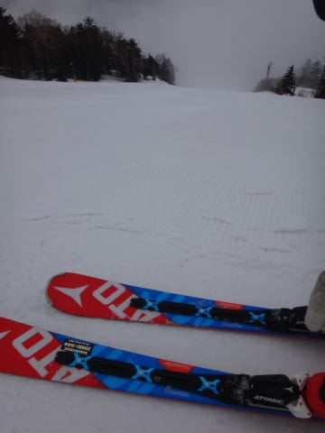
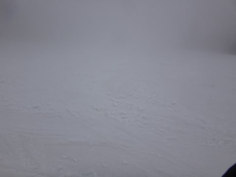
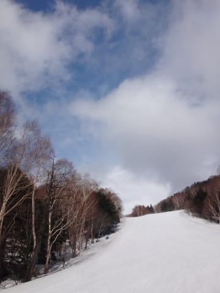

# 本日2連更新一発目…GWの谷間，5/1の志賀高原の状況は…朝から雨（涙）．午後は止んで，夕方に晴れたけど…

📅 投稿日時: 2017-05-01 21:09:47

🏷️ カテゴリ: [2017スキー滑走日記](c7d777cecfc91bdf0fa464ad62c6d49ab.md)

えー．

GWの谷間の本日も，志賀高原にいるわけで．

なんと．

今日はスキー場レポートとGW後半5連休天気予想の，

2連続更新します…！

ってことで．

まずは1発目，本日の志賀高原スキー場の

レポートをば…

今日も早朝スキーへ繰り出そうかと，

朝5時に起きると…

うげげげげ！

なんということだ！

雨が降り始めているじゃないですか…（涙）

ってことで．

早朝スキーをあきらめて．

通常営業の一の瀬でスタートとした本日．

…雨はぽつぽつ程度の，かなりの小降りに

なっていたものの．

ゲレンデはガスの中ですね…（泣）．

でも．

山頂に出ると．

朝イチの山頂はガスの上で．

をを！

雲海状態！！

朝イチのゲレンデは．

一応はシマシマですが…

雪質は…雨を吸った雪ですね（泣）

朝は下地がある程度硬かったので，

板が潜るほどではなかったですが…

しかし．

朝イチの正面バーン．

ちとピステンが荒くて．

結構怖かったかも…

ゲレンデは，じきガスに覆われて…

ピステンが荒いのに，ゲレンデが

見えなくて…

こわいでござるよ（泣）．

そして．

追い打ち．

9時半ごろ．

雨が強くなってきましたよ…

それも，かなりの降りなんですが（涙）

雨のなか，こんなガスなので…

だれも滑ってませんよ～！

誰も滑ってないから，バーンもそれほど

荒れてませんよ～！

…一の瀬正面バーンを，貸し切りで滑れるなんて…

なんて贅沢なんでしょう！！←無理やりのポジティブシンキングで乗り切ろうとしてみる

しかし．

11時過ぎ．

ポジティブシンキングでもごまかせないほどの

激しい雨になっちゃいました…（泣）

この私が，滑るのをあきらめて，

早めのお昼休みタイムに入ったという

くらいの，すごい雨です！←この表現で，すごい雨かどうかわかるのか？？

で．

お昼休みを取っていたら．

12時半ごろから，雨はかなり小降りになったので．

再び出撃！

＃誰も滑ってない…

そして．

ガスは残っているものの．

1時前には，完全に雨はやみましたよ！

…まぁ．

雪は，雨を吸ったかなりずっしりとした

感じになっちゃいましたけど…（涙）

で．

午後2時半ごろには…

をを！

太陽が顔を出してきましたよ！

ゲレンデに日が差してきましたよ！

今日は滑った人が少なかったので，

パーフェクターコースは最後まで

フラットで，かなり楽しい感じでしたよ！

ただ，日が差してからは．

ちと板に張り付く，滑りの悪い雪に

なってきたのが残念だったけど．

気温は+3℃程度と結構寒めで．

それほど壊滅的な雪には

ならなかったのが救いか…

さすがに，リフトストップの4時半近くともなると，

正面バーンはちょいと荒れてきたけど．

でも，人が多くて全面コブコブになっちゃう

ような状態に比べれば，かなりマシな状態！

…ってことで．

今日もしっかり，リフトストップのラストまで．

こんな感じで，

「人が…人が，どこにもいないん

ですけど？？？」

と，叫びたくなるような，貸し切り

ゲレンデを滑り続けたのでした…

…しかし．

本日．

早朝営業開始前のタイミングで

雨が降り出し．

…そして，リフトが営業終了した

タイミングで．

ちょうど狙ったかのように，こんなにすっきり

晴れてくるなんて…

…きっと，今日，ゲレンデで滑っていた人に．

強烈に激烈に日頃の悪い人がいるに違いない！！

だれだ～！日頃の行いが悪い人は！！←だから，自分でしょうが…

## 💬 コメント一覧

### 💬 コメント by (Unknown)
**タイトル**: Unknown
**投稿日**: 2017-05-01 21:42:01

11時台、山頂付近は「雨→霙→雪」となったため

緩斜面は全く滑らなくなりました orz

4/29 に続いて、降雪で滑らなくなるとは…

### 💬 コメント by (Skier_S)
**タイトル**: unknownさま
**投稿日**: 2017-05-01 22:47:10

あ，自然淘汰で生き残った方が

こちらにいらっしゃいましたね（笑）．

私の休憩中に，山頂付近はかなり

雪っぽくなってたのですね…

私は雨が強くなったので，早々に

無料休憩所でくつろいで

そば食べてました（笑）

しかし，まさか中1日挟んで，

また降雪に見舞われると思いません

でしたよね…

### 💬 コメント by (Seeker)
**タイトル**: Unknown
**投稿日**: 2017-05-02 03:19:22

強い降りの時、ゲレンデから人影が消え、それでも強行していたら一気に体温を奪われました。

と言うことで12時前に今シーズンのスキーを終えました。

4月は結構な確率で雨が降りましたが、S様、シーズンの残りは天候に恵まれます様にお祈りしております。

### 💬 コメント by (komu)
**タイトル**: 行い
**投稿日**: 2017-05-02 04:14:51

久しぶりにご一緒できて楽しかったです。

相変わらずの激しい滑りに親子共々感動しました。

あの滑りなら板は消耗品しますな。

という訳で、もう一本いっときますか？

### 💬 コメント by (Skier_S)
**タイトル**: コメント遅くなってすみません
**投稿日**: 2017-05-03 11:20:44

＞Seekerさま

コメント遅くなりましてすみません．

かなりの無理な日程だったので…（笑）．

あの日は雨の中お疲れさまでした．

残念なシーズンの終わり方でしたね．

翌日はおかげさまで最高でしたよ！

また来シーズン，お会いできることを

楽しみにしております！

＞komuさま

こちらこそ，息子さんと一緒に滑らせて

いただいて楽しかったです．

いろいろ刺激を受けました…

昨日の午前中は最高でしたね～！

…板は，お金があればもう1本といわず，

あるだけ買い占めたい気分です…（笑）

