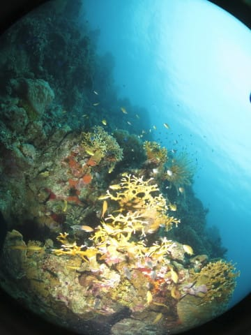
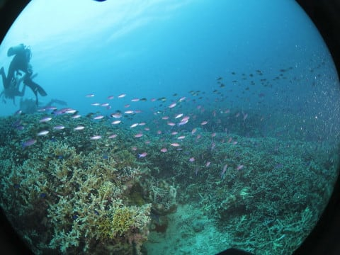

# 2019年8月，4度目のモアルボアル・小6の娘Cカード取得1周年！その31…今日は午前中に一気に3本！

📅 投稿日時: 2020-09-18 04:03:31

🏷️ カテゴリ: [ダイビング日記](ce3a7a8d424d112fce83ee85c81a0e344.md)

ってなことで．

2本目のダイビングが終わり，浮上しましたが…

本日はダイビング最終日で．

明日は，午前中に飛行機に搭乗して

帰国なので．

潜水病予防の観点から，最終ダイビングから

飛行機搭乗までの時間を空けることを

考えると…

残念ながら，

今日の午後はダイビングができません．

でも．ここで終わると，娘と妻は

今日は1本しか潜れないことに…

ということで，本日の出航前．

私「1本目はビーチダイブで移動時間が

　無かったから，まだ時間も早いし．

　午前中のうちに，もうあと2本

　潜れますかね…？」

アイさん「今日，午前中で3本行きたいって

　ことですね…！

　大丈夫です．行けますよ！！」

というやり取りがあって．

我が家3人だけの貸し切りの本日，

もうプランを我が家のワガママ放題

好き勝手放題にさせてもらって．

午前中にビーチ1本，ボート2本という

プランとしてもらい．

ビーチに行けなかった娘と妻にも，

2本潜れるようにしてもらったの

でした…！←あなたが3本潜りたかっただけでしょ

まさに，自分たち家族で好き勝手に

できる，殿様ダイビング！

アイさん，ありがとう！

…ってなことで．

今日の2本目が終わりましたが．

ボートはショップに戻らず．

2本目のポイントのそばで，

1時間の水面休憩を取ります…

娘はいつもの特等席で寝てますね…

休憩が終わったら，3本目のポイントへ

ボートを動かしますが．

2本目のポイントと3本目のポイントは

すぐそば．

…というか．風と波がそこそこあるので，

潜れるポイントは限られてます．

湾のようになっている中でわずかに動いた

場所が3本目のポイント．

ブリーフィングが始まりますが．

ポイント名は「マリンサンクチュアリ」

ここは，珊瑚が広がるポイントの

ようです…

ってなことで．

本日午前の3本目へ，エントリー！

なんと…早くも，

今回のモアルボアル旅行の

ファイナルダイブです…！

エントリー直後は，サンゴというより

ちょっとガレ場に近いところを進んで

行きますが…

また，アイさんが娘に何かを見せて

くれているようですが…

おっと．

透明ボディに赤いおめめの

アカメハゼですね…

そこからは，珊瑚の広がるところを

進んで行きます…

’

曇り空なので太陽光があまり入りませんが…

それでも，いい感じ！

…フィリピンはやっぱりサンゴが

元気だなぁ…

おっと．

これは久しぶりに見たかな．

オイランヨウジですね…

さらにサンゴの上を進んで行くと…

また，こいつがいると無条件に

撮ってしまうカクレクマノミが

います…

なんでカクレクマノミってついつい

撮っちゃうんでしょうね…

そして．

またサンゴを愛でながら，

ゆったりと泳いでいきます…

ぺスカドール島ほどの密度は

無いけど，いい感じのポイント

ですね…！

いや…

きれいじゃないですかっ！！

…そして，娘が

また不思議なポーズをしている…

なんかこの岩の周り．

地味なハタンポがいっぱいいますね…

ハタンポって岩陰とかの暗いところに

いるイメージがあるけど…

ダイビングも後半に入り，

こんな感じの景色を見ながら，

浅瀬を進んで行きます…

おっと．

これは，テングカワハギ！

…そしてこっちは，

メタリックブルーが印象的な

スプリンガーズダムゼル．

こうして撮るときれいですね…

娘と妻も一生懸命撮ってるけど…

そんなに遠くから写るかな？

ラストの浅瀬でしばらく遊んだら…

これにて，今回の遠征の全ダイビング，

終了！

