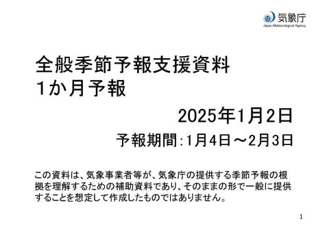
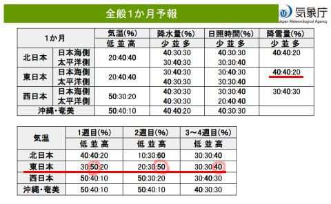
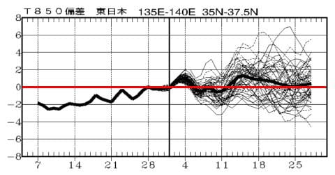
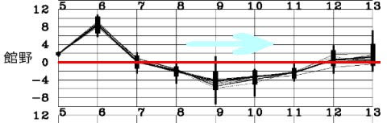

# スキー場の激冷え祭りは1月14日あたりでいったん終了か？…その後は平年並みかわずかに高め

📅 投稿日時: 2025-01-07 02:15:37

ということで．

長かった9日間の休みが終わり，

本日から仕事を開始している

わけですが．

9連休後の新年初日の仕事は効く…

そして，今日の仕事がまだ終わって

いない，この恐怖（涙）

初日からいきなりきつい…

ってなことで．

ちょっと今日は短め更新！

えー．

木曜に記事にできなかったので，

ちょいといまさら感がありますが．

先週木曜に出た，1か月予報．

この1月の一か月の予想になりますが．

ざっくり見てみると…

1月8日までの第1週は冷えるけど，

それ以降は平年より気温が上がる

しょそうになってきました…（泣）

そして，降雪量も平年より少なめの

予想ですね…（泣）

まぁ．

とはいえ，これからの気温も上がり

気味と言っても，このグラフを見ると

ほぼ平年並みっぽい感じだから．

1月に平年並みなら，志賀高原なら

十分冷えてちゃんと雪は降ってくれる

気温ですね…！

そして，今後の1週間の予想では，

9，10，11日あたりは平年比2～5℃は

気温が下がり．

今週後半は，また雪が降りそうな感じだし．

とりあえず，昨シーズンのようにヤバい

天気になるような，危険な予想じゃない感じ…

とりあえず．

この1月はそこまでの激冷えには

ならなさそうな感じではありますが，

まぁ，1月は平年並みに冷えてくれれば

醜聞じゃないかな～．

ということで．

仕事初日で疲れていて，

ちょっと短め更新でしたが．

今年も相変わらずご無体な

仕事が続きそうだということが

十分わかった，2025年の仕事

初めだったのでした…（泣）

## 💬 コメント一覧

### 💬 コメント by (レインボー77)
**タイトル**: Unknown
**投稿日**: 2025-01-07 17:43:29

火曜日の志賀高原情報

17日ぶり、久々のスキーです。ニゴンパークは積雪５センチ。

白樺、唐松はまあ普通。なんかコース幅が広くなった感じ。

オリンピックは夕方圧雪なので15センチくらい。もう荒れていて、引っ掛かりそうでなんか怖い。

GSも三高も普通。大して気持ちよくないし(贅沢になってます)、腰も痛いので11時前に終了。まあ老人はこの程度で。

### 💬 コメント by (Skier_S)
**タイトル**: ＞レインボー77さま
**投稿日**: 2025-01-08 00:28:59

ゲレンデ復活，お帰りなさい～！

17日ですか…かなり長い中断期間でしたね．

このBlogにはひそかにレインボーレポートを待っている人も多いと思うので，

またレポートお願いします～！

