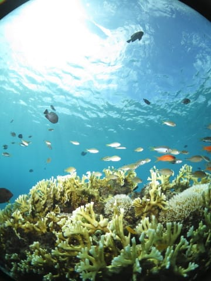

# 2016年8月　子連れ座間味ダイビング旅行記　その11…3日目の1本目は，沖縄らしいのんびり癒しダイブ！

📅 投稿日時: 2017-07-20 02:49:23

🏷️ カテゴリ: [ダイビング日記](ce3a7a8d424d112fce83ee85c81a0e344.md)

どうやら．

関東地方は，梅雨が明けたようですね～！

梅雨も明け，本格的な夏がやってきたようですが．

いつも季節感を狂わせるこのBlogも，

珍しく夏らしい記事になってます…

ってことで．

去年の座間味ダイビング旅行記へ．

Go!

----

というわけで．

早くもダイビング最終日．

それも，今日は高速船が欠航しそうで，

午前中しか潜れないという状況…（泣）．

だもんで．今回の旅行で潜れるのは，

結果的には初日の夕方の1本と，

あとはわずか1日半（涙）．

こーゆー悲しい状況の中．

残り半日のダイビングの1本目へエントリー

したわけですが…

ほう．

午後には海が荒れて，高速船が欠航になりそうとは

とても思えない感じで．

太陽が射して，透明度が高く感じる海ですよ！

そして，海底には，

ハナダイやスズメダイ系がいっぱいついている，

きれいな根がいっぱいあって…

それに太陽がキラキラ差し込んで，

きれいです！

そうそう！

これが慶良間の海だ！

見事な感じの．

ザ・慶良間といった海ですね～！！

ハダカハオコゼちゃんもいるし…

ハマクマノミちゃんも太陽を浴びて

気持ちよさそうだし…

デバスズメもキラキラしてるし…

テッポウエビ君の掘った穴に暮らす，

ダテハゼ君もゆっくりと眺められます．

＃ここまで寄らせてくれる，ダイバーを恐れないハゼだった…

流れもなく，のんびりゆったりした．

いかにも南国らしい，癒しの海ですね～．．．

おそらく，このあたりの写真を見ると．

ノンダイバーの人でも，

「潜ってみたい」と思うのではないでしょうか？？

やっぱり，ケラマの海．

いいなぁ～．

…という感じで．

たっぷり南国の海の，癒しエネルギーを

もらったところで．

1時間のロングダイブタイム，終了！

ボートに上がります．

いやーー．

いい感じのダイビングだった…！

って感じで．

満足の1本目のダイビングを終えたボートは，

ダイビング中にボートの周りで泳いでいたらしい，

娘とその友達を乗せて．

2本目のポイントへ移動を開始しました…

