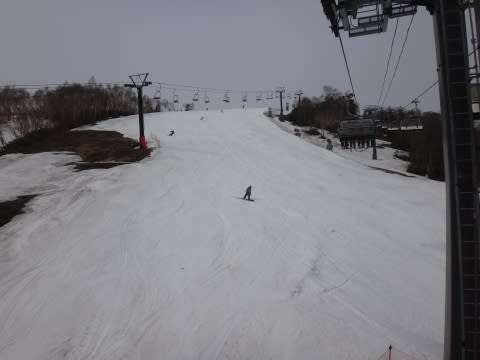
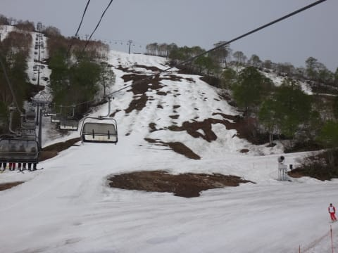
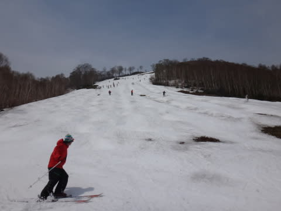
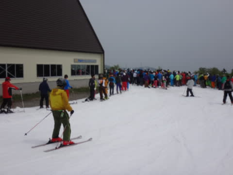
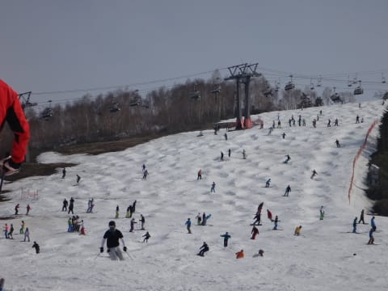
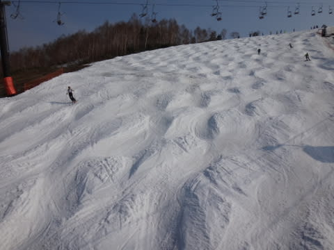
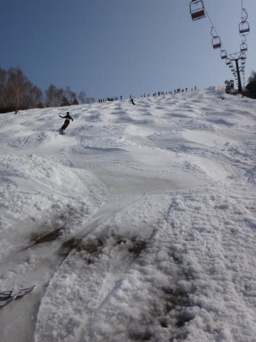

# 5月26日のかぐら速報…かぐらファイナルは，混んでたよ～！

📅 投稿日時: 2014-05-26 00:37:24

🏷️ カテゴリ: [2014スキー滑走日記](c992167609b6415052179ee69ea1ea7d8.md)

えー．

相変わらず，今日も帰宅が遅かったので．

恒例の，速報モードで…

ということで．

本日最終日のかぐら．

天気は終日薄曇りって感じで．

気温は高めだったけど，直射日光が射さないだけ，

激暑ってほどにはならなかったのが救いかな～

んで．

朝イチのメインバーンは．

ましなコンディションでしたね～

でも．

あらら？

テクニカルコースはもうおしまい？

完全，コースが途切れてますね～．

ジャイアントコースも…

まだ滑れるとはいえ，かなり土が…

で．

今日は，人が多かったよっ！！

ピーク時のリフト待ちは10分以上…

昼から，リフト待ちは3分以下に減ったものの．

コース上はずっと人口密度が高く…

午後は盛大なコブ祭り状態っ！

メインバーンも，コブ溝にところどころ

マズいものが出始めてきちゃったよ…（涙）

んでも．

まぁ，5月下旬と考えれば．

幅いっぱい滑れるだけ，恵まれてたファイナルデー

だったかな！

詳細は，また明日っ！
