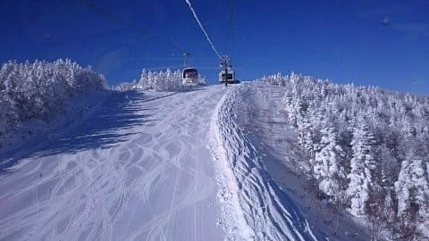
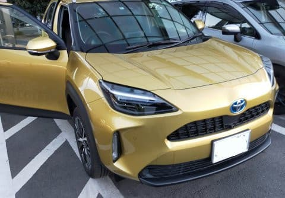
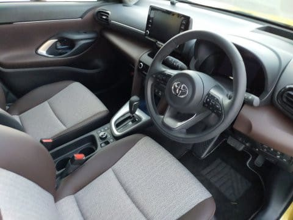
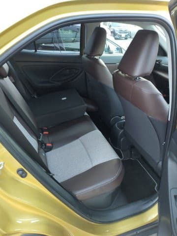
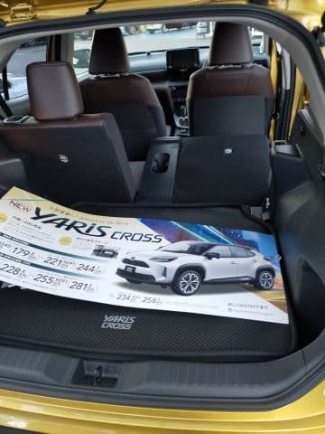

# トヨタ・ヤリスクロスのハイブリッドに試乗してみた

📅 投稿日時: 2020-12-23 04:00:15

今日，22日の火曜の志賀高原．

晴天最高だったようですね…

あぁ…こんな日に滑りたかった…

（某20000m特派員より）

そして．

ついに今週金曜から，わが生息地，

焼額第1ゴンドラの営業開始です！

それもGSコースだけじゃなく，

オリンピックコースも同時オープン

するようです！

（[焼額山スキー場ホームページ](https://www.princehotels.co.jp/ski/shiga/winter/)より）

いやー．

自分の生息地が動き出すとなると．

これでやっと落ち着きますね…

ようやく，私の本格シーズンの

スタートです…！

ってなことで，本題へ．

先日，トヨタのYaris Crossに試乗してみたので．

久しぶりの車試乗レポートです！

この車，ヤリスをベースに車高を上げて，

SUVっぽいボディを載せてるわけですが…

見た目は背が高くて，ボンネットの高さも

あるので，かなり大きめに見えますね…

試乗したグレードは，Hybrid Z．

ヤリスクロスの最上位グレードになります．

運転席を見ると…

シフトノブ回りとかにちっとプラスチックっぽさも

あるものの，ステアリングも本革だし，

メーターは巨大なディスプレイ化してるし．

まぁ，260万円もする車ならこのくらいで

あってほしい…というレベルに達しているか…

後ろ座席はミニマムの広さですね．

大人が長時間乗るとつらいかな．

ただ，トランクがヤリスよりかなり

広くなってるように感じます！

…ってな感じで．

運転席に座ってみますが…

シートの座り心地はいいですね．

シートは電動シートですが，

モーター数を減らして，前後動や

リクライニングを一つのモーターで

切り替えてやるタイプだからか．

シートの調整時に，ギアの駆動音が

ちょいと響きますが．

まぁ，シートを動かすときの音くらいは

どうってことは無い．

ということで．

いざ，スタートボタンを押しますが…

ハイブリッド車なので，システム起動しますが，

エンジンはかからず．

アクセルを踏むと，最初はモーターでスーッと

走り出します．

ステアリングは…低速ではアシストが結構強めで，

クルクル回せますね…

足回りは…車高が高くてサスのストロークが

あるぶん，スプリングレートは低めかな？

と思ったところ．

バネレート自体は，ヤリスとそんなに変わらない

のか，結構しっかりした足回り．

柔らかさより，適度な硬さがあり，

そこそこのスピードで舗装路を走るのに

合わせてある感じ．

そして，アクセルを踏み込むと．

エンジンが掛かりますが…

エンジン始動の音と振動がしっかり

聞こえますね…

カローラとかプリウスは，エンジンが

かかっているかモーターのみで走っているか

分からないレベルですが，ヤリスクロスは

エンジンが3気筒で振動が抑えきれて

いないのか，エンジンルームの防音が

弱いのか．

エンジンが始動するたびに，

「ブルン」という音と振動があるのが，

ちょっと惜しい…

そして，エンジンが始動してからは，

割とはっきりエンジン音が聞こえて．

そして，加速が終わるとエンジン音が

止まり，静かになります…

交差点などを曲がって，また加速する

際にまたエンジンが掛かるのですが，

加速を始めてしばらく後から，

「ブルン」とエンジンが掛かり，

加速が終わるとエンジンが止まり…

というのを繰り返すので，

「エンジンが掛かるかな…来るかな…来た！」

という感じ…

アルファードやハリアーなんかの

ハイブリッドだと，エンジンが掛かって

いるかどうか，メーターを見ないと

分からないレベルだから気にならないけど，

エンジン音が聞こえると，

「いつエンジンが掛かるんだ…？」

と気になってしまうんだなぁ…

慣れれば気にならなくなるのかもしれないけど．

で，純粋なエンジン車より，モーター

トルクがプラスされる分，ハイブリッド車の

方が加速時のトルクがあるはずですが，

人間が感じるトルク「感」というのは

結構いい加減なもので…

エンジン回転が上がらないのに低回転から

トルクが出ると，トルク感があるように

感じるけど．

この車，ある程度以上のトルクを

出そうとした時にはエンジンが掛かり，

それもそこそこの回転数で回るので，

「頑張ってパワー出してます！」

という感じで，余裕のトルクで

加速している…というトルク感が

弱く感じるのも，惜しいところ．

うーむ．足回りや，ステアリングフィールが

わるくないだけに．

エンジン始動時の振動とエンジン音が惜しい…

基本的に街乗りしか乗っていないので，

コーナーを攻めた時の挙動などは

分からないけど，

足回りは比較的しっかりしているので，

高速での安定性も良く，普通の道を

走るぶんには不満は無いでしょう．

ということで．

トヨタが気合を入れて作ってきた

車なんだろうなぁ…と思いながらも．

このグレード，4WDだと280万円もするし．

うーーーん．

私なら，エンジンも静かで，

モータートルクがヤリスの

1.5倍以上あってグイグイ気持ちよく

加速してくれる，FITの方を選ぶかなぁ…

## 💬 コメント一覧

### 💬 コメント by (yumi)
**タイトル**: Unknown
**投稿日**: 2020-12-23 06:31:10

Ｓさぁ～ん🚗💨😅

ちょっち💧残念な感じです😢

ヤリスクロスは 我が家🏠️の 一番候補だったけど・・・

どっしよう・・・かなぁ～～～🙄

### 💬 コメント by (カンタロス)
**タイトル**: Unknown
**投稿日**: 2020-12-23 16:04:59

２３日水曜日の志賀の状態です。

志賀上り坂、第一発電所あたりから積雪路面。

昼間日があたる所はとけていて、本格的な圧雪路面はサンバレーあたりから。

終日、晴れで時折曇り。ほぼ無風で適度に暖かい最高のスキー日和。

ダイヤはポールはっていたのでゲレンデ狭いですね。

高天原、上部はちょいちょいブッシュ地雷があり注意。

一ノ瀬、正面は荒れる事なく最高でした。パーフェクタは取りつきからブッシュで閉鎖されてます。

明後日までいるので、先んじて、オープンしたてのgsコースいただきます(笑)

### 💬 コメント by (Skier_S)
**タイトル**: また深夜（早朝？）にコメント
**投稿日**: 2020-12-25 03:36:40

＞yumiさま

ハイブリッド買うなら，FITの方がいいかと…

もしガソリン車なら，FITもヤリスクロスもそんなに変わらない感じですが…

＞カンタロスさま

パーフェクターはまだ開いてないのですね…

そして，25日まで滞在ですか！

我が住み家，1ゴンのオープンに立ち会えるとは羨ましい．

GSコースとオリンピックのパフパフを楽しんできてください

