# 2018年8月，モアルボアルで小5の娘をダイバー化！その４…今年1本目のダイビングは，ぺスカドール島！

📅 投稿日時: 2019-07-10 02:37:00

🏷️ カテゴリ: [ダイビング日記](ce3a7a8d424d112fce83ee85c81a0e344.md)

今日は，2019シーズン全滑走記録後半だと

お思いでしょうが．

本日は，ダイビングネタに戻ります…！

いや．

全滑走リスト作るの大変なんで…（涙）

2019シーズン滑走日記のカテゴリーの記事数，

100本を超えていて．

これをみんなたどりながら1本1本の記事に

リンクを張って，そしてコメントを

書いていくってのは，

めちゃくちゃ大変なんです…

（前半の記事を書くのに3時間かかった（泣））

…で．

今日も帰宅が遅かったので（涙）．

すみません．

今日はモアルボアル旅行記です！

…全滑走リスト後半は，明日か明後日あたりに

書きます…

---

ってな感じで．

Cカードの講習を受ける娘を

ショップに置いて，

ファンダイブ組はダイビングに

出発したわけですが…

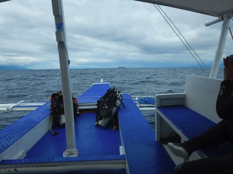

向かった先は，ショップから

ボートで20分ほどの沖合にある島，

ぺスカドール島！

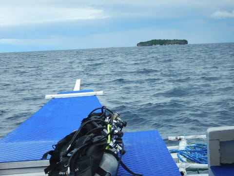

きれいなサンゴと，それに着く

色とりどりの魚が美しい，

モアルボアルでNo.1のダイビング

ポイントです…

…が．

今日は波が荒く．

ぺスカドール島に行けるギリギリの

海況．

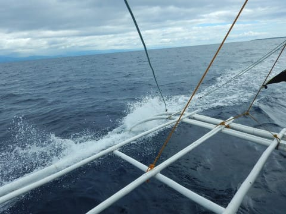

とりあえず，ぺスカドール島に到着したら．

船が揺れるので，手短にブリーフィングを

済ませて…

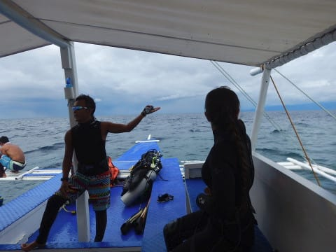

いざ，今年の1本目のダイビングへ

エントリーっ！！

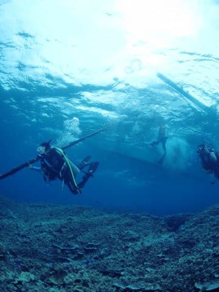

…去年のラストダイブは8月下旬．

娘の夏休みにしかダイビングを

しなくなった現在．

毎年シーズン初めのダイビングは，

ほぼ1年ぶりのダイビングになります…

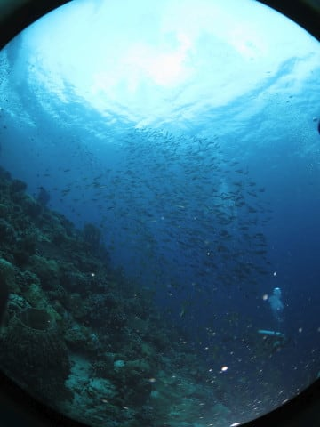

でも．

1年ぶりのダイビングですが．

まぁ，体が覚えているもんですね…

それほど違和感を感じず．

「ををー！久しぶり！」

といった感じもなく．

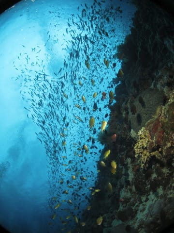

今年1本目のダイビングが

スタートしました…

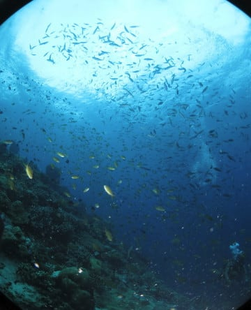

しかし．

やっぱり．

ぺスカドール島，きれいですね～！

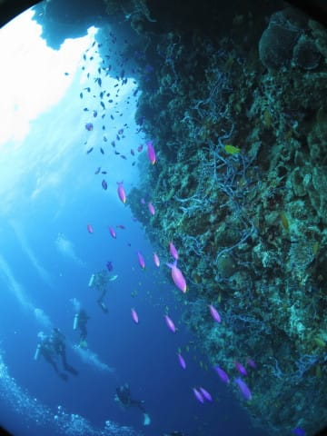

…でも．

1年ぶりのダイビング．

身体がダイビングを覚えているんですが…

いつものことで．

カメラの使い方を上手く思い出せず．

フラッシュと自然光のバランスが悪い…（涙）

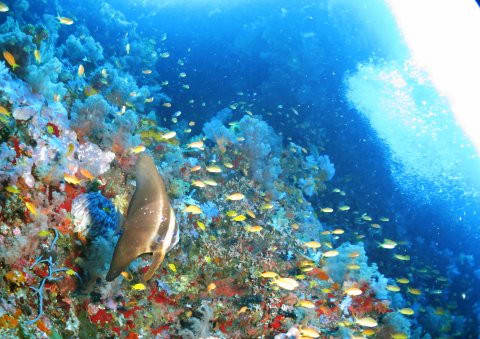

この写真も，フラッシュが当たっている被写体の

ツバメウオの露出は適正っぽいけど．

背景が露出オーバー気味（泣）

この写真も，背景が飛んでる…

ちょいと絞りを開けすぎたかのかな…？

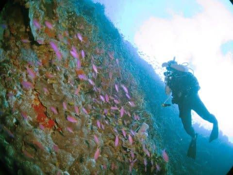

そんなこんなで．

いつも通り，1本目はダイビングを楽しむというより，

カメラの絞りとフラッシュの発光強度と

露出補正の三つを，ひたすら調整し続け

ていたのですが…

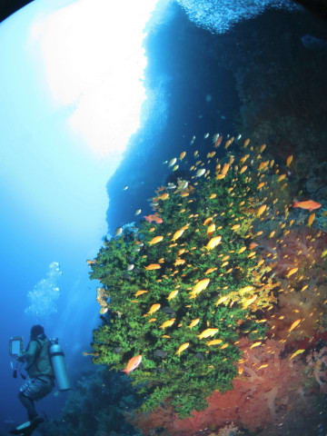

エグジット直前に，ISO設定を

オートにしたままだったことに気づき．

「それじゃ露出が安定するわけないわな…（涙）」

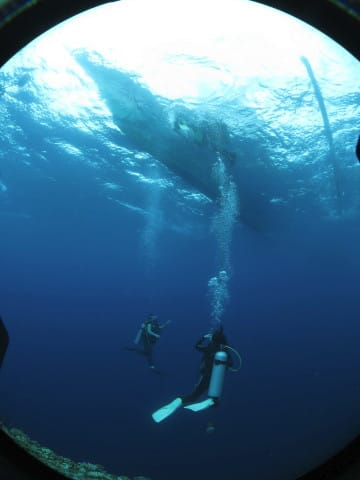

ってなことで．

露出が安定してきたのはエグジット時（泣）．

…せっかくのぺスカドール島．

ほとんどまともな写真が撮れなかった…（涙）．

ってなことで．

リハビリダイビングと言える，

今シーズンの1本目のダイビングを終えたら．

エグジット後にスタッフから渡される，

暖かい紅茶を飲んで…

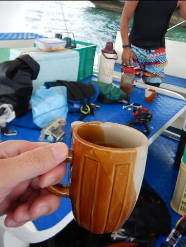

船はぺスカドール島を後にしたのでした…

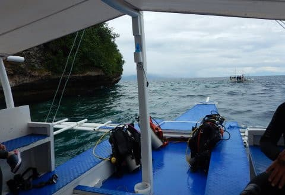
