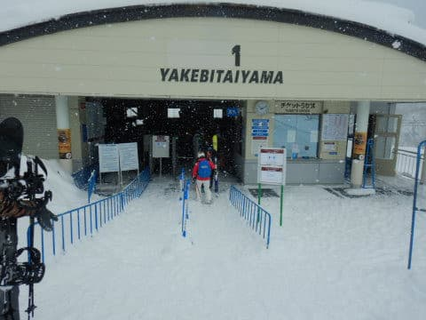
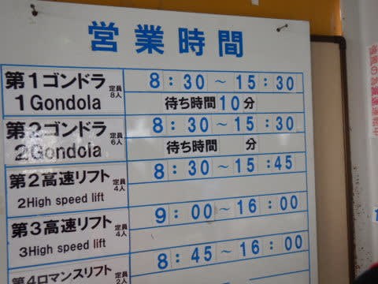
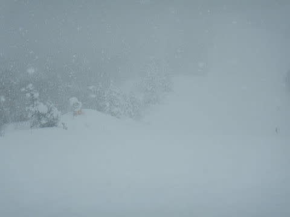
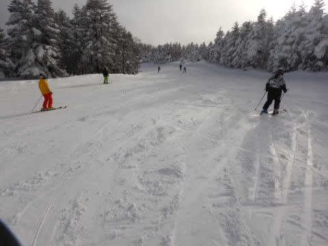
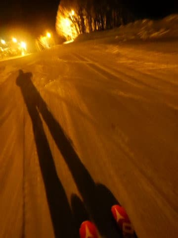

# 2021/1/1,2021年の元日の志賀高原，焼額山スキー場は…朝イチ冷え冷え膝パフ！午後は天気も穏やかで雪も最高の一日！

📅 投稿日時: 2021-01-01 23:08:49

🏷️ カテゴリ: [2021スキー滑走日記](c2b0fc073d6357d3b786f6ca655147f7d.md)

えー．

私がスキー場にいる間に，世の中は年が

変わったようで．

今日から，2021年が始まるという，

驚愕の事実に驚いている今日この頃．

皆さまあけましておめでとうございます．

（時候の挨拶に見せかけた年始の挨拶）

ってなことで．

2021年も始まった本日．

今日も焼額を滑ってました～！

今日も，朝までに30～40cmの積雪があり．

残念ながら新春ファーストトラックは

中止になったものの，

通常営業は昨日のように遅れることなく

予定通りの8:30営業開始！

でも，開始前のゴンドラの待ち行列は，昨日より

短いですね…

あさイチの山頂の気温は…

  －11～12℃の冷え込み

という予想から，わずかに低い－13℃．

でも，3日前の予想としてはかなりの精度だな（自慢）

ってなことで．

ゲレンデは冷凍庫並みの冷え冷え気温で…

圧雪コース上も，10㎝ほどの積雪が！

でも，すごい軽い雪なので，圧雪を滑っている感覚で

滑れちゃいます…！

こういう日には，当然新雪パフパフの

オリンピックコースへ！

…昨日の太ももパフほどではないけど．

これは，膝パフ！

それも，昨日は重かったけど…

今日はかなり軽めのパウダー！

ファーストトラックがなかったので，1本目は

全くフレッシュな，まだ誰も滑ってない

最高シアワセ軽雪膝パフをいただきました！

昨日と全然違う！軽いよ！

これをシアワセと言わず，何をシアワセと

いうのだろうか…！！

ゴンドラも，朝10時ごろまでは完全にがら空きで．

コース上の人も少なく．

さらに，時折日も射すタイミングもあり…

ゲレンデの視界が結構良くて，滑りやすい！

昨日は3本滑ったら荒れ荒れになって楽しくなかった

オリンピックコースのパフパフ．

今日は昼近くまで楽しめました！

ただ，朝のうちはガラガラだった第1ゴンドラは，

午前11時という比較的遅めの時間から混み始め…

なぜか，午前11時半ごろ，一瞬だけ10分待ちに

なったものの．

12時にはまたゲートの外に並ばない程度に

待ち時間が短くなり，その後はゲートの

外まで列がつくことがほとんどない

感じでした．

で．

ゴンドラ混雑時間でも，リフトはがら空き

だったし．

コース上の人口密度も低く…

というより，かなりガラガラで．

正月元日にしては，ムチャクチャ空いてて，

超快適でした！

天気は，午前中は時折雪が強く降る

タイミングがあったものの．

午後になると天気は穏やかになり，

曇ったり晴れたりで．

午後3時以降は完全に晴れになりました！

だのに．

気温は最高気温でも，－10℃をわずかに

上回るかという冷え冷え気温なので…

雪は一日中，最高のまま！！！！

こんないい雪質の雪で．

天気も穏やかで，今日は根性の無いスキーヤー

ふるい落とし機能は全く機能してない状況なのに．

ゲレンデもガラガラだし．

こんな午後まで，冷え冷え最高雪質で，

人が少なくてそんなに荒れないバーンを

滑れて，いいんですか！？？

さらに，夕方になってもコース脇には

軽い新雪が残ってるし…

もう，今年は正月1日から最高の雪，

最高のコンディションで，ガラガラゲレンデという

嬉しいお年玉をもらった感じ！

ってなことで．

あぁ…今日の営業，終わらないで！！

と強く念じたものの．

無情にも日が暮れていき．

いつも通りのラストリフト，誰もいなくなる

16時まで，たっぷり滑り続けたのでした…

いやーー．

いい一日だった…

…

…

…では，終わらない．

本日は，焼額のナイターが営業するのだ！

昨日，おとといと2日間ナイター中止となり

泣いたー…という憂さを晴らすのだ！！←なんだ，この小学生以下のダジャレは…

ということで．

本日は焼額ナイターへ参戦！！

今日の昼間の最高冷え冷え雪に，

圧雪をかけなおした，最高級のシマシマ

バーン．

こいつを，たらふくいただくのだ…！！

いや，最高！

昼間もいい雪だったけど，そのいい雪に

圧雪をかけなおしたゲレンデは最高！

滑っている人が少ないので，最後まで完全フラット．

ナイターストップの午後8時まで，

最高雪質をキープしてくれて．

超満足な，1月1日が終わったのでした…

いや．

はじめ良ければすべてよし．

今年は，いい年になりそうだな！！

## 💬 コメント一覧

### 💬 コメント by (アリス)
**タイトル**: 素晴らしいお年玉ですね♪
**投稿日**: 2021-01-02 15:36:26

Skier_S様

新年明けましておめでとうございます。

新年早々に激軽のパウダー＆空いているゲレンデに幸せ感が伝わってきます♪

さらに、泣いたー（Sさん張りにダジャレ）まで堪能できて素晴らしい年の始まりですね。

このまま、シーズンオフなしで年間通じてずっと滑れればいう事なしです。

### 💬 コメント by (Skier_S)
**タイトル**: Unknown
**投稿日**: 2021-01-02 23:35:54

今日もいい感じの一日でした！

このまま何もなくシーズン終わりまで行ってほしいのてすが…

緊急事態宣言がでたらスキー自粛てす（涙）

