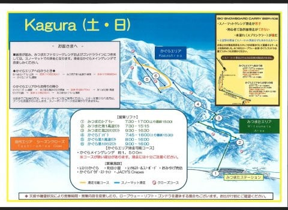
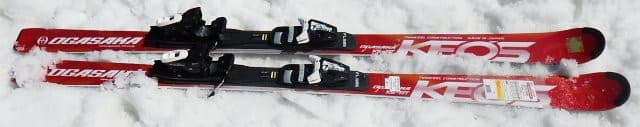
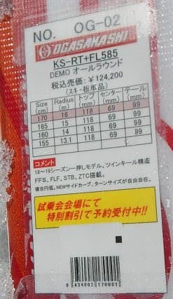
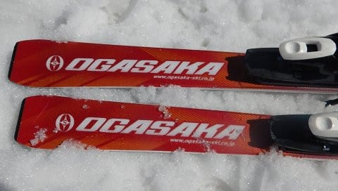
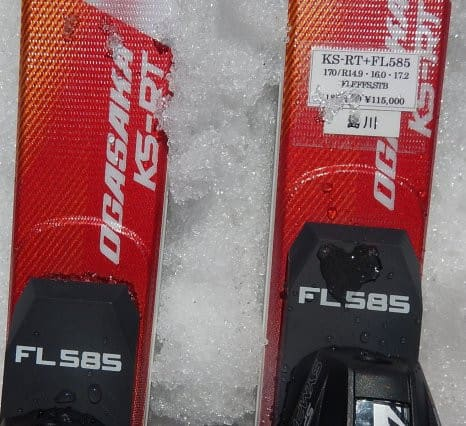

# 2019シーズンのスキー板，試乗レポート第11回…OGASAKA編その2

📅 投稿日時: 2018-05-26 02:07:40

うーむ．

本日，かぐらの今週末の営業予定マップが出ましたが．

なんと！！

この週末も，かぐらクワッドが滑れるようですね…

（[かぐらスキー場ウェブページ](http://www2.princehotels.co.jp/ski/kagura/images/2018coursemap0526.JPG)より）

先週の状況から考えると信じられないのですが…

まぁ，明日，明後日は．

昼前になるとコブ溝が全面土になっちゃいそうな

予感…

とりあえず．

私は土曜に用事があるので．

日曜，かぐらファイナルデーに参戦予定！

…ってなわけで．

まだスキーシーズンが続くので．

このBlogはまだまだ冬モード！

今日は，スキー試乗レポート．

オガサカのケオッズです…

では，どうぞ～！

----

○OGASAKA KS-RT+FL585 170cm

基礎オールラウンド．

Keo'sシリーズは，ツインキール構造のRT，CT，TTと，

シェルトップ構造のRX，CX，TXの，3種類ずつありますが．

来シーズンはのシェルトップ構造のRX，CX，TXが

今シーズンからの継続モデルとなり，

ツインキール構造のRT，CT，TTが新規モデルになります．

ってなわけで，この板は．

来シーズン新登場となる，ツインキールKEO'sの

最上級モデルですね．

FL585プレート，FM-600プレート，プレート無しが選べるようですが．

これはこのうちで一番強い，FLプレート付きになります．

R=16.6と，大回り寄りではあるけど，中庸の

なんにでも使えそうなサイドカーブ．

ガッツリグリップの板ではなく．

結構マニュアル操作感を感じる板…

というより，基本的にずらしでコントロールするところがベースなのかな？

迎え角を作っていくと板が回り始める感じで．

角づけだけでガッツリグリップして，

簡単にギュイーンと回っていく板ではありません．

簡単にずれていきます．

ただ，ずれていく中でのコントロール性は高く．

どんな荒れた斜面でも，ズレを伴っていきながら

安心安全で下りて行けます．

山回りでも，ガッツリグリップというより．

切ろうと思えば切っていけるけど．

簡単にグリップを外して，すっと板を

動かしに行けます．

私の好きな，脳内麻薬系サイドカーブ

ギュイーン板ではありません．

動かしやすいので，サイドカーブは大きめですが，

小回りしていこうと思えばズラシで簡単に

小回りできますし．

大きめのサイドカーブに乗ってそこそこの

大回りまで行けますから．

かなり適用範囲は広い感じですが…

すごいトップスピードでガンガン滑る人には

物足りないかも．

私は，TC-SCのように，トップから食い込んで

ギュインと回ってくる方が好きだなぁ…

## 💬 コメント一覧

### 💬 コメント by (もりや)
**タイトル**: かぐらファイナル
**投稿日**: 2018-05-26 05:34:06

日曜日かぐらファイナルに参戦しますので、また宜しくお願いします。

### 💬 コメント by (すぎぃ)
**タイトル**: KEO'S
**投稿日**: 2018-05-26 12:39:45

＞来シーズンはツインキール構造のRX，CX，TXが

＞今シーズンからの継続モデルとなり，

＞シェルトップのRT，CT，TTが新規モデル

RX，CX，TX・・・継続モデルのシェルトップで

RT，CT，TT・・・新規モデルになるツインキール

ですね。

### 💬 コメント by (Skier_S)
**タイトル**: もりやさま
**投稿日**: 2018-05-26 13:22:47

ファイナル参戦ですか！

こちらも参戦しますので，また一緒に

滑りましょう～！

…でも，ゲレンデはすごい状態だと

思います(笑)

### 💬 コメント by (Skier_S)
**タイトル**: すぎぃさま
**投稿日**: 2018-05-26 13:28:48

ご指摘ありがとうございます…！

さっそく修正しました！

ありがとうございました…

