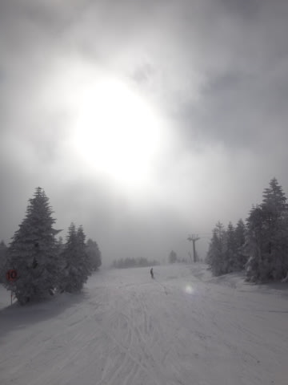

# 1月18日の志賀高原速報モード…午後は晴天の一日！

📅 投稿日時: 2015-01-19 00:45:39

えー．

今日も，帰宅が遅かったので，

速報モードで…

本日．

うっすら日も射すものの，曇り空で始まった一日．

…風が強く，ゴンドラは第1，第2ともに減速，

奥志賀ゴンドラは運転していないという，

ちと残念な状況ではありましたが…

で．

パフパフを期待したオリンピックコースは，

脛パフくらいで…

うむ．

もう少し積もるかと思ったんだけどな～

でも，楽しめましたよっ！

で．

圧雪コースはピカピカシマシマで…

午前10時過ぎには，太陽が出てきました！

太陽が出ても，気温は冷えていて，雪質も良く…

人も少なめで，雪よし，天気よし！

日が暮れるまで，たっぷり楽しめましたよ～！！

いやー．

恵まれた一日だったな！

詳細は，また明日…

PS.なんだか，22日．

　志賀高原でも，雨が降りそうなんだけど…

　なぜ，1月に雨…（涙）

## 💬 コメント一覧

### 💬 コメント by (Goku)
**タイトル**: Unknown
**投稿日**: 2015-01-19 23:51:10

また休み前に雨ですか(T_T)

皆で山の神に祈りを捧げましょう。

昨日は会えなくて残念でした。

### 💬 コメント by (Skier_S)
**タイトル**: Gokuさま
**投稿日**: 2015-01-20 02:29:07

雨です…

今度は間違いなく，確実に，

避けられないレベルで雨です．

どしゃ降りです（涙）

その次の日は激冷えなので，カチコチです．

…次の日からの積雪で，アイスバーンが

隠れてくれることを祈るばかり…

