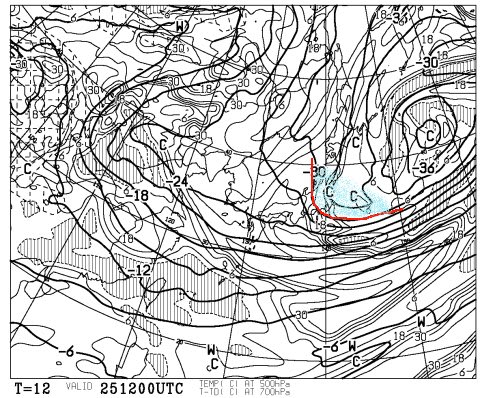

# 恒例！今週末の志賀高原の天気は…今日まで冷えたというのに，週末は完全に春だよ

📅 投稿日時: 2015-03-26 01:51:31

🏷️ カテゴリ: [スキー天気予想](c6554f5c3c106093b511a8daae23757e8.md)

えー．

どうやら．

スキー試乗レポートは人気があるようですね．

…このBlogの本来のネタであるはずの，

スキー場レポートをするとPV数が減ってしまうという，

…私としては，微妙に寂しい感じを受ける今日この頃．

いかがお過ごしでしょうか．

＃そして，天気予想の回はさらに訪問者が減るという…（涙）．

でも，

くじけずに．

今週も天気予想，行くのだ．

えー…

ふむふむ（天気図読込み中）

…

こ，これは…

…

…これは，ダメじゃん（涙）．

この週末（泣）

…だって．

水曜まで，こんな感じだったんですよ．

真冬じゃないとそうそうやってこない，500hpaの

マイナス30度の寒気さんがお越しくださって…

そのおかげで，850hpaの0℃線もかなり南まで下がり．

水曜は，超冷え冷えのいい雪がたっぷり積もり．

[パウダーも楽しめた](http://blog.princehotels.co.jp/yakebi/2015/03/25/)みたいなのに．

そう…木曜までは，冷えるというのに．

意味もなく，週明けから冷えたというのに．

これから週末に向かって，気温はぐんぐんと上がっていくのだ．

こんな感じで，赤矢印で示した水曜までは，平年比－8度近くまで

すごく冷え込んでいるというのに．

木曜も，平年比-4℃くらい，冷えているというのに．

それ以降，週末に向かっては．

逆に，平年より4度以上気温が上がってしまうのだ…っ！！

…見事に週末を避けて冷えてくれましたね（涙）

とりあえず．

土曜の850hpa気温図を見ると…

…なんてことだ．

水曜の天気図とあまりにも違いすぎる．

0度線は北海道の北まで行ってしまってます…（激涙）．

土曜の地上天気図は，こんな感じなので．

まぁ，基本的には晴れそうな感じ．

…でも．

この時期．

晴れるということは．

…そうです．

雪は強烈な日差しで溶けて．

ザブザブになっていきますので．

覚悟のほどを…（泣）．

で．

日曜の天気図ですが．

850hpaの0℃線は相変わらず北海道近辺で．

ああ．

ダメだ．

あれだけ重い雪になった先週より，気温が高いよ…（涙）．

これは．

朝から緩んだ雪で始まりますね（泣）．

地上天気図は，こんな感じなので．

まぁ，今のところは，基本的に晴れ．

午後は雲が多くなるかも…

って感じですか．

とりあえず．

昼間は「あぢーょ」って言いたくなるくらい，気温が上がるかと…

ってことで．

まとめると．

土曜日：終日晴れ．早朝の初めは締まった雪だろうけど，通常営業開始時には

　　もうかなり雪が緩んでる可能性．暑いくらいに気温が上がり，

　　昼間はスキーが埋まるようなゆるゆるな雪になり，荒れ荒れ凸凹に．

　　夕方まで緩んだままの雪が続くでしょう…

　　気温も高く，日差しが暑いくらいの典型的春スキーの一日．

　　ナイターは表面がちょっと固まり気味の雪になってるかな．

　　でも，アイスバーンってほどまでガチガチになるほど冷え込まない感じ．

日曜日：午前は晴れ．午後は雲が増えていく．この日も，締まった雪が楽しめるのは

　　早朝営業の間だけかな．朝の早いうちから雪は緩みはじめ，

　　土曜と同じく，昼にはザブザブの荒れ荒れバーンに…（涙）．

　　午後に向かって雲が増えていくかな．

　　まぁ，この日も「春だねぇ…」という，シーズン末期を感じさせる

　　ゲレンデ状況になるでしょう．

…ということで．

先週に引き続き，この週末も同じような感じで．

過ぎ去りし冬を懐かしむ週末となりそうです…

でも．

どうして，週末を見事に避けていい雪が降るのかな～（涙）．
