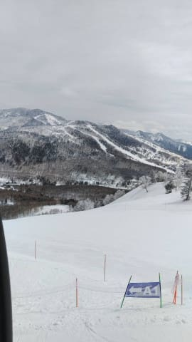
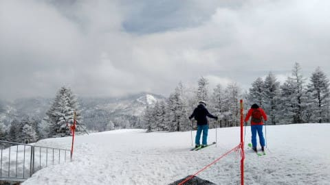
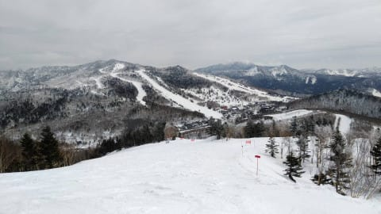
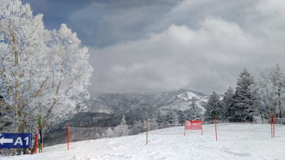
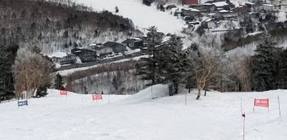

# なんとか仕事のピークは乗り切れそう…そして，4/1,2日の志賀高原はすごい冷えるよ！！

📅 投稿日時: 2022-03-29 05:31:13

ということで．

正常な人間ならスキーに行くという

判断はしないだろう

というクリティカルな状況なのに．

昨日もラストまで滑ってしまい，

深夜11時過ぎに帰宅，それから

夜中3時過ぎになんとか今朝8時締切の

資料を完成させ．

今日も朝からぶっ続け7件の会議．

最後のWeb会議が終わったのは

22時前で，そして今，やっと

明日提出の資料がほぼ書き

あがったという…

ザ・綱渡り

の毎日ですね（涙）

いや．

スキーに行かないでおけば，ここまで

危険な綱渡りをしないで済むんですが．

危険な綱渡りをすればスキーに行ける

となれば．

そりゃ，危険な綱渡りを選びますよね．

普通…←いや，そっちが普通じゃないから

とりあえず，明日で地獄の年度末進行は

終わりそうかな…

なんとか乗り切れたっぽい…

ってなことで．

今日も志賀高原特派員からの写真が

送られてきましたが．

うーん．

今日の志賀高原．

すっきり晴れじゃなく，曇り空

だったみたいですね…

時折うっすら日も射したみたいですが．

昨日書いた通り，気温は終日

低く．

基本的に曇り空だったので，焼額も

終日雪は緩まなかったようです…！

…というか．

終日ガリガリバーンだった

という方が正解だったようですね…

そして，残念なことに．

焼額は今日からSGSコース＆イーストコースが

春営業に向けた雪出しのためにクローズ．

さらに予告通り，白樺・ブナコースも

クローズされてたようです…

うーん．

春ですねぇ…

そして，これからの天気は．

29日(火)は曇り~晴れで気温がひくめ，

おそらく午前ガリガリバーン．

午後は日差しで一部緩むところもあるかな…

30日(水)は晴れ~曇りで気温が上がる．

朝は硬いけど雪はじき緩む．

午後はザクザクバーン．

31日(木)は…微妙．曇り後みぞれ~雪がぱらつく．

そんなに激しい降りにはならない．

朝は気温が高めだけど，夕方から冷える．

1日(金)は…めちゃくちゃ冷える．

朝は-7~8℃くらい？

天気は曇り→晴れ．

運がよければ朝はうっすら1-2cm雪が

積もっていい感じ．

運が悪ければ雪が積もらず

終日ガチガチカリカリバーン

どっちにしろバーンは硬い．

2日(土)：この日は晴れ！

この日も気温は低め，バーンは硬い．

午後，日あたりが良いバーンは緩む．

日当たりが悪いバーンは硬いまま．

3日(日)：曇り．気温は上がる．

あさイチは硬いバーン．

昼ごろに緩んでいく感じか．

…って感じでしょうか．

とりあえず，4月1，2日はむちゃくちゃ

冷えそうですが…

でも，雪は積もらなさそう(涙)

ってなことで．

今日は遅い(朝早いともいえる）ので，

もう寝ます…

なんでこんな長い記事更新してるんだ…
