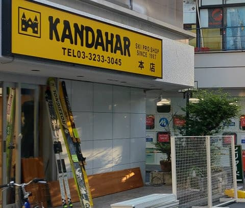

# 今年も開催，物欲選手権！その4

📅 投稿日時: 2020-11-13 02:06:01

えー．

やはり，冷え込みは今日の朝までだったようで．

12日の昼には気温が上がり，どのスキー場も

人工降雪機を動かせなくなったようですが…

それでも，横手山は明日13日（金）に予定通り

プレオープンできるようですね…！

そして，14日からは一般営業開始のようです…！

（[横手山スキー場ホームページ](https://yokoteyama2307.com/news/11072/)より）

熊の湯は，明日には14日の土曜オープンできるか

どうか判断するようですが…

…見てる感じ，厳しい感じかな…

そして．

今週末オープンできなかったら…

13日から19日まで，平年より気温が

高い日が続きそうで．

19日までは，人工雪を打てるほど冷ることはなさそう

です…（激涙）

…やはり，21日からの3連休も辛いか…

ってか．

この予想だと．

アサマ2000やかぐらなど，21日オープン予定の

スキー場は軒並みヤバいです（涙）

うーむ．3連休，せめて熊の湯はオープンして

欲しいけど．

それも厳しそうな予感…

…という，ちょっと悲しい予想のあとは．

[前回](e629a5b8d8ab33bf005e36358f17ce6e4.md)で終わったはずの（？）物欲選手権の

続きです～！！

ーーー

アナウンサー　「ということで．

　長岡で物欲に敗れたSkier_S選手ですが…

　なぜか長岡からまっすぐ帰らず…

　…

　…なんだか，神田に寄ってるようですね」

解説　「え？

　帰りに神田！？？

　なぜそんな危険なことを…」

アナウンサー　「なぜ，

　なぜSkier_S選手はそこまでして

　この危険な街に自ら進んで乗り込んで

　いくのか！

　そして，自らを窮地に追い込んで

　いくんでしょうか！！」

解説　「…アホだから，

　としか言いようがないですね」

アナウンサー　「そして．

　いくつかのお店でスキー板，

　FISCER RC4 SC Proの値段を

　きいています…！！」

解説　「いや．この時期ですから，

　どこのお店もエキップさんと全く同じ

　1.5割引きのはずですね．

　とてもSkier_S選手が出せる金額では

　ないはずなんですがね…」

アナウンサー　「どうやらそのようです．

　神田でも，どのお店に行っても，

　長岡で伝えられたのと同じ値段のようです．

　Skier_S選手，やはり14万近いお値段を

　聞いて，引いています」

解説　「わざわざ帰り道に神田まで行って

　確認しなくても，この時期はまだ

　値段が崩れませんから」

アナウンサー　「そして，いつものお店に

　やってきましたね…」

解説　「ホントに諦め悪いですね～．

　この時期は，どこに行っても同じ

　値段だというのに…」

アナウンサー　「ここでも値段を

　聞いていますが…

　やっぱり，同じ14万円近いお値段を

　言われています．

　お値段，全く変わりません．

　このお店に最後に寄るパターンの

　Skier_S選手．これで最後の諦めがついた

　ようです」

解説　「…そうですね．

　最後に寄るいつものお店でも

　値段が変わらなかったので，

　今回は諦めが…」

　

アナウンサー　「…あれ？

　ちょっと待ってください．

　お店の人に何か言われてるようですが…

　ちょっと様子が変ですよ」

解説　「いや，しかし．

　絶対この時期，それもFISCHERの

　板が，1.5割引以上になることは

　ありえませんから」

アナウンサー　「でも．

　なんだか動揺しているようですよ…

　…

　え？？

　お…

　おおおーーーーっと！

　なんと．

　行きました！

　板を行ったようですっ！」

解説　「…え？」

アナウンサー　「なんということか！

　どうしたことだ！

　なぜか，Skier_S選手．

　行ってしまった―ッ！！

　板を，板を行ってしまいましたっ！

　それも今シーズンの最新モデルの

　FISCHER RC4 SC Proを買ってます！」

解説　「え！？まさか…

　いくらSkier_S選手とはいえ，

　ここまで自制心が無いとは…！」

アナウンサー　「見事です．今シーズンも，

　見事な負けっぷりですっ！

　板とブーツの大物2点セット揃って撃沈という，

　素晴らしい物欲っぷりを見せてくれました！

　それも今シーズンはどちらも最新モデル！

　さすが物欲大魔王！

　負けっぷりが違います！」

解説「板，ブーツ揃って最新モデル

　というのは，Skier_S選手でも

　史上初となる負けっぷりですね」

アナウンサー　「さすがはSkier_S選手！

　今回も素晴らしい負けっぷりを

　見せました！

　さすが，我慢という言葉をはるか

　アンドロメダの彼方に置いてきた男！

　すばらしい負けっぷりです！」

解説　「だから，負け方を素晴らしいって

　褒めることが，何か間違ってますから」

アナウンサー　「どうやら．

　今回，普通ならこの板とセット販売の

　Z13Freeflexビンディングを

　Z11Freeflexビンディングに換えて，

　3万以上値引きする

　という荒業を繰り出され，Skier_S選手，

　瞬殺だったようです！」

解説　「この板，ビンディング

　セット販売なので，普通の店では

　組み換えはできないんですが…

　この，いつものお店．

　ビンディングセットのATOMICのSXも

　ビンディング抜きで売ってくれるなど，

　かなり特殊な対応をしてくれるますから…

　…それにしても，瞬殺でしたね…」

アナウンサー　「やはりSkier_S選手．

　我慢という日本語を全く知らない

　ようです！」

解説　「我慢って日本語以前に，

　『限度』とか『常識』って日本語を

　教える必要がありますね」

アナウンサー　「しかし…どうやら，

　まだ終わらない！

　一旦たがが外れた物欲は，もう留まる

　ところを知りません！

　さらにゴーグルです！

　ゴーグルまで買ってます！

　もう，物欲大魔王の本領発揮です！

　すばらしい物欲です！」

解説　「…予想より板を安く買えたから，

　ゴーグルくらい買ってもいいよね，という

　いつものパターンなんですけど…

　だから，Skier_S選手は勝負に負けてるのに，

　負ける方が盛り上がってるのは何か

　間違ってませんか?」

アナウンサー　「そして，なんと．さらに，

　CW-Xも買ってます！

　見事です！

　さすが，物欲大魔王！

　まみれてます！

　物欲にまみれてます！

　素晴らしい！」

解説　「だからこれ，

　負けっぷりをたたえる選手権

　じゃなかったはずでは？

　…それにしても，板が安くなったという

　ことを言い訳に，安くなった分だけ

　別のものを買って，結局せっかくの

　値引き分を完全に吹き飛ばしましたね…」

アナウンサー　「ということで．今回の

　『 スキーヤーの物欲を刺激する

　スキー専門店に来て，物欲にまみれた

　スキーヤーが買い物をせずに

　我慢できるか選手権』

　長岡でブーツを買った帰りに，

　神田で板を買うという．

　常人には考えられない見事な

　負けっぷりを見せてくれたところで

　また次回の選手権まで，

　ごきげんよう！」

解説　「…

　まさか，まだその5に続いたり

　しませんよね…？」

（ホントに終わり）

## 💬 コメント一覧

### 💬 コメント by (Northfox)
**タイトル**: Unknown
**投稿日**: 2020-11-13 12:59:29

帰りに神田に寄ったら話として面白いのに、と思っていたら本当に行っていましたか！！

しかし、神田に行く気持ち分かるなぁと思う自分が少し心配です。

買うべきものは無いのにこのところウズウズするんですよね．．．（^^;

### 💬 コメント by (Goku)
**タイトル**: Unknown
**投稿日**: 2020-11-13 15:07:45

お見事!

それにしても、今シーズンはヤケビメンバーのフィッシャー率がブーツも板もかなり高くなりました。

### 💬 コメント by (いちと)
**タイトル**: Unknown
**投稿日**: 2020-11-13 18:26:43

楽しく拝見させて頂きました！

昨日まで、株で結構儲かったので、神田に見に行きましたが、買えなかった自分が情けないです　

今年の志賀高原も全てgotoトラベルで予約してしまい、2月も延長を見込み、いやがられながも宿にお願いしているセコさです

### 💬 コメント by (Unknown)
**タイトル**: Unknown
**投稿日**: 2020-11-13 22:08:43

まさか長岡からの神田へワープとは！

予想以上の展開でした

型落ち板を2本かと予想していたのですが､まさかのNewType！

（ホントに終わり）は信じていい物か､判断付きかねます

### 💬 コメント by (さち)
**タイトル**: Unknown
**投稿日**: 2020-11-14 00:33:28

なにやってんすかwww

### 💬 コメント by (Skier_S)
**タイトル**: ホントに終わり（のはず）です
**投稿日**: 2020-11-14 02:36:29

＞Northfoxさま

いや…やっぱり神田行っちゃいました．

値段確認のつもりだったんですが，まさかあんな荒業を繰り出されるとは思わず．

瞬殺でした．

＞Gokuさま

いやー．

私もFISCHERで板とブーツ揃えてみたかったんですが．

今シーズンの焼額メンバーは，車はスバル，スキーはFISCHERが

あふれそうですね（笑）

＞いちとさま

ええ！

せっかく神田に行ったなら，ぜひ物欲にまみれて

日本経済に貢献してください…

＞Unknownさま

まさかのブーツ＆板ダブルで新モデルです…

10万円の給付金で気が大きくなってしまったのか…

＞さちさま

ホントに，何やってるんですかね！

このSkier_S選手は！←自分のことでしょ

### 💬 コメント by (しんちゃん)
**タイトル**: Unknown
**投稿日**: 2020-11-15 01:07:36

楽しく拝見致しました。

しかし、すごい負けっぷりですね。（笑）

でも、ゴーグルもCW-Xも、結構年季入ってましたからね。

私もクルマの冬仕度が出来ました。ひそかに遠路より例の踊りを踊り、雪乞いをしています（笑）

### 💬 コメント by (Skier_S)
**タイトル**: ＞しんちゃんさま
**投稿日**: 2020-11-16 01:03:45

見事な大敗でした．

板，ブーツとも最新モデルは人生初です．

でも，ゴーグルは8000円の激安品…(笑)．

とりあえず，早く雪が積もるよう，例の踊りを全力でお願いします．

### 💬 コメント by (ikkun)
**タイトル**: Unknown
**投稿日**: 2020-11-22 01:36:49

ぇ～😱💦ブーツ&スキー？おニューですか？すごいなあ。 羨ましい🎵

### 💬 コメント by (Skier_S)
**タイトル**: ＞ikkunさま
**投稿日**: 2020-11-22 03:32:39

両方とも行っちゃいました~！

10万円の給付金と，昨シーズン4月以降スキーに行かなかった分と，

会社の歓送迎会や忘新年会がすべてつぶれたおかげで（？）

それ以上の金額が浮いた勘定になるので…

ついつい財布が緩みました(笑)．

### 💬 コメント by (ikkun)
**タイトル**: Unknown
**投稿日**: 2020-11-22 22:05:46

ありがとうございますm(__)m  横手山でさえ消えてしまいますから仕方ないですね

ダブればすいません 昨年のレクザムm120の260 地元スキーshopラスト①(笑)63000込み スキーは19年GSデモ65%offですから(笑)  ちなみに準指導員？を受ける為に買った訳ではないんですが(笑)

### 💬 コメント by (Skier_S)
**タイトル**: ＞ikkunさま
**投稿日**: 2020-11-22 23:45:25

準指うけられるんですか？？

頑張ってください！！

### 💬 コメント by (ikkun)
**タイトル**: Unknown
**投稿日**: 2020-12-01 20:20:58

いやいや(・・;) スキークラブ会長がハンコを押してくれないとって このコロナも含めた不況中では？二桁掛かりますしね？

### 💬 コメント by (Skier_S)
**タイトル**: ＞ikkunさま
**投稿日**: 2020-12-02 01:50:19

準指検定，お金かかりますからね…

それどころか，資格を取った後の維持費（SAJ年会費＆研修会費用）も

バカになりませんよね…

SAJは

Syukin Association Japan（全日本集金連名）の略だという説が…

### 💬 コメント by (ikkun)
**タイトル**: Unknown
**投稿日**: 2020-12-12 21:17:11

確かに おおもと 会員になれば6000円尚更会員になる人少なくなりますよね？ スキー人口少ないのにと 受験料等々安くすべきですよね！

### 💬 コメント by (Skier_S)
**タイトル**: ＞ikkunさま
**投稿日**: 2020-12-12 22:50:20

まぁ，SAJも今いろいろ物議をかもしてますから(笑)

今年は東京都連は

研修会中止のため，指導員研修費用不要で研修終了済み扱いになるみたいですね．

