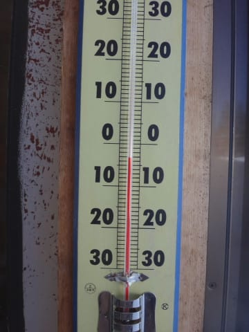

# 4月2日（日）の志賀高原詳細レポート…晴天冷え冷えガラガラフラット．4月なのにシアワセすぎるっ！！！

📅 投稿日時: 2017-04-04 02:01:34

🏷️ カテゴリ: [2017スキー滑走日記](c7d777cecfc91bdf0fa464ad62c6d49ab.md)

えー．

今週半ば，5，6，7日の水曜～金曜ですが．

…なんじゃ，こりゃ！？？

赤く印した0℃線は北海道のはるか北．

志賀高原は，+6℃～+9℃線がかかっており．

昼間は，山頂の気温も10℃くらいに

上がっちゃいそうな感じ…（涙）

こーゆーのを見ると．

「なんてことだ…っ！！」

と，思いますが．

…普通の年なら，4月はこの程度に気温が上がっても，

驚かない程度なんですよね…

今年は恵まれすぎていた，ということか…

とりあえず．

4日以降，気温がぐんぐん上がり．

5，6，7日は気温が+10℃くらいで，

かつ晴天になりそうなので．

この3日間で，

ゲレンデは春の雪になっちゃうでしょう（涙）

そして．

8日，9日の週末は…

ヤバいです．

今のところ，8日の土曜はぎりぎり昼間は降らなくて．

9日に…雨になりそうな予感…

うーむ．

先週の段階の予想図では．

今週のなかばに気温が上がり，

週末には冷える予想だったけど…

今の天気図では．

週末に気温がさらに上がり，

狙ったように，雨の終末週末になる予想

に変わってきました…（激涙）

まぁ．

まだ天気図は変わる可能性がありますので．

また追って週末天気予想やります…

＃8日の土曜，平年比+5℃の激烈高温は確定だけど…（涙）

ってことで．

本題．

日曜の志賀高原．

詳細レポートです…

日曜の朝．

やはり，気が付いたら．

あれ？また第2ゴンドラ？

そして，時計は朝6時半？？

うーむ．

昨日も夜遅くまで飲んでいたというのに．

Blogを書くと日付が変わっていたというのに．

今日も，

意識を失っているうちに，早朝スキーに来てしまった

ようです…←んなわきゃない

恐るべし，無意識の力っ！！←睡眠時間3時間の翌日，さらに睡眠時間5時間半で

早朝スキーに来てしまうというありえなさを，あくまで

無意識の行動のせいにしておきたいSkier_S

放射冷却で冷えたゲレンデは，-10℃近くと

良い冷え込みで…

そして．

ゲレンデは…

そう，シマシマっ！

うははははははは！！！シマシマ！！

ところどころ，氷のコロコロがわずかに

出てるところもあったけど，

でも，この時期に-10℃の冷え冷えの締まった圧雪が

滑れるとはっ！！！

…とても4月と思えないっ！

…という，シアワセ朝イチバーンを堪能したあとは．

8時に，奥志賀の朝イチバーンへ車で移動！

今度は奥志賀のシマシマバーンを堪能するのだ！

この日は奥志賀早朝営業がなく，8時に行けばシマシマなのだ！

いやーーー．

最高の天気で，いい感じの締まった圧雪を自由落下できるシアワセ！

そして，今度は8時半に焼額へ移動し…

今度は8時半オープンの焼額のシマシマを

いただくのだ！

ふはははは！

本日3度目のシマシマっ！！

自他ともに認めるシマシママニアとしては←なんじゃそりゃ？？

6:30オープンの早朝焼額2ゴン，

8:00オープンの奥志賀，

8:30オープンの焼額1ゴン

と渡り歩けば．

1日で3度おいしい，

はしごシマシマができるのだ！！！！←アホ

焼額の8:30の山頂の気温は-4℃．

こんな晴天のもと，4月というのに気温はマイナスで．

こんな冷え冷えシマシマを切り裂き続けるシアワセっ！！

あぁ…なんて恵まれてるんでしょう…

…残念ながら，10時ごろにはちと人も

多くなってきたけど．

でもせいぜいこの程度で．

ゴンドラ待ちも無し！

お昼になっても雪はそれほど緩むことなく…

ええんか？？

4月の昼間で，こんなに雪質が良くて，ええんか！？？？

あぁ…去年の今の時期に，この雪を半分分けてあげたい…

で．

この日の昼間は，一の瀬方面へ遠征してみましたが．

をを！

ダイヤモンドもフラットバーン！

一の瀬ファミリーも…

4月の昼間というのに．

雪は全く緩む気配を見せず…

エッジが効く固めの斜面の上に，

さらっとした雪が乗ったような，

比較的滑り良い斜面！

ダイヤモンドは午後2時過ぎにはちょっと

荒れてきたけど…

でも，ザブザブな雪になることなく．

わずかにしっとりした程度の雪．

そして，午後3時ごろに焼額に戻ると…

なんですか？？

この最高の雪質は！？？？

なんですか？？

午後3時になっても，この最高のフラットバーンは？？

なんてこった！

4月の晴天の日で．

夕方までこんなにいい雪をキープしていいんだろうか！？？

この焼額第1ゴンドラ側のGSコース．

このコースが，今日で営業終了なんて…

信じられない…！！！ウソだと言って！！

今日でこの，焼額第1ゴンドラの営業が終わってしまうなんて．

もったいないっ！

勿体なすぎるっ！！

明日あたり．

もったいないお化けの大群が1ゴンを襲うに違いない！！！

…という感じで．

午後4時前．

今シーズンラストの焼額第1ゴンドラに乗り…

おそらく今シーズンも．

600回以上乗ったであろう，

わが生息地に，今シーズンの別れを

告げたのでした…←だから，住んでないんじゃなかったの？

お世話になってね，第1ゴンドラ．

また来シーズン～！！！！

…で．

まだ終わらない．

ヤケビの1ゴンは4時に終わったけど．

奥志賀は4:45までやっているのだ！

奥志賀も，ちょいと固めとはいえ．

4月末と思えないいい雪質をキープ！

焼額第1ゴンドラが終わってしまった悲しみをぶつけるように．

夕闇が迫りくる営業終了まで．

奥志賀を滑り倒したのでした…

…しかし．

今週も良かった．

良すぎた．

あまりにもコンディションが良い日が続きすぎて．

まだ，春が来たという実感がないので．

なぜ，焼額がもう終わってしまうのだ？？？

…ということが，自分にまだ納得させられない，

Skier_Sだったのでした…

## 💬 コメント一覧

### 💬 コメント by (たろ)
**タイトル**: ありがとうございました
**投稿日**: 2017-04-04 09:10:25

焼額の週末ヒロイン（ヒーローか）でもあり、1ゴンの一部とも認識されているSさんですから、いっそのこと来シーズンから、コンドラ山頂駅に出勤札を設置してもらうというのはどうでしょうか。（TVドラマ・相棒のあのイメージ）読者の方はそれを確認して、「Sさん、ヤケビにいる！」とか、「あっ、一ノ瀬に遠征中かー」と確認出来る便利なシステム完成です。（笑）

冗談はさておき、私たちは4/2がシーズンラストと決めていたので、最後にご挨拶できて良かったです。一足先にスキーのない退屈な日常に戻ってしまい喪失感で一杯ですが、来シーズンもお会い出来た時はよろしくお願い致します。お体に気をつけて、残りのシーズンをお過ごしください。

### 💬 コメント by (FCAMEL)
**タイトル**: 久しぶりにお目にかかれました
**投稿日**: 2017-04-04 10:12:08

昨日は久しぶりにお目にかかれました。

このシーズン志賀高原、横のツアーできるのがほぼ最後だったので、子供を連れて高天ヶ原、東館、寺子屋と回っての帰り道でした。

それにしても前日は視界が悪かったから仕方がないにしろ、日曜は私も早朝2ゴンはファーストトラックに近いところから滑ってましたし、イチゴンも開くと同時くらいに2ゴンから移ったのに本当にこのシーズンはお見かけしないですね。(Sさん早すぎて見えない？)

また、奥志賀でお会いしましょう！

### 💬 コメント by (FCAMEL)
**タイトル**: ↑× 早すぎて→ ◯ 速すぎて
**投稿日**: 2017-04-04 13:26:13

失礼しました！

### 💬 コメント by (いー)
**タイトル**: Unknown
**投稿日**: 2017-04-04 14:05:21

初めてご挨拶できました‼

嫁の分までシール ありがとーございました‼

あの後は、土曜日の分までファミリーで滑りまくりました‼

早速板に貼り付けます‼

一緒滑ってみたいけど 着いていけるか…

20000mクラブ皆さん速すぎです(@_@)

またよろしくお願いします。

### 💬 コメント by (yama)
**タイトル**: 検証奥ゴン４８本
**投稿日**: 2017-04-04 17:46:48

日曜日はmaeさんと奥志賀から一の瀬まで往復してきました。奥ゴンぐるぐる２０本ほど乗りましたが、ターンしての１０分台は２回でした。１１分台が出れば良いと思います。1日張り付いても４８本は限界だと思います。破るのはパーちゃんしかいませんね。また、来週会いましょう。

### 💬 コメント by (しんちゃん)
**タイトル**: あ～もったいない
**投稿日**: 2017-04-04 22:04:15

まだ日曜の余韻に浸っています。(^^ゞ

１ゴン終了とは。。。

ホントにもったいないお化けですよね。。。

### 💬 コメント by (Skier_S)
**タイトル**: 今週末はおそらく日曜日帰り
**投稿日**: 2017-04-05 01:58:27

＞たろさま

今シーズン，終了とは残念です…

GWまで，まだまだ滑れるんですけど（笑）．

とりあえず．

ヤケビ1ゴンの一部と化している人間としては．

出勤札いるかもしれませんね．

Skier_S同乗ゴンドラとか言って，

ラブゴンと同じようなレアゴンドラとして

扱われる…

訳が無いですよね（笑）

来シーズンもよろしくです！

＞FCAMELさま

いつもおひとりの時にお会いするので，

お子さん連れでいらっしゃったのにちょっと

びっくりでした（笑）．

日曜は早朝も滑ってらしたんですか…

今シーズンはなかなかタイミングが合わない

巡り合わせだったのでしょうか…

来週以降，奥志賀でお会いしましょう～！

＃また会えなかったりして

＞いーさま

ステッカー，喜んでいただけたようで良かったです…

一の瀬ファミリー滑り倒したんですね．

あそこはいろいろと20000mの大御所がいらっしゃるので，

私よりもっとすごい人が見れますよ（笑）．

またよろしくお願いします～！

＞yamaさま

ターンしても10分台を出したことに驚きを禁じ得ないのですが…

凄すぎます．

私は10分台，無理です（笑）．

しかし，48本はすごい記録ですね…

雪質・天気・混雑・ゴンドラ搬器間隔など，

ホントにいろんなラッキーが重ならないと

出せない記録だと思います…

＞しんちゃんさま

日曜は楽しかったですね～！！

でも．

ホントに1ゴン終了とは勿体なさすぎです！

勿体ないお化けと一緒に1ゴンを襲いに行きたい気分です…

### 💬 コメント by (Unknown)
**タイトル**: Unknown
**投稿日**: 2017-04-25 22:15:00

俺も4月1～2日で行ってました🎿

1日はガスって視界不良でしたが、2日は最高でしたね❗

トップシーズン変わらずの抜群の雪質でした✨

