# 2月28日の志賀高原は…すっきり晴天！…でも，午後の雪は硬かった（涙）

📅 投稿日時: 2015-02-28 22:45:19

🏷️ カテゴリ: [2015スキー滑走日記](c09ea645cfc085f86dfcd80f49599dd89.md)

ということで．

いつもどおり，志賀高原へ来ているわけですが…

今朝の志賀高原の上り坂．

これまでの高温でとけた氷の上に，雪がうっすら積もった

という，かなりいやらしい道路状況で．

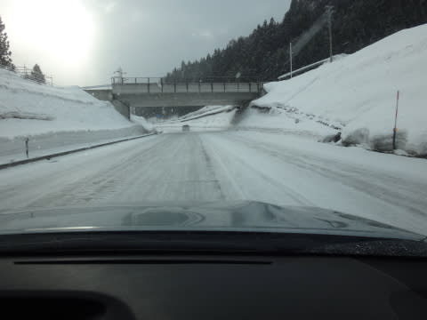

…途中で登れなくなっている犠牲者（車？）やら，

スリップして歩道に乗り上げている車やら，

苦労している車が多数…

おかげで．

焼額の営業開始に5分遅れるという，大変たいへん悔しいスタートとなった，

本日なわけですが（悔）．

いつもどおり，ゴンドラで山頂へ行くと…

ふむ．気温はマイナス10度．

よく冷えてますな．

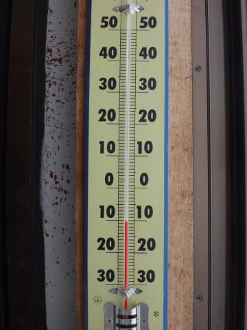

そして…朝イチの天気は，雪降り．

予想通りですな！

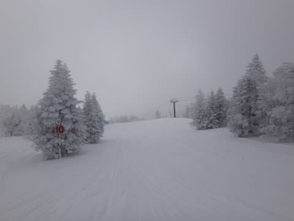

…ゲレンデは，冷えた雪質のいい雪が，圧雪の上にうっすら乗っており．

これも，予想通りですな！

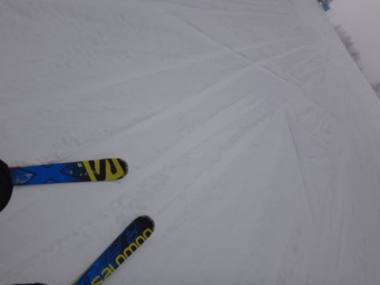

ふはははははは！

やわらかい圧雪の上に薄い軽い新雪で，これは気持ちいいよ！

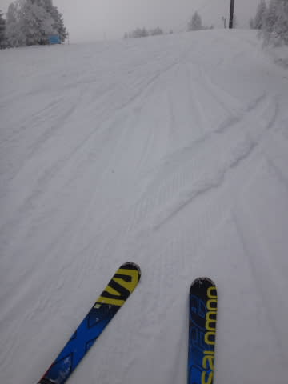

おとといまで壊滅的天気だったのに．

昨日一日冷えひえのいい雪が降って，ゲレンデ状況は

一気に改善！

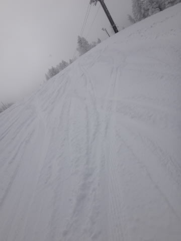

これは，きっと．

週末にやってくる私にあわせて，神様が…（いつものたわごとなので以下略）

で．

オリンピックコースに行ってみると．

うむ．ブーツパフ．

これも予想通りですな！←とりあえず予想があたったことを強調している

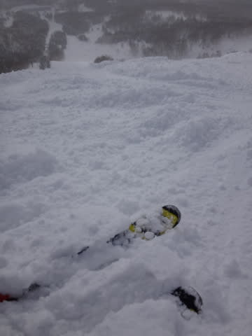

下地がちょっと硬いけど，かなり軽めの，いい感じの新雪！

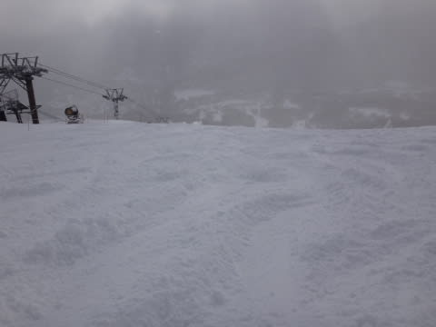

新雪を数本堪能していると，すぐ荒れ荒れになっちゃったので…

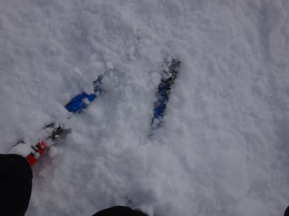

整地へ移動すると…

をを！晴れてきました！

これも，予想通り！←しつこい

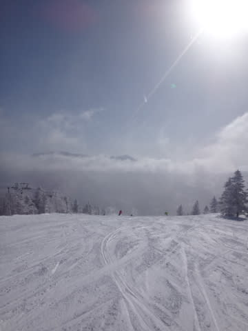

9時半には，もう晴天になっちゃいましたよ～！

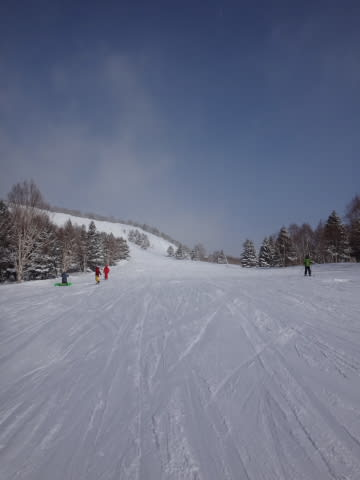

日が差すけど，気温は低く，ばっちり雪質の晴天!!

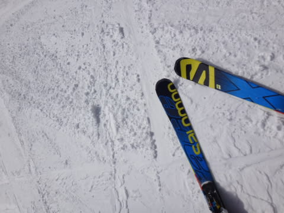

ピカピカ晴天の下，大回りだ～っ！

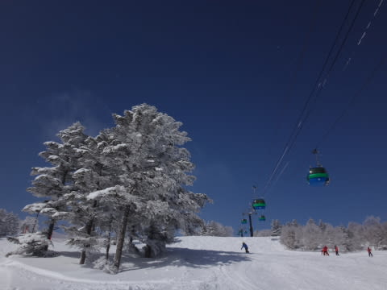

…と，意気込むと．

あら？

あらららら？？？

じ，人口密度が…

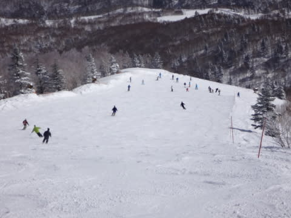

そして，10時半～11時は，ゴンドラ5分待ち（涙）

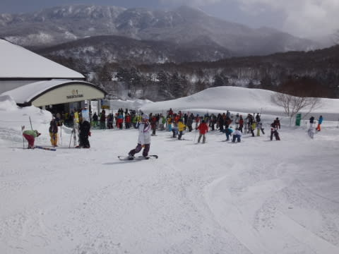

まぁ，許す．

先週の40分待ちに比べれば，許す．

11時には，こんな感じになったので，許す．

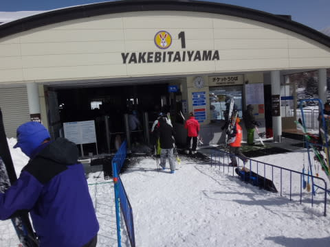

この日は11時以降，待ち時間はぎりぎり改札の外まで

並ぶかな～，って程度で．

午後でも最大2-3分，平均1分前後…

ってところでした．

で．晴天ぴかぴかなのに，気温は氷点下で．

日差しが暖かいのに，上に乗ってる雪質は

冷えひえGoodなんですが…

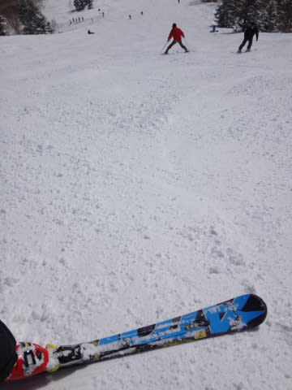

だけど．

しかし．

But.

人が多いので，だんだんゲレンデは掘り返されていき…

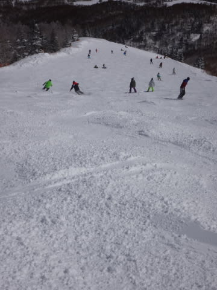

掘り返された底には．

そう．

忌まわしき先週の雨で固まった，アイスバーンちゃんが

「コンニチハ～」

と，しなくてもいいご挨拶をしに出ていらっしゃいました（涙）

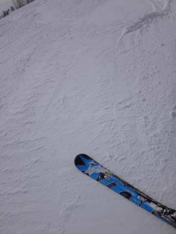

そして．

氷の細かなコロコロが…

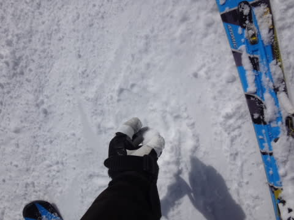

さらに．

ゲレンデは，午後までこんな感じの人口密度で…

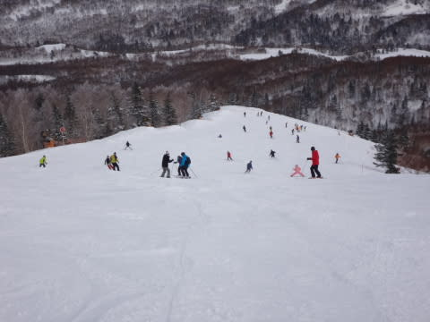

人海戦術による掘削作業が，過激な勢いで進行するので．

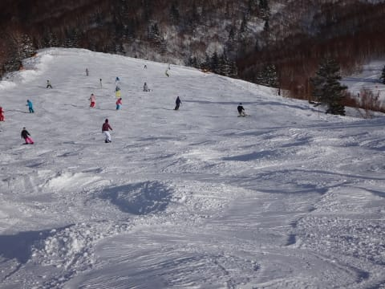

コブ様と，その谷間に広がるアイスバーンちゃんとの

きれいなコントラストを楽しめる（苦しめられる）

見事な状況に…

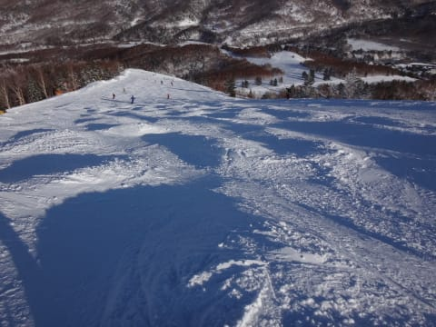

うーん．気温はひくく，上に乗っている雪質がいいばかりに，

残念！！

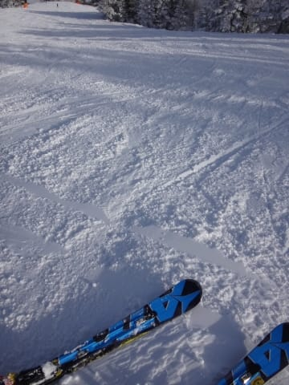

山頂付近は，夕方まで結構いい雪でもってくれたのが，

救いかな～．

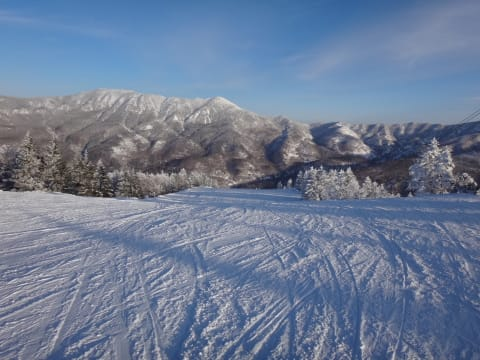

とりあえず．

「硬い…かたいよ…（涙）」

とつぶやきつつ，夕方まで滑り続けたSkier_Sなのでした…

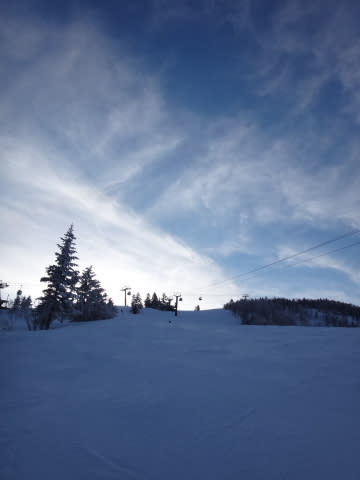

…

で．

まだ続く．

当然行ってきた，ダイヤモンドナイター．

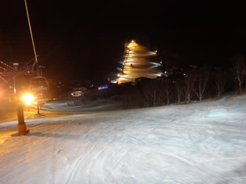

ここは，圧雪をかけなおしてくれるので．

再びシマシマぴかぴかを思う存分楽しめました！

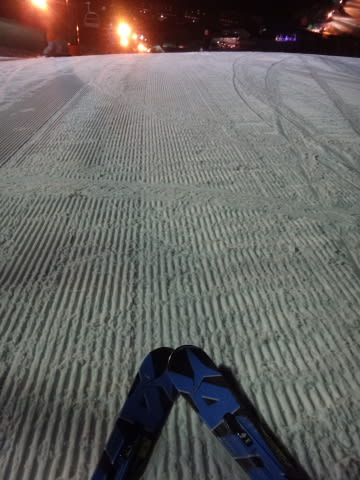

もう，アイスバーンってなに？

って感じで．

やわらかめの圧雪を堪能できましたよ～！

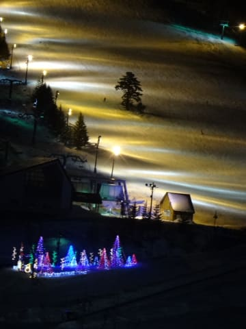

って感じで．

午後のアイスバーンはちと残念だったけど．

天気には恵まれた本日だったわけでですが．

…気になるのは，明日の天気．

…志賀高原では，一体いつごろ降りだすのか…？←しかし，このBlogを読んでる人で，明日志賀高原で滑る人が何人いるのかな…？

といったところで．

…大変残念なニュースですが．

低気圧の移動が，予想よりちょっと早そうで．

朝から雲が増え…昼前に，来るかもしれません．

…うーん．でも，降り始めは雪っぽいな～．

かなり湿った雪～霙が夕方までちらちら降るかな…

標高が低いところは，雨っぽいかも…

ゴンドラが強風で，昼ごろから減速運転か運休に

なるかも知れないのも，痛い…

とりあえず．

明日は．

皆さんの日ごろの行いのよさが試される一日となりそうですので．

・他人にはやさしくする

・困った人は助ける

・つまらないブログでも，「面白い」といってあげる

・天気予想が外れても責めない

などといった基本動作について，くれぐれもよろしくお願いします（なんのこっちゃ）

## 💬 コメント一覧

### 💬 コメント by (Goku)
**タイトル**: Unknown
**投稿日**: 2015-03-01 23:12:44

お互い朝イチを逃し、悔しいスタートでしたね（笑）

私は更に機械の故障で発券が遅れ、９時近くの乗車になってしまいました（泣）

でも、天気も良く楽しい一日でしたが、Ｓさんと一度もご一緒できなかったのが残念でした。

### 💬 コメント by (Skier_S)
**タイトル**: Gokuさま
**投稿日**: 2015-03-02 01:09:50

いやー．

朝イチに遅れて，かなり悔しかったです…

でも，チケット発券遅れてさらに待たされたって，

かなり残念ですね…

午後はかなりぼこぼこでしたが，ずっとヤケビ

だったんですか？

### 💬 コメント by (Goku)
**タイトル**: Unknown
**投稿日**: 2015-03-02 20:15:05

＞午後はかなりぼこぼこでしたが，ずっとヤケビ

だったんですか？

いや、ヤケビに戻ったのは３時過ぎでした。

http://www.skiline.cc/skiing_day/1jp4l85skjm

### 💬 コメント by (Skier_S)
**タイトル**: Gokuさま
**投稿日**: 2015-03-03 02:46:54

ジャイアントまで行ってたんですね…

ジャイアントはぼこぼこではなかったんでしょうか…

雪も硬くなかったんですか？

日曜は，かなり修行な一日でした…（涙）

