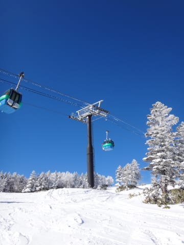

# スキー試乗の難しさ

📅 投稿日時: 2016-08-14 04:57:12

ということで．

モアルボアル旅行記の連載も終わったので．

…このあたりで，またスキーネタを挟んでみようかと．

えー．

スキー試乗が大好きな私なので．

今シーズンも，[たくさんのスキー板を試乗](ede6c7391fcb5c6cecd84c271f5705bd8.md)したわけですが．

まぁ，毎度ながら，

せっかく試乗したのだから．

素人ながらも「試乗してみて私個人がどう感じたか」

を，インプレッションとして記録しているわけですが…

しかし．

ホントに．

いつも書いてるように…

こんなど素人の試乗インプレッション，なんかの役に立ってるの

かな～？？

と，心配になる今日この頃．

スキー試乗の難しさというのは．

「自分が気持ちいいと感じるものと，

人が見てうまく滑れているというものは

全く違う」

ということなのかと．

ど―ゆーことかというと．

試乗してみて．

「いや，いいよ！この板！

　乗りやすいよっ！！」

…と思う板は．

たまたま自分の変な滑りの癖で

滑りやすいだけの板である

可能性も高く．

逆に．

「この板…曲がりにくいよ．

　自分の思う通りに動いてくれない…（涙）」

と思うような板のほうが．

その板が曲がってくれるポジションに動くと．

実は変な癖がとれた，よい滑りに導いてくれる板

なのかも知れません．

…っていうか．

実は，かつて昔．

私がそういう体験をしたんですね～．

かれこれ10年前．

試乗することなく，人に勧められて某社の板を

買ったとき．

自分の普段の滑りでは全然操作できず．

「な，なんじゃこの板！

　こんな板，試乗してたら絶対買わなかったよ～（泣）

　だ，騙された…

　高い買い物したのに…(涙）」

と，すごい悲しい思いをした経験があり．

「せっかく高い買い物したんだから

　何とかこの板でも滑れるようになろう…」

と，この板でも曲がれるよう，良く曲がる

ポイントを探し，

そのポイントを押さえて滑れるように

滑り込んだところ．

しばらく後．

スキー仲間から

「どうしたの？最近，上手くなったじゃない」

と言われたという経験が…

実は，当時．小回りでかなりポジションがおかしかった私．

この板が回ってくれるポイントに合わせて滑れるように

ポジションを変えたところ．

どうやらポジションがかなり良くなっていたようで．

ってなわけで．

自分の変な癖で滑って気持ちよく滑れる板

と，

試乗でのフィーリングは激烈に悪いが，

スキーを上手くしてくれる板

この両者は全く別物だということを学んだのでした…

というわけなので．

私はスキーを試乗する際に．

自分のいつものポジション・滑りではなく

「この板の性能を引き出せるポジションはどこか？」

「どういう動きで乗ることを想定している板か？」

…ということを探りながら滑るように心掛けているのですが．

…いや，心がけてはいるのですが．

やっぱり．

自分の滑りに合っていて，気持ちよ―――く

滑れる板を，ついつい選んでしまうわけで…

＃そうじゃなきゃSXを3セットも続けて買わない（笑）

もう，テール荷重の板じゃないと滑れない体に

なってしまっていることを痛感した，Skier_Sなのでした…
