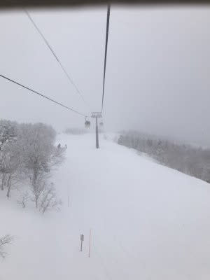
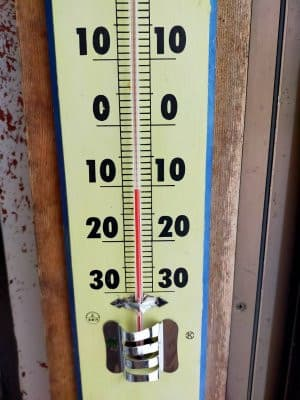
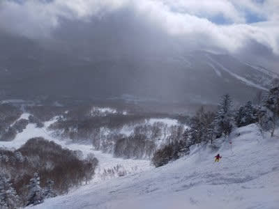

# 残念なお知らせ…この週末の志賀高原スキー場，土曜は曇り時々雪，日曜も一日雪降りになりそうな天気図にtね

📅 投稿日時: 2022-01-29 00:06:06

うーむ．

本日の志賀高原．

朝は雪降りで，10cmほどの積雪が

あったようで…

朝は最高のシマシマという予想とは

全然違ったと，特派員からレポートが

ありました（涙）

しかし，朝は-10℃近くという

予想は当てたし…

昼間は日が射すタイミングもあった

ようだから．

　朝は日が射しそう！

　時々雲が飛んできて，

　もしかすると時々雪もぱらつく

　タイミングもあるけど，

　雲の隙間から日が射す天気．

という予想，朝が日が射すと

いう予想以外は，大体当てた気が

するんだけど…

でも，今日の予想は難しかった…

で，明日以降の天気図がかなり変わったので．

ちょっと土日の予想を直しますが．

明日以降も難しい…（泣）

29日（土）：朝までにうっすら積雪，

　朝は雪降り～曇り．

　朝の気温は-11～-12℃くらい．

　朝は柔らかめ圧雪．

　天気は雪が降ったりやんだり．

　風がもう少し北に回ると

　結構降りそうだけど，

　もう少し西に回ると晴れそう…

　という微妙な領域なので．

　時折晴れ間も見えるかも？

　曇ったり雪が降ったり，時折

　日が射したり…という天気かな？

30日（日）：朝までに10～20cm

　積もるかな？

　朝は雪降り．

　-12～-13℃の冷え冷え！

　あさイチは圧雪の上にうっすら

　軽い新雪．

　この日は基本的に山の上は

　雪雲がずっとかかって，曇ったり

　雪が降ったり．

　ただ，この日も風が西に回ると

　晴れそうなギリギリの領域．

　みんなの日ごろの行いがよければ

　太陽も顔を出すかも？？

…いや．

ホントに微妙なんです．

わずかな風向きの違いで，曇るか

晴れるかの境界ギリギリ…って状態が

2日間続きます．

細かな擾乱があれば，晴れたり雪が降ったり…

と天気が目まぐるしく変わりそう．

うーん．

とりあえず．

予想に悩んだ時は．

みんなの日ごろの行いがよければ晴れます！

と．

いつもの責任転嫁で締めておこう…
