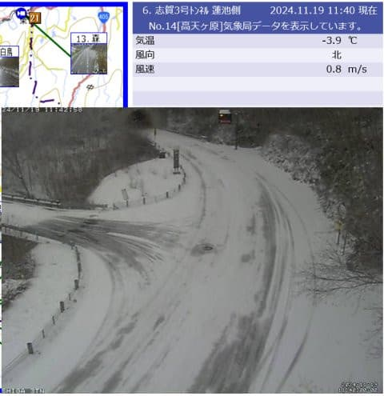
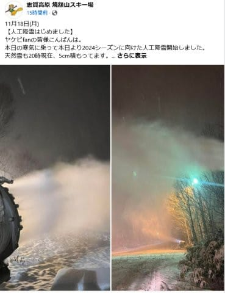
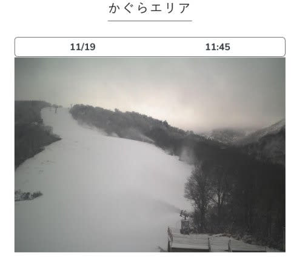

# 志賀高原やかぐらスキー場では雪が積もってるよ！雪はやんだけど20日朝までは人工降雪できて，また23，24日は冷える！

📅 投稿日時: 2024-11-19 12:08:38

🏷️ カテゴリ: [日記](cc4b5682fb7b8b144980957a978653fb0.md)

えー．

昨晩Blogを書く時間が取れず，

死んだように寝てしまったので．

今日は昼間に手短更新…

予想通り，志賀高原は昨晩から10cmほど

雪が積もって，雪景色になりましたね～！

（[北信建設事務道路気象状況カメラ](http://hokushin.pref-nagano-roadcamera.jp/)より）

この冷え込みで，横手・熊・一ノ瀬・高天ヶ原は

昨晩から人工降雪機フル稼働です！

焼額も人工降雪機を動かし始めたようです…！

（[焼額山スキー場Facebook](https://www.facebook.com/yakebitaiyama/posts/pfbid0wJY4x6zCc1kY46G9KY7hNc3jc7xazQTgB2mbVeWEhkFvX2jxznLUkptR5DCGtF7Fl)より）

かぐらも雪が積もり，人工降雪機を

動かしているのがライブカメラで見れますね…

（[かぐらスキー場ライブカメラ](https://www.princehotels.co.jp/ski/kagura/livecamera/)より）

今は雪はやんでいますが．

明日の朝までは人工降雪機が動かせる

冷え込みが続きます！

…その後，20日の昼間から22日の昼間

くらいまでは冷え込みが緩みますが…

また22日の夜から25日の午前中くらいまで

冷え込みますよ～！

今回と同じくらいの冷え込みになりそう…

次の冷え込みはそこまで天然雪が積もら

なさそうなので，23日に間に合うか

微妙ですが，次の冷え込みが終わるころには

営業できるスキー場が出てきそう！

その後26日から数日はまた気温が

上がりそうですが…

そこまで高温にならずに，平年並みの

気温に収まってくれそう．

意外とこの11月下旬，冷えてくれるのかも…！！
