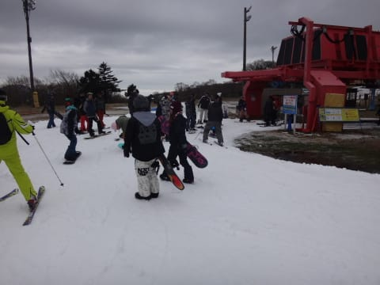

# 11月23日，3連休最終日のイエティ速報

📅 投稿日時: 2015-11-24 04:20:47

えー．

今日もイエティに行ってきましたが．

詳細は明日レポートということで．

速報モードにて…

雨の天気予報だった本日．

私の日ごろの行いが良かったため．

…大事なところなので，もう一回繰り返すと．

私の日ごろの行いが良かったため．

夕方まで，雨が降らずに，持ちました．

時折薄日が射す程度で，全く雨の

気配はなく．

だのに，雨の天気予報だったからか，

他のスキー場がオープンしていない状態の

3連休と考えると，人は多くなく．

リフト待ちは午前中は2分程度，

午後はちょっと混んだけど，午後1時半でもこの程度．

午後2時過ぎから3-5分程度と，ちょっと待ったものの，

それほどひどい待ちではなかったですよ！

ただ，ゲレンデはかなり混みましたが…

とりあえず．

夕方まで天気はもってくれたので，

行って良かった…

あー．ナイターは滑ってませんので（笑）．

詳細レポートは，また明日！
