# 3月14日(木)の志賀高原スキー場は特派員によると晴れ時々小雪，雪質は柔らか冷え冷え！…そして来週19日～21日も冷えて積もる！でも，4月はそこまで冷えないか

📅 投稿日時: 2024-03-15 02:57:29

🏷️ カテゴリ: [日記](cc4b5682fb7b8b144980957a978653fb0.md)

えー．

本日は最後の会議が22時ごろに終わり．

今日はこのあとは仕事しないで

早めに寝よう…

と，思ったけど．

きょうはSpaceXのStarship3の

打ち上げの日じゃないか！！！

（[SpaceX ホームページ](https://www.spacex.com/vehicles/starship/)より）

ということに気づいて，ついつい打ち上げ

動画を見ていてこんな時間になってしまい．

あぁ…せっかく仕事を早く終えたのに，

早く寝ずに無駄に私語してしまった…

と，ちょっと落ち込んでいるSkier_Sです．

しかし，33個ものRaptorエンジンを

乗せたSuper Heavy BoosterのLift offは

なかなか圧巻だったし．

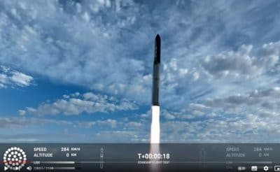

Booster Separationも上手くいき，

こんなくそでかいBoosterが制御下で

降下し，着水したし…

（Starshipから見たBooster切り離し)

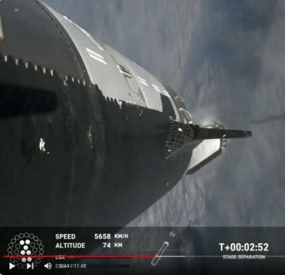

Starshipのエンジン燃焼は

最後まで無事に終わったし…

でも，今回すごかったのはStarshipの

Re-entry．

大気圏再突入を，突入開始から

全体がプラズマに覆われるまで，

あんな鮮明な画像で生中継で

見られるとは…！！

Black Outしないんだ～…

と，感動していたら．

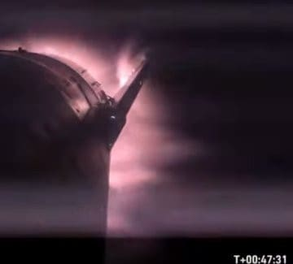

再突入のピークでは，やっぱりさすがに

映像が切れるのか…

と思ったところ．

その後，通信がずっと復活せず…

ライブでは何も言ってなかったけど，

残念ながら，予定通りに着水できず．

機体は分解しちゃったみたいですね…

でも，なかなか迫力のライブでした！！

ってな余談の後は，

このBlogがスキーBlogだったことを

思い出して，本来のスキーの話題へ．

本日も志賀高原特派員から写真が

送られてきましたが…

ふぎゃーーーーー！！！

なんだこりゃーー！！

今日はすごくよかったみたい！！！

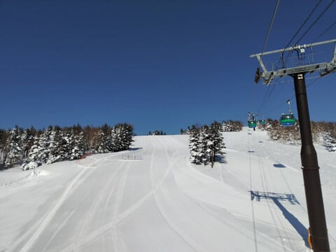

晴天ピカピカで，あさイチは

-7℃まで冷え込んで．

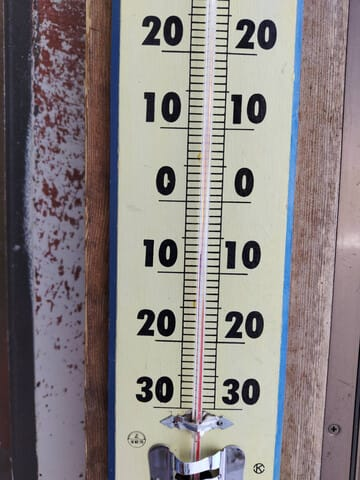

あさイチは最高シマシマだったみたい

です…

う，うらやましい～っ！！！

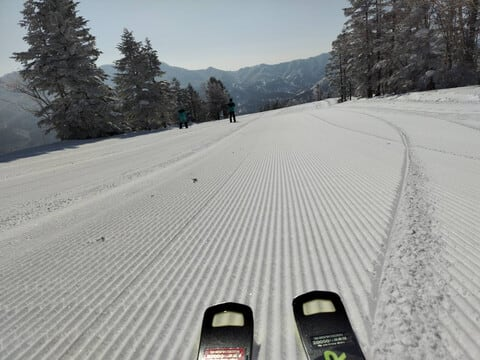

そして，3月に入ってからインバウンドの

お客さんも減ったのか．

いつにも増してガラガラだったみたいで…

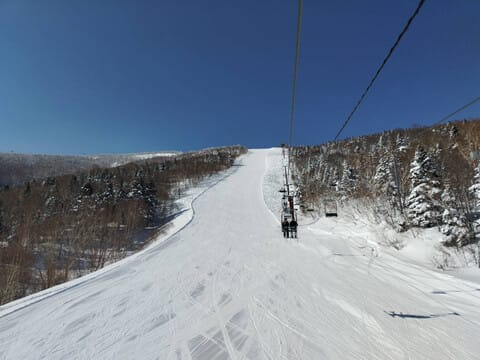

雪は柔らかめなのに，午後まで荒れず．

3月中旬とすればかなり恵まれた，

冷え冷え柔らか雪を滑れた

晴天の一日だったようです…！！

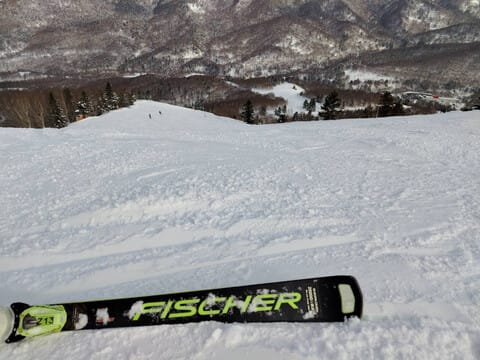

ただ．

午後は時折雲が出て雪がぱらついたり

したタイミングもあったようですが…

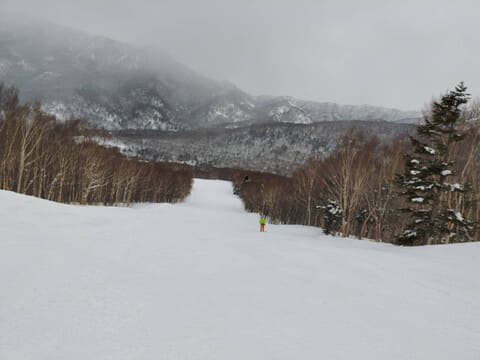

基本的にはリフトストップの夕方まで

晴れていて，最高気温も-3℃程度で

そこまで雪は緩まず，

いい雪で一日滑れたようです…

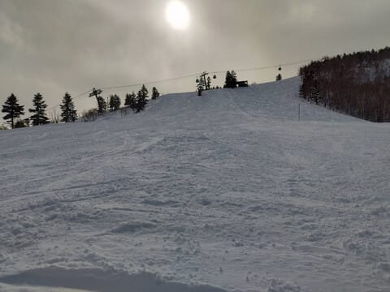

うーん．

このまま週末までもってほしい

ところだけど…

やっぱり昨日の予想通り，明日は

ちょっと気温が上がって．

土日もそこそこ気温が高めになりそう

なんですよね…

まぁ，でも土曜と日曜の午前までは

天気がよさそうだし．

雪の量も一時期ほどはひどくないし．

昨日も書いたけど，今週末も楽しめると

思いますよ～！

で．

来週は…

[週間天気予報解説](https://www.data.jma.go.jp/fcd/yoho/data/jishin/kaisetsu_shukan_latest.pdf)を見ると．

18日から21日にかけて冬型が続き，

19日を除いてそこそこの降水量が

日本海側にかかり続けてます！！

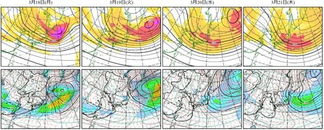

これは，18日から21日かけて

降りますね…

降り続けますね！

来週末もよさそうな感じ…！！！

そして．

本日は木曜なので，一か月予報が出てます！！

[1か月予報資料各種時系列図](https://n-kishou.com/ee/image4/lfax/fcvx14_202403132100.png?x=35&y=16)を見てみると…

うん．これから先は，水色矢印で示した

ように，3月23日ごろまでは冷え冷え期間が

続きそう…！

…でも，その後，4月に入ってからは．

赤矢印部分のように，平年並みかそれ

より高めに推移しそうな感じ…(ちょい涙)

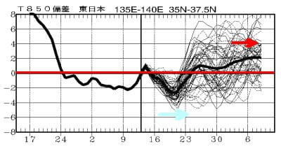

まぁ，2週間先以上の長期予報は

占いみたいなもので当たらないから，

4月も，冷えることを期待…！！

…しかし，眠い…

もう3時過ぎ（泣）

いつもより早いけど，

仕事してないんだから，こんな夜更かし

してないで，さっさと寝ればよかった…(泣)
