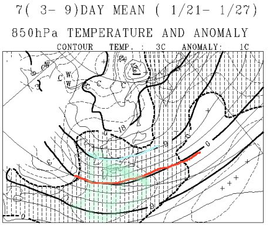
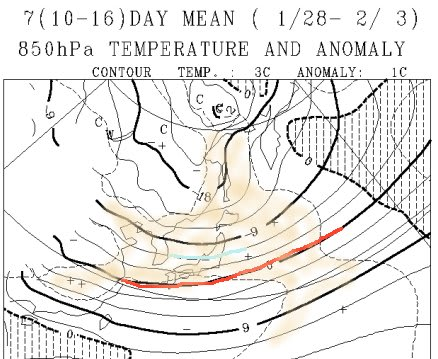
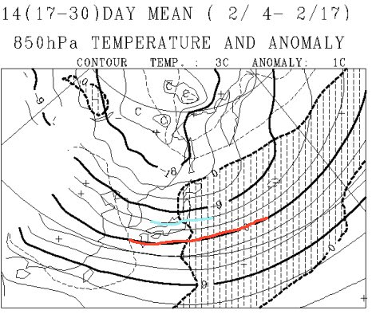
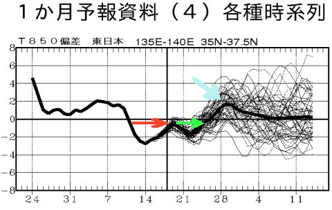

# この冷え冷え祭りはいつまで続くのか…？一か月予想図を読み解いてみた

📅 投稿日時: 2017-01-20 01:57:40

🏷️ カテゴリ: [スキー天気予想](c6554f5c3c106093b511a8daae23757e8.md)

えー．

この週末，土曜日ですが．

脛～膝パフという予想でしたが．

…少し，積雪が少なそうな予想に変わってきました…

もしかするとブーツパフくらいかも？？

まぁ，朝までの積雪が20cm～30cmってことで．

おそらく，ブーツパフ～それよりわずかに多いかな？

ってくらいの予感…

そして．

日曜も．

夕方からの雪の降りは，そんなに降らなさそうな感じ．

完全西風で，日本海側にはそこそこ降るけど．

志賀には雪雲がパラパラ飛んでくるかな…

という感じで．

志賀では，午後は雪がさーーーっと舞ったり，止んだり…

という感じでしょうか…

でも．

この2日間．

気温が冷え冷えで，いい雪で滑れそう…

ってのは変わらずなわけで．

いやーーーー．

ここしばらく．

冷え冷え踊りを踊らずに済んでいるこのシーズン．

…なんて．

なんて平和なんだろう…（感動）

…果たして．

これから先．

このまましばらく，冷え冷え踊りを踊らずに済みそうなのか？

あるいは．

超冷え冷えのあとに恐ろしい反動がやってきて．

一気に気温が上がっちゃったりするのか？

さて．

一体どっちなのか…

かすかな恐怖も感じつつ．

一か月予想天気図を見てみましょうか…

…ドキドキ．

どっちだろう…（がさがさ）←天気図を読んでいる音

…

…みなさん．

ご安心ください．

これから一か月，昨シーズンみたいな超高温が続くことはなさそうです！！

ふはー．

よかった…

えー．

まず．

1月21日から27日までの一週間の平均850hpa気温図を見てみると．

こんな感じで，赤く印した0℃線は日本のはるか南にあり．

志賀には水色で示した-9℃線が近づいてます．

一週間の平均で，-9℃線がこんなところに

いるってことは．

かなり冷える一週間ですね～！

ちなみに，うっすら緑で塗ったところは，

平年より1℃気温が低いエリア．

志賀はぎりぎりこのエリアに掛かっているかどうか，

ってくらいなので．

まぁ，平年よりそこそこ冷える感じ…

で．1月28～2月3日の一週間ですが．

うぐっ！

オレンジに塗った，平年より1℃高いエリアに

日本全域が入っています…

だもんで．

この一週間は，冷え冷え祭りは一旦

中休みになりそう…

でも．

志賀高原は-6℃線がかかっているので．

この時期であれば，平年比1℃くらい高めでも．

志賀高原は十分冷え冷え．

雪が解けちゃう心配は無いでしょう．

そして．

2月4～17日の2週間ですが．

志賀高原は，網掛け部分と網掛けの無い部分の

境界線にあるので．

まぁ，ぴったり平年と同じ気温ですか．

で．

この期間も0℃線は日本のはるか南で．

志賀高原は-6℃線がかかっているくらいなので．

平年並みであれば，もう全く問題なし．

この期間も，平和に過ごせるでしょう…

この一か月の850hpa気温の傾向はこんな感じで．

赤く印したのが，13日から17日までの激烈大雪になった

超冷え冷え期間ですが．

18，19日の中休みのあと．

また，緑で記した20日～23日に，

超冷え冷え期間より，わずかに弱い

冷え冷え期間パート2がくる感じ…

そのあとは，27日～2月3日くらいまで，水色矢印で

示した，ちょい気温が高そうな期間がありますが．

それ以降は平年並みの気温の，平和な気候になりそうです…

ということで．

これから2月中旬までの一か月間は．

冷え冷え踊りを踊らずに済みそうな感じ…

…いやー．安心だなっ！！←ってか，これが普通なんだけど．去年がひどすぎただけ

## 💬 コメント一覧

### 💬 コメント by (かず)
**タイトル**: この先冬がいつまで続くか分からないですからね
**投稿日**: 2017-01-20 11:40:54

土日行きます　雪次第で月火も笑　またお会いしたらよろしくお願いします

### 💬 コメント by (Skier_S)
**タイトル**: かずさま
**投稿日**: 2017-01-20 22:33:55

え？？

月，火曜も滑れるのですね…

月曜，火曜も，それほど深くないけど

パウダーになる可能性が高いです…

いいなぁ．

また，志賀でお会いしましょう！

