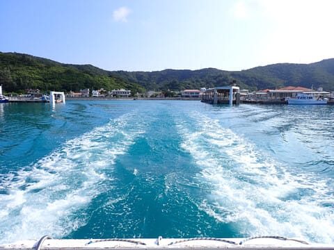

# 2024年8月，今年も座間味で親子ダイビング！その11…ダイビング2日目の1本目へ，Go！

📅 投稿日時: 2024-09-04 01:53:24

🏷️ カテゴリ: [ダイビング日記](ce3a7a8d424d112fce83ee85c81a0e344.md)

この時期の我が家．

スキー道具が多く，スキー板は年中私の

部屋に出しっぱなしで．

私の板と家族の分で合わせて9セットの

板が私の部屋に立てかけてあり．

その周りにはスキーブーツ家族分で

なぜか全部合わせて6足もあるし…←うち4足はあなたのでしょ

さらにダイビングが終わってから，

ダイビング器材も片付けてない今の時期．

フィンやらBCやらいろんなダイビング

器材が私の部屋の中に展開していて．

この部屋の主は，いったいどんだけ遊び人なんだ

という状況になっている今の私の部屋．

在宅勤務のリモート会議で，仮想背景無しで

カメラをONにするのは絶対無理ですね

そろそろダイビング器材を片付けないと

いけないけど．

でもまだスキーシーズンまでのこの時期は，

スキーウェアやらヘルメットやらが

片付けられているだけマシだな…

と思っている，Skier_Sです．

しかし改めてみると…

ダイビング器材3人分とスキー道具3人分

（うち1人のスキー道具だけで普通の人の4-5人分はある）

が並べられているこの部屋，壮観だな…

ってなことで．

今日も本題は，座間味ダイビング旅行記です～！

ーーー

（[前回はこちら](e9ac15b11681ec41ed1b5975388b31838.md)）

ということで．

ボートは港を出港し，ダイビング2日目が

スタートしましたが…

向かった先は，また昨日の午前中と同じ，

安慶名敷島の北西の方ですね…

このあたりのポイントは港から近いので，

ポイントまでは10分もかからず到着です…！

ってなことで．

やってきたポイントは「アダン下」．

ボートの上から見ても波はないべた凪だし．

透明度もよさそうです…！

手短なブリーフィングが終わったら，

港を出て15分後には早くもエントリー！

今日の1本目は，いつもの我が家オンリー

チームではなく，他のゲストさんも2名

入ったチームで潜ります…

まずは最初に，深場にあるキンメモドキが

ついている根を狙うようです…

そして，一気に深度を下げますが…

目標とする根が見えてきましたね…！

深場とはいえ，せいぜい深度16m程度なので…

透明度も25mは越えていることもあり，

太陽光がいい感じで差してます！！

岩の隙間を除いてみると…

確かにキンメモドキの群れがいますね…！

でも．

シャイなのか，岩の隙間の奥深くに

入ったまま出てこないので．

あんまりいい写真にならないな…（涙）

これだと何とかキンメモドキの群れの

ごっちゃり感がわかるかな？

娘も必死に写真を撮ってますね～…

もう，ダイビングも2日目になると，

危なげもなく潜っているので，

安心して見てられます．

この根の周りには，ガーデンイールも

いたし…

かなり近づかせてもらえるガーデンイール

でしたが．

ガーデンイールって，ネコ目ですよね…

そして，巨大なロクセンヤッコのペアが通り

過ぎているのを見送ったりしたら．

一つ目の根を後にして，移動開始します…

しばらく移動したら．

次の目標は，この根みたいですね…

根のそばにやってくると…

浅くて日が射すし，魚もいっぱいで

いい感じ…！！！

そして．

グルクンの若魚の群れが目の前を

通り過ぎていきます…！！

グルクン…というか，こいつは

クマザサハナムロですが．

この若魚は，この根に根付いている

ようで．

根の周りをずっとグルグルしてました…

ってな感じで．

私の大好きな，いかにも座間味っぽい感じの

癒しの根でしばらく過ごしたら．

そろそろダイビングも終了に近い時間なので，

ボートへ向かって引き返します…

（[続く](e4e10e588d345222f3542072809069230.md)）

## 💬 コメント一覧

### 💬 コメント by (1kamakura)
**タイトル**: Unknown
**投稿日**: 2024-09-04 07:55:46

江戸の秋

ダイビング器材三人分+

スキーセット三人分プラスアルファ！

圧巻ですね👀❗️

透明度良し！

魚群れてる！

いいですね〜👍

### 💬 コメント by (Skier_S)
**タイトル**: ＞江戸の秋さま
**投稿日**: 2024-09-05 00:24:12

この日の座間味は透明度良かったですよ～！

ちなみに私の部屋，このほかに山歩き用のザックやら何やらも転がっているので，遊び道具だらけです（笑）．

